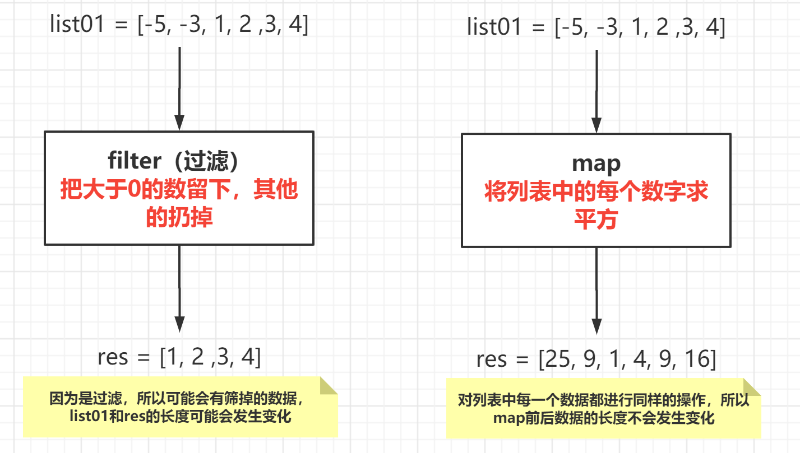
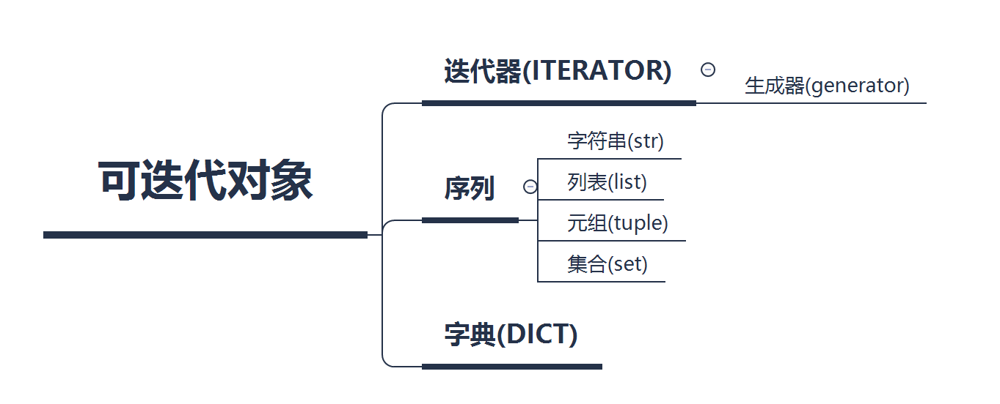
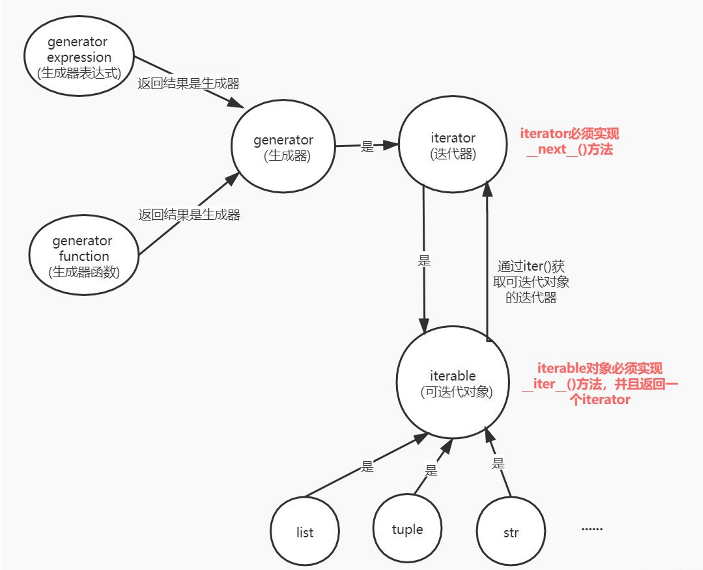

# 函数进阶

## 创建函数

### def语句

- 标题行由 def 关键字、函数的名字，以及参数的集合（如果有的话）组成

- def 子句的剩余部分包括了一个虽然可选但是强烈推荐的文档字串，和必需的函数体

### 前向引用

- 函数不允许在函数未声明之前，对其进行引用或者调用

```python
def foo():			# 定义函数foo()，先调用bar()函数，报错，下面定义以后，报错取消
    print('in foo')
bar()

def bar():			# 定义函数bar()
	print('in bar')

foo()				# 函数foo()已经被定义，可以直接调用
```

**注意**

- 定义函数时，函数的先后顺序不重要，重要的是 **函数在什么位置被调用**

### 调用函数

- 使用一对圆括号() 调用函数，如果没有圆括号，只是对函数的引用

- 任何输入的参数都是必须放置在括号中

```python
>>> def foo():		# 定义函数foo()
...     print('in foo')
... 
>>> foo		# 调用函数时，函数名后必须有小括号，否则返回一个位置对象
>>> foo()		# 函数得正确调用方式
```

### 关键字参数

- 关键字参数的概念仅仅针对函数的调用
- 这种理念是 **让调用者通过函数调用中的参数名字来区分参数**
- 这种规范允许参数不按顺序
- **位置参数应写在关键字参数前面**

```python
>>> def get_age(name, age):		#关键字参数的使用,定义函数get_age(name,age), 形参：name和age
...     print('%s is %s years old' % (name, age))
...
>>> get_age('tom', 20)		#调用函数get_age(name,age)，name为‘tom’，age为20
>>> get_age(20, 'tom')		#会按照顺序将实参传递给对应得形参，name=20，age='tom'
>>> get_age(age=20, name='tom')		#使用关键字进行传参
>>> get_age(age=20, 'tom')		#关键字参数【age=20】要写在位置参数【'tom'】的后面
>>> get_age(20, name='tom')		#传递实参时，位置参数name在第一个位置，在这里获取了两个name的值
>>> get_age('tom', age=20)		#传递实参时，name值为'tom'，age值为20,正确
```

### 练习 1：简单的加减法数学游戏

**需求**

- 随机生成两个100以内的数字
- 随机选择加法或是减法
- 总是使用大的数字减去小的数字
- 如果用户答错三次，程序给出正确答案

**创建新的python文件math_game.py ，构建加减法数学游戏程序的结构**

```python
def exam():				#函数exam(), 功能：出题，让用户作答
    pass
def main():				#函数main(), 功能：主函数，用户选择继续答题或退出
    while 1:             	#永久循环
        exam()          	#调用函数，让用户作答
        #判断是否继续，yes或no，strip() 去掉字符串两边空白符，只判断第一个字符
        yn = input('Continue(y/n)?').strip()[0]
        if yn in 'nN':         #用户输入第一个字符是n或N时，退出程序
            print('\nBye-bye')
            break              #退出while循环

if __name__ == '__main__':
    main()
```

**编写出题函数 exam()**

```python
# 导入random模块的randint方法【随机产生一个整数】和choice方法【随机取出一个元素】
from  random import  randint, choice
def exam():
    nums = [randint(1, 100) for i in range(2)]	#使用列表解析，产生两个1 ~ 100的随机整数
    nums.sort(reverse=True)        			#让列表nums中的元素，从大到小排序
    op = choice('+-')              #随机取出运算符'+'或'-'
    if op == '+':      		#当op为'+'或'-'时，得到列表nums中两个元素的正确计算结果
        result = nums[0] + nums[1]
    else:
        result = nums[0] - nums[1]
    prompt = '%s %s %s = '  % (nums[0], op, nums[1])	#给用户显示出题信息
    answer = int(input(prompt))		#定义变量answer，获取用户输入得答案
    if answer == result:    #判断用户答案和正确结果是否相等，打印相应信息
        print('Very Good!!!')
    else:
        print('Wrong Answer!!!')
def main():				#函数main(), 功能：主函数，用户选择继续答题或退出
    while 1:             #永久循环
        exam()           #调用函数，让用户作答
        yn = input('Continue(y/n)?').strip()[0]    
        if yn in 'nN':         #用户输入第一个字符是n或N时，退出程序
            print('\nBye-bye')
            break              #退出while循环

if __name__ == '__main__':
    main()
```

**测试**

```python
(mypy) [root@localhost day02]# python math_game.py 
65 - 30 = 10            #给出一个错误结果10
Wrong Answer!!!
Continue(y/n)?a         #这里只判断第一个字母为n或N，输入任意字符都代表yes
25 - 10 = 15            #给出一个正确结果15
Very Good!!!
Continue(y/n)?N0        #这里只判断第一个字母为n或N，则为不继续执行
Bye-bye
```

**修改 exam()，用户有三次机会，全部答错则给出正确答案**

```python
from  random import  randint, choice
def exam():
    nums = [randint(1, 100) for i in range(2)]
    nums.sort(reverse=True)        #让列表nums中的元素，从大到小排序
    op = choice('+-')              #随机取出运算符'+'或'-'
    if op == '+':                 
        result = nums[0] + nums[1]
    else:
        result = nums[0] - nums[1]

    counter = 0            #定义变量counter，统计用户的答题次数
    prompt = '%s %s %s = ' % (nums[0], op, nums[1])
    while counter < 3:		# 用户有3次答题机会，答对退出循环，答错给出正确答案
        answer = int(input(prompt))   #定义变量answer，获取用户输入得答案
        if answer == result:          #判断用户输入和正确答案是否相等
            print('Very Good!!!')
            break                     #相等，则退出while循环
        else:                         #不相等，则打印print()
            print('Wrong Answer!!!')
        counter += 1                  #每循环一次，counter自加1                 
    else:                             #答错三次，给出正确答案
        print('%s%s' % (prompt, result))
def main():
    while 1:             #永久循环
        exam()           #调用函数，让用户作答
        yn = input('Continue(y/n)?').strip()[0]    
        if yn in 'nN':         #用户输入第一个字符是n或N时，退出程序
            print('\nBye-bye')
            break              #退出while循环
if __name__ == '__main__':
    main()
```

**修改 exam() 和 main()，进行异常处理**

```python
from  random import  randint, choice
def exam():
    nums = [randint(1, 100) for i in range(2)]
    nums.sort(reverse=True)        #让列表nums中的元素，从大到小排序
    op = choice('+-')              #随机取出运算符'+'或'-'
    if op == '+':                 
        result = nums[0] + nums[1]
    else:
        result = nums[0] - nums[1]
    counter = 0            
    prompt = '%s %s %s = '  % (nums[0], op, nums[1])
    while counter < 3:  
        try:		# 用户必须给出答案，所有异常，均continue
            answer = int(input(prompt))  ##定义变量answer，获取用户输入得答案
        except:
            print()
            continue
        if answer == result:          #判断用户输入和正确答案是否相等
            print('Very Good!!!')
            break                     #相等，则退出while循环
        else:                         #不相等，则打印print()
            print('Wrong Answer!!!')
        counter += 1                  #每循环一次，counter自加1                 
    else:                             #答错三次，给出正确答案
        print('%s%s' % (prompt, result))

def main():
    while 1:             #永久循环
        exam()           #调用函数，让用户作答
        try:
            yn = input('Continue(y/n)?').strip()[0]
        except IndexError:
            yn = 'y'
        except (KeyboardInterrupt, EOFError):
            yn = 'n'
        if yn in 'nN':         #用户输入第一个字符是n或N时，退出程序
            print('\nBye-bye')
            break              #退出while循环

if __name__ == '__main__':
    main()
```

**测试加减法数学游戏【异常测试】** 

```python
(mypy) [root@localhost xxx]# python math_game.py
87 - 47 = ^C      #Ctrl + C, 执行continue，继续作答
87 - 47 =         #Ctrl + D, 执行continue，继续作答
87 - 47 =         #回车, 执行continue，继续作答

87 - 47 = 40      #给出正确答案
Very Good!!!
Continue(y/n)?    #直接回车，默认继续答题
69 - 63 = 6       #给出正确答案
Very Good!!!
Continue(y/n)?^C  #Ctrl + C或Ctrl + D，默认退出程序
Bye-bye
```

## 匿名函数

- python 允许用 lambda 关键字创造匿名函数
- 匿名是因为不需要以标准的 def 方式来声明
- 一个完整的 lambda "语句"代表了一个表达式，这个表达式定义体必须和声明放在同一行

```python
# 使用def定义函数add(x，y)
def add(x, y):
    return  x + y
if __name__ == '__main__':
	print(add(10, 5))

myadd = lambda x, y: x + y		# 定义匿名函数，赋值给myadd，x和y作为形参
print(myadd(10, 20))
```

### filter() 函数

- filter(func, seq): 调用一个布尔函数 func 来迭代遍历每个序列中的元素；返回一个使 func 返回值为 true 的元素的序列
- 如果布尔函数比较简单，直接使用 lambda 匿名函数就显得非常方便了

**filter(func, seq)函数的使用，如果seq序列中的元素，传入函数func后，返回值为True，则保留下来**

```python
from random import  randint		#导入random模块的randint方法(随机产生一个整数)
def func1(x):						#定义函数func1(x)，奇数返回True, 偶数返回False
    return True if x % 2 == 1 else False

if __name__ == '__main__':
    nums = [ randint(1, 100) for i in range(10)]   #10个100以内的随机数
print(nums)                                    #打印nums
result = filter(func1, nums)                   #filter()过滤结果
result2 = filter(lambda x: True if x % 2 == 1 else False, nums)
print(list(result))               #将result转换为列表，打印
print(list(result2))
```

### map() 函数

- map(func， seq): 调用一个函数func 来迭代遍历每个序列中的元素；返回一个经过func处理过的元素序列

**map(func, seq)函数的使用，将seq序列中的元素，传入函数func后，经过处理后全部保留下来**

```python
from random import  randint

def func2(x):		# 定义函数func2(x)，函数返回结果：(x * 2) + 1
    return x * 2 + 1

if __name__ == '__main__':
    nums = [ randint(1, 100) for i in range(10)]   # 10个100以内的随机数
    print(nums)                                    # 打印nums
result3 = map(func2, nums)    # 结果为：nums经过函数func2处理后的序列对象
result4 = map(lambda x: x * 2 + 1, nums)
print(list(result3))          # 将result3转换为列表，打印
print(list(result4))
```

**总结**



### 练习 2：修改数学游戏程序

- 修改上一节内容中的数学游戏程序
- 将数学运算改为匿名函数的形式

```python
# 创建新的python文件math_game2.py，复制math_game.py的内容到math_game2.py，优化加减法数学游戏程序
from  random import  randint, choice
def add(x, y):				#定义函数add(x, y), 功能：进行加法运算
    return  x + y
def sub(x, y):				# 定义函数add(x, y), 功能：进行减法运算
    return  x - y

def exam():
    cmds = {'+': add, '-': sub}		#定义字典cmds，用户选择数字时，返回不同的函数名
    nums = [randint(1, 100) for i in range(2)]
    nums.sort(reverse=True)
    op = choice('+-')
#删除if判断语句，添加如下代码调用函数时，一个 *, 指将序列对象拆分开来【字符串，列表，元组】
    result = cmds[op](*nums)
    counter = 0
..................................................................................

# 复制math_game2.py到math_game3.py，优化加减法数学游戏程序
from  random import  randint, choice

def exam():
    cmds = {'+': lambda x, y: x + y, '-': lambda x, y: x -y}
    nums = [randint(1, 100) for i in range(2)]
    nums.sort(reverse=True)
    op = choice('+-')
    result = cmds[op](*nums)
```

# 变量作用域

## 全局变量

- 标识符的作用域是定义为其声明在程序里的可应用范围，也就是变量的可见性
- 在一个模块中最高级别的变量有全局作用域
- 全局变量的一个特征是除非被删除掉，否则他们会存活到脚本运行结束，且对于所有的函数，他们的值都是可以被访问的

**全局变量的使用**

```python
>>> x = 10			# 定义全局变量x
>>> def func1():		# 定义函数func1()，函数内部可以直接使用变量x
...     print(x)
... 
>>> func1()		#调用函数func1(),结果为10
```

## 局部变量

- 局部变量只是暂时的存在，仅仅只依赖于定义他们的函数现阶段是否处于活动
- 当一个函数调用出现时，其局部变量就进入声明它们的作用域。在那一刻，一个新的局部变量名为那个对象创建了
- 一旦函数完成，框架被释放，变量将会离开作用域

**局部变量只在函数内部起作用**

```python
>>> def func2():		#定义函数func2(), 其中的变量a为局部变量，只在函数内部有效
...     a = 10
...     print(a)
... 
>>> def func3():		#定义函数func2(), 其中的变量a为局部变量，只在函数内部有效
...     a = 'hello'
...     print(a)
... 
>>> func2()			#调用函数func2()，结果为10
>>> func3()			#调用函数func3(), 结果为hello
>>> a		#查看a的值，没有被定义，函数内部的a为局部变量，只在该函数内部有效
```

**如果局部变量与全局变量有相同的名称，那么函数运行时，局部变量的名称将会把全局变量的名称遮盖住**

```python
>>> x = 100		# 定义全局变量x
>>> def func5():		# 声明函数func5(), 函数内有局部变量x=200
...     x = 200
...     print(x)
... 
>>> func5()		# 局部变量
200
>>> x			# 查看x【全局变量】，没有发生变化
100
```

## global 语句

- 因为全局变量的名字能被局部变量给遮盖掉
- 为了明确地引用一个已命名的全局变量，必须使用 global 语句

```python
>>> x = 100		#定义全局变量x
>>> def func6():		#定义函数func6()
...     global x      #引用全局变量x
...     x = 200       #为全局变量x赋值为200
...     print(x)      #打印变量x的值
... 

>>> func6()		#调用函数func6()
>>> x
```

## 查找变量或函数的顺序

- 首先在函数的内部去查找
- 函数内部没有，然后去全局去查找，看是否定义
- 全局也没有，最后会去内建函数中查找

```python
# 验证python查找变量或函数的顺序，定义函数func7()，统计字符'abcd'的长度
>>> def func7():
...     print(len('abcd'))
... 
>>> func7()		#调用函数，结果为4，正确
>>> len			#全局查看是否有len，没有，不存在
# 先在函数func7()内部查找方法len()，再在全局查找，最后在内建中查找len()
```

# 可迭代对象和迭代器

- **可迭代对象需要实现\_\_iter\_\_方法**
- **迭代器不仅要实现\_\_iter\_\_方法，还需要实现\_\_next\_\_方法**



**从 for 循环说起**

我们都知道，在Python中，我们可以for循环去遍历一个列表，元组或者range对象

```python
for i in [1, 2, 3]:
    print(i)
for i in range(0, 10):
    print(i)
```

那底层的原理是什么样的呢？这其中涉及到了几个概念，“**可迭代”，“迭代器”，“生成器”** 等，用一幅图说明问题



如果一个对象是可迭代对象，那么我们就可以用 **for循环去遍历它**，比如列表、元组、字符串等都是可迭代对象。而我们用for循环去遍历它的原理就是，先获取了它的迭代器，然后使用迭代器的**next**方法去逐一遍历

```python
a = [1, 2, 3]
# for相当于下面的代码
for i in a:
    print(i)
# for循环分解(实际是通过Python底层C语言实现的，此处只是演示)

## 第一步： 获取迭代器
iterator_a = iter(a)
## 第二步： 通过next逐个遍历
while True:
    try:
        print(next(iterator_a))
    except StopIteration:  ## 第三步：遇到StopIteration异常，停止
        break
```

注意可迭代对象与迭代器的区别，如果一个对象是可迭代对象，那么我们就肯定能调用 **iter()** 方法获取它的迭代器，而如果一个对象是迭代器，我们就能用 **next()** 方法去拿下一个元素。

我们可以用 **isinstance方法** 判断一个对象是不是可迭代对象，是不是迭代器。

```python
>>> from collections.abc import Iterable
>>> from collections.abc import Iterator
>>> isinstance([1,2,3], Iterable)
True
>>> isinstance([1,2,3], Iterator)
False
>>> i = iter([1,2,3])
>>> isinstance(i, Iterable)
True
>>> isinstance(i, Iterator)
True
>>> type(i)
<class 'list_iterator'>
```

列表本身不是迭代器，它是可迭代对象，所以你不能用 **next()** 操作列表

```python
>>> a = [1, 2]
>>> next(a)
Traceback (most recent call last):
  File "<stdin>", line 1, in <module>
TypeError: 'list' object is not an iterator
>>> iter_a = iter(a)
>>> next(iter_a)
1
>>> next(iter_a)
2
>>> next(iter_a)   # 当没有剩余元素时，就抛出StopIteration异常
Traceback (most recent call last):
  File "<stdin>", line 1, in <module>
StopIteration
```

可迭代对象必须实现 **\_\_iter\_\_()** 函数，返回迭代器，调用对象自身的 **\_\_iter\_\_()** 函数与将iter()作用于对象效果是一样的，同理对 **\_\_next\_\_()** 和 **next()** 也一样

```python
>>> a=[1,2,3]
>>> iter_a = a.__iter__()
>>> next(iter_a)
1
>>> iter_a.__next__()
2
```

## 生成器

Python 使用生成器对延迟操作提供了支持。所谓延迟操作，是指在需要的时候才产生结果，而不是立即产生结果。这也是生成器的主要好处。

Python有两种不同的方式提供生成器：

- **生成器函数：**

  - 常规函数定义，但是，**使用 yield 语句而不是 return 语句返回结果**
  - yield 语句一次返回一个结果，在每个结果中间，挂起函数的状态，以便下次重它离开的地方继续执行

  ```python
  def generator(array):
      for i in array:
          return i
      
  gen = generator([1,2,3,4,5])
  print(type(gen))
  # 输出
  # <class 'int'>
  # ====================================
  def generator(array):
      for i in array:
          yield(i)
          
  gen = generator([1,2,3,4,5])
  print(type(gen))
  # 输出
  <class 'generator'>
  ```

- **生成器表达式：**

  - 类似于列表推导，但是，生成器返回按需产生结果的一个对象，而不是一次构建一个结果列表

  ```python
  >>> from random import randint
  >>> nums = [randint(1, 100) for i in range(10)]		#产生10个1~99的随机数
  >>> nums
  >>> nums2 = (randint(1, 100) for i in range(10))		#() 会产生一个随机数的生成器对象
  >>> nums2		#为一个对象，不占用空间，使用时才会产生数据
  >>> for i in nums2:		#使用for循环遍历nums2中的元素，成功
  ...     print(i)
  ... 
  
  >>> ['192.168.1.%s' %i for i in range(1, 255)]		#使用列表解析产生一个254个元素的大列表，占据比较大的内存空间
  >>> ips = ('192.168.1.%s' %i for i in range(1, 255))		#() 会产生一个IP地址的生成器对象【包含254个IP地址】
  >>> ips			#为一个对象，不占用空间，使用时才会产生数据
  >>> for ip in ips:			#使用for循环可以遍历出ips中的所有元素，成功
  ...     print(ip)
  
  ```

  - Python不但使用迭代器协议，让for循环变得更加通用。大部分内置函数，也是使用迭代器协议访问对象的。例如， sum函数是Python的内置函数，该函数使用迭代器协议访问对象，而生成器实现了迭代器协议，所以，我们可以直接这样计算一系列值的和：

  ```python
  >>> sum((x ** 2 for x in range(4))
  # 而不用多此一举的先构造一个列表：
  >>> sum([x ** 2 for x in range(4)]) 
  ```

  - 生成器的好处在于延迟操作，需要的时候再使用，所以会节省空间

  ```python
  sum([i for i in range(100000000)])
  sum((i for i in range(100000000)))
  ```

- **注意事项**

  - 生成器的唯一注意事项就是：**生成器只能遍历一次**

  - 我们直接来看例子，假设文件中保存了每个省份的人口总数，现在，需要求每个省份的人口占全国总人口的比例。显然，我们需要先求出全国的总人口，然后在遍历每个省份的人口，用每个省的人口数除以总人口数，就得到了每个省份的人口占全国人口的比例。

  ```python
  # population.txt
  # 123456
  # 123243
  # .....
  def get_province_population(filename):
      with open(filename) as f:
          for line in f:
              yield int(line)
  
  
  gen = get_province_population("population.txt")
  all_population = sum(gen)
  for population in gen:
      print(population/all_population)
  ```

  执行上面这段代码，将不会有任何输出，这是因为，生成器只能遍历一次。在我们执行sum语句的时候，就遍历了我们的生成器，当我们再次遍历我们的生成器的时候，将不会有任何记录。所以，上面的代码不会有任何输出。

  - **自定义生成器函数的过程**

    - 在函数内部，有很多 **yield** 返回中间结果；
    - 程序向函数取值时，当函数执行到第1个yield时，会暂停函数运行并返回中间结果；

    - 当主程序再次调用函数时，函数会从上次暂停的位置继续运行，当遇到第2个yield，会再次暂停运行函数并返回数据；

    - 重复以上操作，一直到函数内部的yield全部执行完成为止

### 练习 4：文件生成器

**需求**：通过生成器完成以下功能

- 使用函数实现生成器
- 函数接受一个文件对象作为参数
- 生成器函数每次返回文件的 10 行数据

```python
#定义生成器函数gen_block(),功能：每次取10行记录
def gen_block(fobj):
    lines = []           		#每次存储10行记录
    counter = 0          		#计数器，用于每次从文件中取10行记录
    
    for line in fobj:         	#从文件对象中，一行一行读取记录
        lines.append(line)    	#将读取的行记录，存储在列表lines中
        counter += 1          #统计读取了几行记录
        if counter == 10:     	#当读取10行记录时，执行代码块
            yield  lines      #暂停运行函数，给函数返回列表lines
            lines = []        	#再次读取时，继续运行函数，清空lines
            counter = 0       #再次读取时，counter复位到0，重新计数
            
    if lines:            		#当lines不为空时，返回剩余的行记录【不足10行】
        yield lines

if __name__ == '__main__':
    fname = '/etc/passwd'         	#读取数据的文件
    fobj = open(fname)            	#打开文件，默认只读数据
   
    for block in gen_block(fobj): 		#调用生成器函数，每次打印10行记录
        print(block)              	#打印每次读取的记录
        print('*' * 50)           	#打印50个*, 区分每次读取的记录
    fobj.close()                  	#打开文件，就需要关闭文件
```

# 模块详解

## 模块

### 基本概念

- 模块支持从逻辑上组织 python 代码
- 当代码量变得非常大的时候，最好把代码分成一些有组织的代码段
- 代码片段相互间有一定的联系，可能是一个包含数据成员和方法的类，也可能是一组相关但彼此独立的操作函数
- 这些代码段是共享的，所有 python 允许 “调入” 一个模块，允许使用其他模块的属性来利用之前的工作成果，实现代码重用

### 作用

- 模块可以实现代码的重用，导入模块，就可以使用模块中已经定义好的类，函数和变量，**减少代码的冗余性**

### 模块文件

- 模块是从逻辑来组织 python 代码的方法，文件是物理层上组织模块的方法
- 一个文件被看作是一个独立模块，一个模块也可以被看作是一个文件
- 模块的文件名就是模块的名字加上扩展名 **.py**

### 搜索路径

- 模块的导入需要一个叫做 “路径搜索” 的过程
- python 在文件系统 “预定义区域” 中查找要调用的模块
- 搜索路径在 sys.path 中定义
- 也可以通过 PYTHONPATH 环境变量引入自定义目录

### 导入模块

#### 查看模块的默认搜索路径

```python
>>> import sys		#导入模块sys
>>> sys.path		#path, 查看python搜索模块时的默认查找路径
```

#### 模块导入方法

- 使用import导入模块
- 可以在一行导入多个模块，但是可读性会下降
- 可以只导入模块的某些属性
- 导入模块时，可以为模块取别名

```python
>>> import time, os, sys
>>> from random import choice
>>> import pickle as p
```

- 当导入模块时，模块的顶层代码会被执行

- 一个模块不管被导入（import）多少次，只会被加载（load）一次

```python
[root@py01 ~]# cat foo.py
hi = 'hello'
print(hi)
[root@py01 ~]# python3
>>> import foo
Hello                        #第一次导入，执行print语句
>>> import foo       #再次导入，print语句不再执行

```

如果要让自己写模块也可以在任何位置被搜索到，可以将模块文件拷贝到 **sys.path** 中的 **'/root/mypy/lib/python3.6/site-packages'** 路径下

```python
(mypy) [root@localhost day02]# mkdir /tmp/mylibs		#自定义目录，用于存放自己的模块文件【目录可以随意指定】
(mypy) [root@localhost day02]# cp qsort.py /tmp/mylibs/		#拷贝qsort.py 文件到/tmp/mylibs中，作为一个模块文件

(mypy) [root@localhost day02]# export PYTHONPATH=/tmp/mylibs		#声明全局变量
(mypy) [root@localhost day02]# cd /home/		#切换到任意目录下，该目录不存在qsort.py
(mypy) [root@localhost home]# python 		#进入到python的交互式解释器下
>>> import qsort		#导入模块qsort成功

补充：导入任意目录下的模块文件
(mypy) [root@localhost home]# cd  /root/PycharmProjects/py02/day02/
(mypy) [root@localhost day02]# mkdir mytest		#当前路径下，创建目录mytest
(mypy) [root@localhost day02]# vim mytest/star.py		#mytest目录，定义python文件star.py

hi = 'Hello World!'

def pstar(n=30):
    print('*' * n)
(mypy) [root@localhost day02]# python		#进入到python的交互式解释器下
>>> import mytest.star				#导入mytest目录下的star模块，python中说法为：导入mytest包下star模块
>>> mytest.star.hi
>>> mytest.star.pstar()
```

## 内置模块

### hashlib 模块

- hashlib 用来替换 MD5 和 sha 模块，并使他们的API一致，专门提供hash算法
- 包括md5、sha1、sha224、sha256、sha384、sha512，使用非常简单、方便

```python
# 使用hashlib模块，计算bytes类型数据的md5值
>>> import hashlib
# 一次读取所有数据，计算出文件的md5值，适合于小文件数据
>>> m = hashlib.md5(b'123456')			#计算b'123456' 的md5值，返回一个对象
>>> m.hexdigest()						#以16进制的方式，显示m的md5值

# 每次读取少量数据，最后计算出文件的md5值，适合于大文件数据
>>> m1 = hashlib.md5()		#返回一个空数据的md5值
>>> m1.update(b'12')		#更新b'12'的md5值
>>> m1.update(b'34')
>>> m1.update(b'56')
>>> m1.hexdigest()			#以16进制的方式，显示m1的md5值，结果相同
```

### 练习 5：计算文件 md5 值

**需求**

- 编写用于计算文件 md5 值的脚本
- 文件名通过位置参数获得
- 打印出文件 md5 值

```python
# 创建新的python文件check_md5.py，计算文件的md5值
import sys           	#导入模块sys, 通过argv[1]获取位置参数
import hashlib       	#计算文件的md5值

def check_md5(fname):    		#使用def 定义函数check_md5()，计算文件的md5值
    m = hashlib.md5()         #返回一个空数据的md5值
    with open(fname, 'rb') as fobj:
        while 1:
            data = fobj.read(4096)     		#每次读取4096个字节【4k】
            if not data:               		#data为空时，退出while循环
                break
            m.update(data)             	#更新data的md5值
    return  m.hexdigest()              	#返回给函数16进制的mdf值
    
if __name__ == '__main__':
    print(check_md5(sys.argv[1]))   

(mypy) [root@localhost xxx]# python check_md5.py /etc/hosts
54fb6627dbaa37721048e4549db3224d
```

### tarfile 模块

- tarfile模块允许创建、访问 tar 文件

- 同时支持 gzip、bzip2 格式

```python
>>> import tarfile		#在local下, 导入模块tarfile【实现文件的打包和解压】
>>> tar = tarfile.open('/tmp/demo.tar.gz', 'w:gz')		#以'w:gz'的格式，打开包文件，文件不存在则会自动创建
>>> tar.add('/etc/hosts')			#向包文件中压缩文件/etc/hosts
>>> tar.add('/etc/security')		#向包文件中压缩目录/etc/security
>>> tar.close()					#关闭文件
(mypy) [root@localhost day02]# ls -l /tmp/demo.tar.gz 		

>>> tar = tarfile.open('/tmp/demo.tar.gz')	#打开文件，文件已经存在，则不需要指定类型，python会自动选择
>>> tar.extractall(path='/var/tmp')		#解压到 /var/tmp目录下，不指定解压到当前目录
>>> tar.close()						#关闭文件
(mypy) [root@localhost day02]# ls /var/tmp/etc/		#查看软件包demo.tar.gz是否解压成功
```
