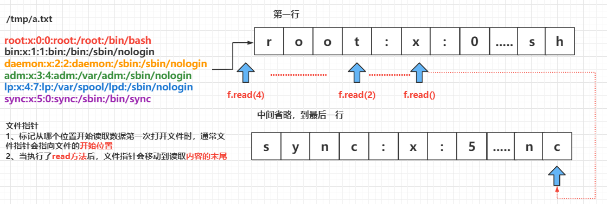
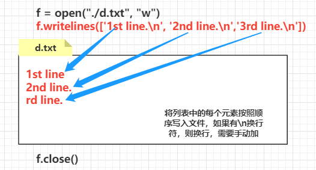
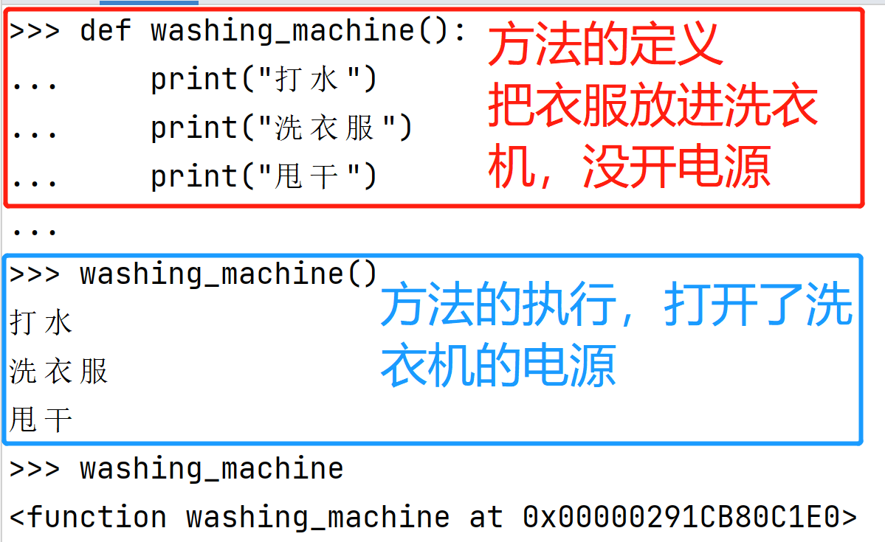
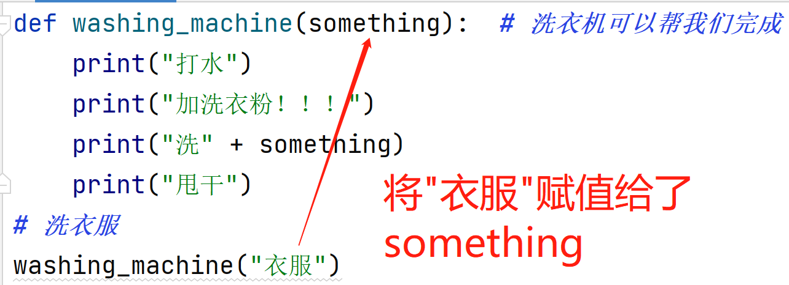
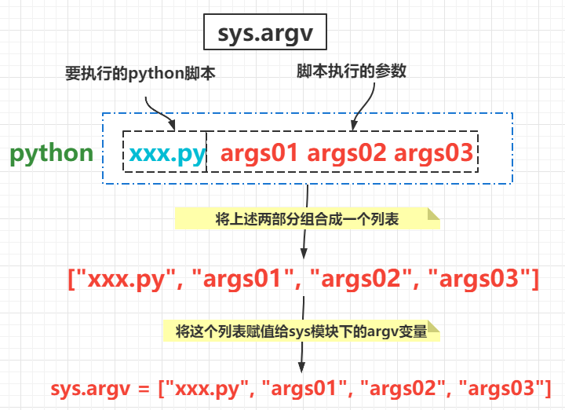
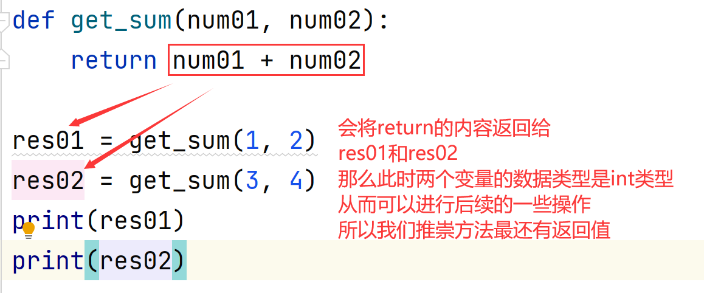
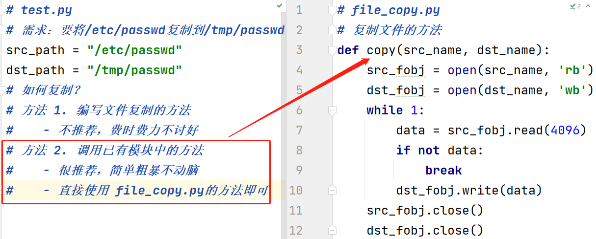

[TOC]

# 文件读写操作

在 Linux 系统中万物皆文件，所以我们不可避免的要和文件打交道，我们会常常对文件进行读和写的操作。例如：

```shell
cat /etc/password  # 读文件
vim /etc/password  # 读写文件
echo test > /tmp/abc.txt  # 覆盖写文件
echo text >> /tmp/abc.txt  # 追加写文件
```

而以上内容我们都是对文本文件进行读写，计算机中也存在对二进制文件的读写操作，那用 Python 如何实现呢？

## 文件的打开方法—open内建函数

不管是读文件还是写文件，我们第一步都是要将文件打开。

作为打开文件之门的“钥匙”，内建函数 open() 提供了初始化输入/输出（I/O）操作的通用接口，成功打开文件后时候会返回一个文件对象，否则引发一个错误。

### 基本语法


要以任何方式使用文件——哪怕仅仅是打印其内容，都得先打开打文件，这样才能访问它。

### 参数介绍

**file_name：**表示我们要打开文件的路径

**mode：**以怎样的方式打开文件

| **文件模式** | **操  作**                                   |
| ------------ | -------------------------------------------- |
| r            | 以读方式打开（文件不存在则报错）             |
| w            | 以写方式打开（文件存在则清空，不存在则创建） |
| a            | 以追加模式打开（必要时创建新文件）           |
| r+           | 以读写模式打开（参见r）                      |
| w+           | 以读写模式打开（参见w）                      |
| a+           | 以读写模式打开（参见a）                      |
| b            | 以二进制模式打开                             |

**file_object：**文件操作对象，我们后续对文件的所有读写操作都需要通过这个对象，而不是直接操作文件中的数据。


## 文件读操作

要使用文本文件中的信息，首先需要将信息读取到内存中。为此，我们可以一次性读取文件的全部内容，也可以以每次一行的方式逐步读取。

### read 方法 —— 读取文件

* `open` 函数的第一个参数是要打开的文件名（文件名区分大小写）
  * 如果文件 **存在**，返回 **文件操作对象**
  * 如果文件 **不存在**，会 **抛出异常**
* `read` 方法可以一次性 **读入** 并 **返回** 文件的 **所有内容**
* `close` 方法负责 **关闭文件**
  * 如果 **忘记关闭文件**，**会造成系统资源消耗，而且会影响到后续对文件的访问**
* **注意**：`read` 方法执行后，会把 **文件指针** 移动到 **文件的末尾**

```python
import sys
# 1. 打开 - 文件名需要注意大小写
file = open("文件路径", "r")

# 2. 读取
text = file.read()  # 一次性将文件中的内容全部读取出来
print(text)  # 将读取到的内容打印再控制台上

# 3. 关闭
file.close()
```

### 文件指针

* **文件指针** 标记 **从哪个位置开始读取数据**
* **第一次打开** 文件时，通常 **文件指针会指向文件的开始位置**
* 当执行了 `read` 方法后，**文件指针** 会移动到 **读取内容的末尾**
  * 默认情况下会移动到 **文件末尾**
* 重新打开文件时，**文件指针** 重新指向文件的最 **开始位置**

**图例**



**思考**

* 如果执行了一次 `read` 方法，读取了所有内容，那么再次调用 `read` 方法，还能够获得到内容吗？

**答案**

* 不能，因为第一次读取之后，文件指针移动到了文件末尾，再次调用不会读取到任何的内容

#### 练习：读取指定个数个字符

```python
# 以 r 的方式读取 /etc/passwd，首先读取10个字节后带引，再次读取20个字节后打印，之后读取文件所有内容后打印
```

### readline 方法 —— 按行读取

* `read` 方法默认会把文件的 **所有内容** **一次性读取到内存**
* 如果文件太大，对内存的占用会非常严重

* `readline` 方法可以一次读取一行内容
* 方法执行后，会把 **文件指针** 移动到下一行，准备再次读取

#### 案例：读取大文件的正确姿势

```python
import sys
# 打开文件
file = open("文件路径", "r")

while True:
    # 读取一行内容
    text = file.readline()

    # 判断是否读到内容
    if not text:
        break

    # 每读取一行的末尾已经有了一个 \n
    print(text, end="")

# 关闭文件
file.close()
```

### readlines 方法

`readlines() `方法读取所有（剩余的）行然后把它们作为一个 **字符串列表** 返回

### 文件迭代

- 如果需要逐行处理文件，可以结合 **for 循环**迭代文件
- 迭代文件的方法与处理其他序列类型的数据类似

```python
f = open("/tmp/passwd")
for line in f:  # 相当于 for line in f.readlines():
    print(line, end=" ")
```

**案例**

```python
# cp /usr/bin/ls /tmp/
f = open("/tmp/ls", "rb")
# 读取10个字节，python会自动将二进制数转换成16进制，以字节的大小进行读取
f.read(10)
# 硬盘格式化时，数据的最小单位为4k，所以建议一次读取音频等数据大小为4096(4k),或者是4k的倍数
r.read(4096)
f.close()
```

## 文件写操作

### write 方法 —— 写文件

- write() 内建方法功能与 `read()` 和 `readline()` 相反
  - 它把含有 **文本数据** 或 **二进制数据块** 的字符串写入到文件中去
- 写入文件时，**不会自动添加行结束标志**，需要程序员手工输入，返回写入的字节数


#### 案例 1：文件写操作

```python
# 以写的方式打开文件，如果文件不存在，则会创建；如果文件存在，即清空文件
f = open("./a.txt", "w")
f.write("Hello World!\n")
f.close()
```

#### 案例 2：刷新内存空间

```python
# 终端执行
>>> f.open('./b.txt', "w")
>>> f.write('hello world!\n')
13
(mypy) [root@localhost xxx]# cat /tmp/passwd  # 验证，没数据

# 数据写入文件的方法：
    #1) f.close()关闭文件; 2) f.flush()刷新内存空间；
>>> f.flush()
(mypy) [root@localhost xxx]# cat ./b.txt # 验证，数据写入成功
```

#### 练习 1：将下列内容写到一个Python文件中之后运行该Python文件

```python
num01 = int(input("num01: "))
num02 = int(input("num02: "))
res = num01 + num02
print('res: ' + str(res))
```

### writelines 方法

- 和 `readlines()` 一样，`writelines()` 方法是针对 **列表** 的操作
- 它接受一个 **字符串列表** 作为参数，将他们写入文件
- 行结束符并不会被自动加入，所以如果需要的话，**必须再调用 writelines() 前给每行结尾加上行结束符**

#### 案例 3：writelines

```python
f = open("./d.txt", "w")
f.writelines(['1st line.\n', '2nd line.\n','3rd line.\n'])
f.close()
```

**图例：**



## with 子句

- **with语句** 是用来简化代码的

- 在将打开文件的操作放在 with 语句中，代码块结束后，**文件将自动关闭**
- 读写文件的逻辑没有变化，变得只是 **写法**

### 案例 4：with

```python
with open('/tmp/passwd') as f:
    f.readline()
```

## 文件内移动

- **seek(offset[, whence])：**移动文件指针到不同的位置
  - **offset** 是相对于某个位置的偏移量
  - **whence** 的值，0 表示文件 **开头**，1 表示 **当前位置**，2 表示文件的结尾

- **tell()：**返回当前文件指针的位置

### 案例 5：文件内移动

**1、以只读文本文件 r 的方式，打开文件**

```python
>>> f = open("./d.txt")
>>> f.tell()  # 通过tell()查看当前在文件中的位置，起始位置
0
>>> f.seek(6, 0)  # 从初始位置0,移动指针6个字节的长度
6
>>> f.read(5)  # 读取指针后的五个字节，以字符方式读取
'ne.\n2'
>>> f.close()
```

**2、只读字节的方式 rb，打开文件**

```python
>>> f = open("./d.txt", "rb")
>>> f.tell()
0
>>> f.seek(6, 0)
6
>>> f.read(5)
b'ne.\r\n'
>>> f.seek(3, 1)  # 从当前位置1，移动指针3个字节的长度
14
>>> f.read(3)
b' li'
>>> f.close()
```

## 总结

读取，写入数据，常用的选择方式

- 读取数据时，如果是 **文本文件**，常采用 **for 循环** 遍历；
- 读取数据时，如果是非文件文件(视频，音频等)，采用 read()，一次读取 **4096(4k)**，或者是4096的倍数；
- 写入数据时，采用 write() 方法

### 练习

```python
# 模拟 cp 操作
# 1. 创建 cp.py 文件
# 2. 将 /bin/ls   "拷贝" 到/tmp 目录下
# 3. 不要修改原始文件
```

#### 版本一

```python
# 创建两个对象变量，f1为原文件；f2 为要写入数据的目标文件
# 因为是二进制文件，以字节的方式进行读写
f1 = open('/usr/bin/ls', 'rb')
f2 = open('/tmp/list', 'wb')
# 从用f1从原文件 /usr/bin/ls 中读取数据，并将数据存储在变量data中
# f2将变量data中的内容，写入到目标文件/tmp/list中
data = f1.read()
f2.write(data)
#关闭文件f1和文件f2
f1.close()
f2.close()
```

查看原文件和目标文件的md5值，是否相等

```shell
(mypy) [root@localhost xxx]# md5sum /tmp/ls /tmp/list
```

#### 版本二：优化

```python
# 创建两个变量，src_fname 存储源文件路径；dst_fname 存储目标文件路径
src_fname = '/usr/bin/ls'
dst_fname = '/tmp/list2'
# 创建两个对象变量，src_fobj为打开原文件；src_fobj为打开目标文件
# 因为是二进制文件，以字节的方式进行读写
src_fobj = open(src_fname, 'rb')
dst_fobj = open(dst_fname, 'wb')
while 1:  # 不确定读取次数，采用while循环
    data = src_fobj.read(4096)     # 每次从元文件中读取4k
    #if len(data) == 0:            # data为0,代表指针指向末尾，数据读完
    #if data == b'':               # b''空字节，代表指针指向末尾
    if not data:                   # data为非空值，中断循环
        break                      # 退出整个while循环
    else:
       dst_fobj.write(data)        # 将data数据写入list2文件中

src_fobj.close()     # 关闭原文件/usr/bin/ls
dst_fobj.close()     # 关闭目标文件 /tmp/lists
```

# 函数

## 快速体验

* 所谓**函数**，就是把 **具有独立功能的代码块** 组织为一个小模块，在需要的时候 **调用**
* 函数的使用包含两个步骤：
  1. 定义函数 —— **封装** 独立的功能
  2. 调用函数 —— 享受 **封装** 的成果

### 案例：洗衣服

```python
# 早上洗衣服
print("打水")
print("洗衣服")
print("甩干")
# 中午洗衣服
print("打水")
print("洗衣服")
print("甩干")
# 晚上洗衣服
print("打水")
print("洗衣服")
print("甩干")
```

发现了问题：我们将有独立功能的代码封装成一个函数

```python
def washing_machine():  # 洗衣机可以帮我们完成
    print("打水")
    print("洗衣服")
    print("甩干")
# 优化后代码
# 早上洗衣服
washing_machine()  # 打开洗衣机开关
# 中午洗衣服
washing_machine()  # 打开洗衣机开关
# 晚上洗衣服
washing_machine()  # 打开洗衣机开关
```

## 函数的创建与调用

### 创建函数

函数用 `def` 语句创建，语法如下：

```python
def 函数名(参数列表):  # 具体情况具体对待，参数可有可无
	"""函数说明文档字符串"""
    函数封装的代码
    ……
```

标题行由 `def` 关键字，函数的名字，以及参数的集合（如果有的话）组成

`def` 子句的剩余部分包括了一个虽然可选但是强烈推荐的**文档字串**，和**必需的函数体**

**函数名称** 的命名应该 **符合** **标识符的命名规则**

* 可以由 **字母**、**下划线** 和 **数字** 组成
* **不能以数字开头**
* **不能与关键字重名**

```python
def washing_machine():  # 洗衣机可以帮我们完成
    print("打水")
    print("洗衣服")
    print("甩干")
```

### 调用函数

使用一对圆括号 () 调用函数，如果没有圆括号，只是对函数的引用

任何输入的参数都必须放置在括号中

**图例：**



### 案例：加洗衣粉

```python
def washing_machine():  # 洗衣机可以帮我们完成
    print("打水")
    print("加洗衣粉！！！")
    print("洗衣服")
    print("甩干")
# 早上洗衣服
washing_machine()
# 中午洗衣服
washing_machine()
# 晚上洗衣服
washing_machine()
```

### 总结

* 定义好函数之后，只表示这个函数封装了一段代码而已
* 如果不主动调用函数，函数是不会主动执行的

### 思考

* 能否将 **函数调用** 放在 **函数定义** 的上方？

  * 不能！
  * 因为在 **使用函数名** 调用函数之前，必须要保证 `Python` 已经知道函数的存在
  * 否则控制台会提示 `NameError: name 'menu' is not defined` (**名称错误：menu 这个名字没有被定义**)

## 函数的参数

### 形参和实参

* **形参**：**定义** 函数时，小括号中的参数，是用来接收参数用的，在函数内部 **作为变量使用**
* **实参**：**调用** 函数时，小括号中的参数，是用来把数据传递到 **函数内部** 用的

### 问题

当我们想洗其他的东西，要手动改方法内部的代码：

```python
def washing_machine():  # 洗衣机可以帮我们完成
    print("打水")
    print("加洗衣粉！！！")
    print("洗床单")  # 洗被套
    print("甩干")
```

在函数内部有一定的变化的值：

```python
def washing_machine():  # 洗衣机可以帮我们完成
    print("打水")
    print("加洗衣粉！！！")
    print("洗衣服")
    print("甩干")
washing_machine()
def washing_machine():  # 洗衣机可以帮我们完成
    print("打水")
    print("加洗衣粉！！！")
    print("洗床单")
    print("甩干")
washing_machine()
......
```

**思考一下存在什么问题**

> 函数只能处理 **固定** 的数据

**如何解决？**

* 如果能够把需要处理的数据，在调用函数时，传递到函数内部就好了！

### 传递参数

* 在函数名的后面的小括号内部填写 **参数**
* 多个参数之间使用 `,` 分隔
* 调用函数时，实参的个数需要与形参个数一致，实参将依次传递给形参

```python
def washing_machine(something):  # 洗衣机可以帮我们完成
    print("打水")
    print("加洗衣粉！！！")
    print("洗" + something)
    print("甩干")
# 洗衣服
washing_machine("衣服")
# 洗床单
washing_machine("床单")
```

**图例**



### 作用

* **函数**，把 **具有独立功能的代码块** 组织为一个小模块，在需要的时候 **调用**
* **函数的参数**，增加函数的 **通用性**，针对 **相同的数据处理逻辑**，能够 **适应更多的数据**
  1. 在函数 **内部**，把参数当做 **变量** 使用，进行需要的数据处理
  2. 函数调用时，按照函数定义的**参数顺序**，把 **希望在函数内部处理的数据**，**通过参数** 传递

### 练习 1：定义一个函数，计算两个数的和

### 练习 2：简单的加减法数学游戏

```python
随机生成两个100以内的数字
随机选择加法或是减法
总是使用大的数字减去小的数字
如果用户答错三次，程序给出正确答案
```

### 位置参数

与 `shell` 脚本类似，程序名以及参数都以位置参数的方式传递给 python 程序，使用 `sys` 模块的 `argv` 列表接收

**图例**



### 默认参数

默认参数就是声明了 **默认值** 的参数，因为给参数赋予了默认值，所以在函数调用时，不向该参数传入值也是允许的

```python
def get_sum(num01, num02=2):
    print(num01 + num02)

get_sum(1)  # 没有给 num02 赋值，但是因为 num02 有默认值，所以不会报错
```

## 函数的返回值

* 在程序开发中，有时候，会希望 **一个函数执行结束后，告诉调用者一个结果**，以便调用者针对具体的结果做后续的处理
* **返回值** 是函数 **完成工作**后，**最后** 给调用者的 **一个结果**
* 在函数中使用 `return` 关键字可以返回结果
* 调用函数一方，可以 **使用变量** 来 **接收** 函数的返回结果

> 注意：`return` 表示返回，表示方法执行结束，后续的代码都不会被执行

### 案例：计算任意两个数字的和

洗完衣服后我们需要把衣服需要使用 `return` 关键字将每一单的价格返回，告诉帐房先生：

```python
def get_sum(num01, num02):
    return num01 + num02
```

**图例**



### 没有 return

如果方法内部没有 `return` 语句，那么会默认返回 None，即 **return None**

### 练习 3：斐波那契数列函数

斐波那契数列函数
- 将斐波那契数列代码改为函数
- 数列长度由用户指定
- 要求把结果用 return 返回

**版本一：方法内部直接打印**

```python
def gen_fib():
    fib = [0, 1]  # 定义列表，指定斐波那契数列的初始两个值
    n = int(input('长度： '))  # 定义变量n, 此变量为用户要看到的列表fib中的元素个数
    for i in range(n - 2):
        fib.append(fib[-1] + fib[-2])
    print(fib)  # 打印列表fib
# 调用两次函数gen_fib()
gen_fib()
gen_fib()
```

**版本二：带返回值**

```python
def gen_fib():
    fib = [0, 1]
    n = int(input('长度： '))
    for i in range(n - 2):
        fib.append(fib[-1] + fib[-2])
    return fib  # 返回最后生成的列表fib
# 调用函数gen_fib()
print(gen_fib())
```

**版本三：带参数**

```python
def gen_fib(n):
    fib = [0, 1]
    for i in range(n - 2):
        fib.append(fib[-1] + fib[-2])
    return fib  # 返回最后生成的列表fib
# 定义列表nlist, 将要产生的斐波那契数列的长度，作为列表nlist的元素
nlist = [10, 8, 6]
# 使用for循环，传递实参(nlist中的元素)给函数gen_fib(n)，得到三组斐波那契数列 
for i in  nlist:
    print(gen_fib(i))

```

### 练习4：复制文件函数

- 修改文件练习中的拷贝程序
  - 将程序改为函数的形式
  - 源文件和目标文件要求通过参数进行传递
  - 实参要求来自于命令行

**版本1：**

```python
# 定义函数copy()，实现指定单个文件拷贝的功能
def copy():
    src_name = '/usr/bin/ls'
    dst_name = '/tmp/list3'
# 以只读字节的方式打开源文件，赋值给变量src_fobj
# 以写入字节的方式打开源文件，赋值给变量dst_fobj
    src_fobj = open(src_name, 'rb')
    dst_fobj = open(dst_name, 'wb')
    while 1:
        data = src_fobj.read(4096)  
        #if len(data) == 0:
        #if data == b'': 
        if not data:
            break
        dst_fobj.write(data)
        
    src_fobj.close()
    dst_fobj.close()    
copy()  # 调用拷贝文件的函数copy()

```

**版本2：**

```python
# 导入模块sys, 传递的位置参数，是由sys模块的argv列表来存储接收的
# sys模块的argv列表中，第1个元素为python程序的文件名
import sys
def copy(src_name, dst_name):  # 定义函数copy()，实现任意文件的拷贝操作
# 以只读字节的方式打开源文件，赋值给变量src_fobj
# 以写入字节的方式打开源文件，赋值给变量dst_fobj
    src_fobj = open(src_name, 'rb')
    dst_fobj = open(dst_name, 'wb')
    while 1:
        data = src_fobj.read(4096)
        if not data:
            break
        dst_fobj.write(data)
    src_fobj.close()
    dst_fobj.close()  
copy(sys.argv[1], sys.argv[2])  # 使用sys模块的，argv列表获取位置参数

```

# 模块基础

## 定义模块

### 基本概念

- 模块是从逻辑上组织python代码的形式
- 当代码量变得相当大的时候，最好把代码分成一些有组织的代码段，前提是保证它们的 **彼此交互**
- 这些代码片段相互间有一定的联系，可能是一个包含数据成员和方法的类，也可能是一组相关但彼此独立的操作函数

## 导入模块 (import)

- 使用 **import** 导入模块
- 模块属性通过 **“模块名.属性”** 的方法调用
- 如果仅需要模块中的某些属性，也可以单独导入

### 为什么需要导入模块？

可以提升开发效率，简化代码

**图例**



**正确使用**

```python
# test.py，将 file_copy.py 放在同级目录下
# 需求：要将/etc/passwd复制到/tmp/passwd
src_path = "/etc/passwd"
dst_path = "/tmp/passwd"
# 如何复制？
# 调用已有模块中的方法
#    - 很推荐，简单粗暴不动脑
#    - 直接使用 file_copy.py的方法即可

# 导入方法一：直接导入模块
import file_copy  # 要注意路径问题
file_copy.copy(src_path, dst_path)

# 导入方法二：只导入 file_copy 模块的 copy 方法
from file_copy import copy  # 如果相同时导入多个模块 from file_copy import *
copy(src_path, dst_path)

# 导入方法四：导入模块起别名 as
import file_copy as fc
fc.copy(src_path, dst_path)
```

### 常用的导入模块的方法

- 一行指导入一个模块，可以导入多行， 例如：**import random**
- 只导入模块中的某些方法，例如：**from random import choice, randint**

## 模块加载 (load)

- 一个模块只被 **加载一次**，无论它被导入多少次
- 只加载一次可以 **阻止多重导入时，代码被多次执行**
- 如果两个文件相互导入，防止了无限的相互加载
- 模块加载时，顶层代码会自动执行，所以只将函数放入模块的顶层是最好的编程习惯

## 模块特性及案例

### 模块特性

模块在被导入时，会先完整的执行一次模块中的 **所有程序**

#### 案例

```python
# foo.py
print(__name__)

# bar.py
import foo  # 导入foo.py，会将 foo.py 中的代码完成的执行一次，所以会执行 foo 中的 print(__name__)
```

结果：

```python
# foo.py   ->   __main__   当模块文件直接执行时，__name__的值为‘__main__’
# bar.py   ->   foo        当模块被另一个文件导入时，__name__的值就是该模块的名字
```

**如何理解？图例：**


所以我们以后在 Python 模块中执行代码的标准格式：

```python
def test():
    ......
if __name__ == "__main__":
    test()
```

## 练习：生成随机密码

**创建 randpass.py 脚本，要求如下：**

1. **编写一个能生成 8 位随机密码的程序**

2. **使用 random 的 choice 函数随机取出字符**

3. **改进程序，用户可以自己决定生成多少位的密码**

**版本一：**

```python
import random  # 调用随机数模块random
# 定义变量all_chs，存储密码的所有选择；
# 定义变量result，存储8位随机数，初值为''
all_chs = '1234567890abcdefghigklmnopqrstuvwxyzABCDEFGHIGKLMNOPQLMNUVWXYZ'
result = ''
#使用for循环，循环8次，每次从all_chs中随机产生一个字符，拼接到result中
for i in range(8):
    ch = random.choice(all_chs)
    result += ch
print(result)  # 输出结果，右键执行【Run 'randpass'】，查看结果
```

**版本二（优化）：函数化程序，并可以指定密码长度，在randpass.py文件中操作**

```python
import random  # 调用随机数模块random
# 定义变量all_chs，存储密码的所有选择；
all_chs = '1234567890abcdefghigklmnopqrstuvwxyzABCDEFGHIGKLMNOPQLMNUVWXYZ'
def randpass(n=8):  # 使用def定义函数randpass(), 生成随机8位密码
    result = ''
    for i in range(n):
        ch = random.choice(all_chs)
        result += ch
    return result  # return给函数返回密码
if __name__ == '__main__':  # 测试代码块，__name__作为python文件调用时，执行代码块
    print(randpass(8))
    print(randpass(4))
```

**版本三：随机密码的字符选择可以调用模块**

```python
# 调用随机数模块random
# string模块中的变量ascii_letters和digits中，定义了大小写字母和所有数字
# 【Ctrl + 鼠标左键】可以看到 ascii_letters 的模块文件内容
import random    
from  string import ascii_letters, digits
# 定义变量all_chs，存储密码的所有选择；
all_chs = ascii_letters + digits
# 使用def定义函数randpass(), 生成随机8位密码
def randpass(n=8):
    result = ''
    for i in range(n):
        ch = random.choice(all_chs)
        result += ch
    return result  # return给函数返回密码
# 测试代码块，__name__作为python文件调用时，执行代码块
if __name__ == '__main__':
    print(randpass(8))
    print(randpass(4))
```


