[TOC]

# 判断语句

生活中的判断几乎是无所不在的，我们每天都在做各种各样的选择，如果这样？如果那样？……


考试成绩对人生的影响，不同的考试成绩对应着的结果，也就是不用的分支

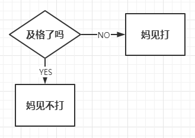

## 判断的定义

* 如果 **条件满足**，才能做某件事情，
* 如果 **条件不满足**，就做另外一件事情，或者什么也不做

> 正是因为有了判断，才使得程序世界丰富多彩，充满变化！
>
> **判断语句** 又被称为 “分支语句”，正是因为有了判断，才让程序有了很多的分支

## if 语句语法结构

- 标准if条件语句的语法

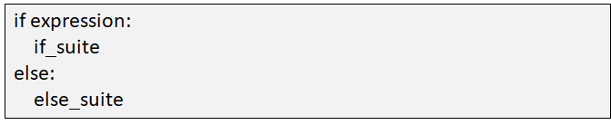

- 如果表达式的值 **非0** 或者为布尔值 **True**，则代码组 **if_suite** 被执行；否则就去执行 **else_suite**

- 代码组是一个 **python术语**，它由一条或多条语句组成，表示一个子代码块

**图例**


只要表达式数字为 **非零值** 即为 **True**

**空字符串、空列表、空元组，空字典 **的值均为 **False**

```python
# 代码1：
if 3 > 0:
    print('yes')
print('ok')

# 代码2：为0的数字都为False，True才执行； 
if -0.0:
    print('为0的数字都为False')
else:
    print('值为0')  

# 代码3：空格是空字符串，为True，会打印； 
if ' ':
    print('空格也是一个字符，为True')    

# 代码4：[False]为列表，列表中元素是False，因为列表存在，为真会打印； 
if [False]: 
    print('非空列表，为真True')   

# 代码5：元组(10,20)存在，为真，会打印； 
if (10,20):
    print('非空元组为True')    

# 代码6：空字典，为假，不打印； 
if {}:
    print('空字典，为False')    

# 代码7：None为假，取反为真； 
if not None:
    print('None为假，取反为真')
```

### 练习 1：判断合法用户

**需求**

1. 创建 login2.py 文件
2. 提示用户输入用户名和密码
3. 获得到相关信息后，将其保存在变量中
4. 如果用户输的用户名为 bob，密码为 123456，则输出 Login successful，否则输出 Login incorrect

```python
# 定义两个变量 username 和 password，分别从键盘获取用户名和密码
username = input('请输入用户名:')
password = input('请输入密码:')

# 在python中等于号用 == 表示；input()函数获取的值都是字符类型，密码要用引号引起来
if username == 'bob' and password == '123456':
    print('Login successful')
else:
    print('Login inorrect')
print(" Login end ")
```

## if 扩展语句

语法结构：

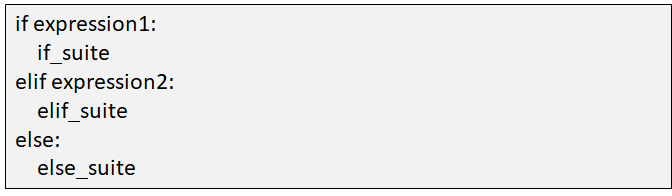

### 练习 2：编写判断成绩的程序

**需求**

1. 如果成绩大于60分，输出“及格”

2. 如果成绩大于70分，输出“良”

3. 如果成绩大于80分，输出“好”

4. 如果成绩大于90分，输出“优秀”

5. 否则输出“你要努力了”

**【方法一】编写判断成绩的程序**

```python
score = int(input('分数：'))
#程序的执行，是从上往下执行的；
#先判断大的数值，不满足再继续往下判断，可以简化程序代码
if score >= 90:
    print('优秀')
elif score >= 80:
    print('好')
elif score >= 70:
    print('良')
elif score >= 60:
    print('及格')
else:
    print('你要努力了！！！')
```

**【方法二】**

```python
score = int(input('分数：'))
#使用逻辑运算符and,判断分数，打印输出
if score >= 60 and score < 70:
    print('及格')
elif 70 <= score < 80:
    print('良')
elif 80 <= score < 90:
    print('好')
elif score >= 90:
    print('优秀')
else:
    print('你要努力了！！！')
```

### 练习 3：编写石头剪刀布小游戏

**需求：**

1. 计算机随机出拳

2. 玩家自己决定如何出拳

3. 代码尽量简化

**方法一：编写剪刀石头布小游戏**

```python
# 导入随机数的模块 random
import random
# 定义列表all_choices，存储出拳的每个选择
all_choices = ['石头','剪刀','布']
# random模块的choice方法，可以从变量中随机选出一个元素，随机出来的元素为电脑的出拳
computer = random.choice(all_choices)
# 使用input()函数，获取用户的出拳选择
player = input('请出拳(石头/剪刀/布):')
# 使用函数print()打印出电脑和玩家的出拳选择
# %s 是占位符，%(player,computer)中的两个变量会按照顺序替换 %s
print("Your choice: %s, Computer's choice: %s"  %(player,computer))
# 当玩家出拳为【石头】时，电脑的每一种出拳选择都要和【石头】进行比较，打印结果
if player == '石头':
    if computer == '石头':
        print('平局')
    elif computer == '剪刀':
        print('You WIN!!!')
    else:
        print('You LOSE!!!')
# 当玩家出拳为【剪刀】时，电脑的每一种出拳选择都要和【剪刀】进行比较，打印结果
elif player == '剪刀':
    if computer == '石头':
        print('You LOSE!!!')
    elif computer == '剪刀':
        print('平局')
    else:
        print('You WIN!!!')
# 当玩家出拳为【布】时，电脑的每一种出拳选择都要和【布】进行比较，打印结果
else:
    if computer == '石头':
        print('You WIN!!!')
    elif computer == '剪刀':
        print('You LOSE!!!')
    else:
        print('平局')
```

**方法二：**

```python
# 导入随机数的模块 random
import random
# 定义列表all_choices，存储出拳的每个选择
all_choices = ['石头','剪刀','布']
# 定义列表win_list, 将玩家赢电脑的选择，提前保存起来
# 每个子列表中，玩家为第一个元素，电脑为第二个元素
win_list = [['石头','剪刀'],['剪刀','布'],['布','石头']]
# random模块的choice方法，可以从变量中随机选出一个元素
# 随机出来的元素为电脑的出拳
computer = random.choice(all_choices)
# 使用input()函数，获取用户的出拳选择
player = input('请出拳(石头/剪刀/布):')
# 使用函数print()打印出电脑和玩家的出拳选择
# %s 是占位符，%(player,computer)中的两个变量会按照顺序替换 %s
print("Your choice: %s, Computer's choice: %s"  %(player,computer))

# 如果玩家和电脑的出拳相同，则平局
if player == computer:
    print('平局')
# 如果[玩家,电脑]的列表，在win_list中，则可判断玩家赢，因为在win_list中定义了玩家赢得各种可能性   
elif [player,computer] in win_list:
    print('You WIN!!!')
# 玩家不是赢，那么就是输了，玩家所有赢得可能性已经在win_list定义了    
else:
    print('You LOSE!!!')
```

# while 循环详解

在程序开发中，一共有三种流程方式：

* **顺序** —— **从上向下**，顺序执行代码
* **分支** —— 根据条件判断，决定执行代码的 **分支**
* **循环** —— 让 **特定代码 重复** 执行


## 循环概述

1. 一组被重复执行的语句称之为 **循环体**，能否继续重复，**决定循环的终止条件**
2. Python 中的循环中 **while** 循环和 **for** 循环
3. 循环 **次数未知** 的情况下，建议采用 while 循环
4. 循环 **次数可以预知** 的情况下，建议采用 **for** 循环

### 何时使用

- 减少重复性代码，提高代码效率

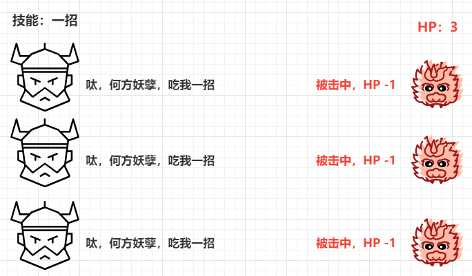

## while 循环语法结构

* 循环的作用就是让 **指定的代码** 重复的执行
* `while` 循环最常用的应用场景就是 **让执行的代码** 按照 **指定的次数** **重复** 执行

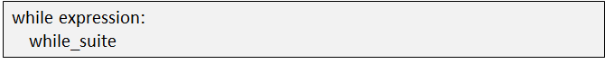

**注意**：

* `while` 语句以及缩进部分是一个 **完整的代码块**

### 案例：打印 5 遍 Hello World

**需求**

* 打印 5 遍 Hello World

```python
# 1. 定义重复次数计数器
i = 1
# 2. 使用 while 判断条件
while i <= 5:
    # 要重复执行的代码
    print("Hello Python")
    # 处理计数器 i
    i = i + 1
print("循环结束后的 i = %d" % i)
```

> 注意：循环结束后，之前定义的计数器条件的数值是依旧存在的

### 案例：使用 while 循环计算1~100的和

```python
# 0. 定义最终结果的变量
sum100 = 0
# 1. 定义一个整数的变量记录循环的次数
counter = 1
# 2. 开始循环，当 counter 小于等于100时，循环执行while中的程序
while counter <= 100:
    # 每一次循环，都让 sum100 这个变量和 counter 这个计数器相加
    sum100 += i
    # 处理计数器，控制循环次数
    counter += 1
print("0~100之间的数字求和结果 = %d" % sum100)
```

### 练习 1：完善石头剪刀布的游戏

**需求：**

1. 基于上节程序，复制到 game3.py

2. 实现循环结构，要求游戏三局两胜

**【优化一】让用户选择数字进行出拳**

```python
import random
# 定义列表all_choices，存储出拳的每个选择
# 定义列表win_list, 将玩家赢电脑的选择，提前保存起来；每个子列表中，玩家为第一个元素，电脑为第二个元素
all_choices = ['石头','剪刀','布']
win_list = [['石头','剪刀'],['剪刀','布'],['布','石头']]

# 定义变量prompt，存储用户的出拳方式
prompt = """(0) 石头
(1) 剪刀
(2) 布
请做出您的选择(0/1/2):"""

# 电脑从all_choices列表中，随机获取出拳方式
computer = random.choice(all_choices)

# 函数input(prompt)获取用户的键盘数字，每个数字都是列表all_choices的下标
# input()获取的值都是字符串，int()将字符串转换为整数类型
ind = int(input(prompt))

# 根据下标ind，从列表all_choice中对应的元素，赋值给player
player = all_choices[ind]
print("Your choice: %s, Computer's choice: %s" %(player,computer))

if player == computer:
    print('平局')
elif [player,computer] in win_list:
    print('You WIN!!!')
else:
    print('You LOSE!!!')
```

**【优化二】实现循环结构，要求游戏三局两胜**

```python
import random
all_choices = ['石头','剪刀','布']
win_list = [['石头','剪刀'],['剪刀','布'],['布','石头']]
prompt = """(0) 石头
(1) 剪刀
(2) 布
请做出您的选择(0/1/2/):"""

pwin = 0     #记录人胜利的次数 
cwin = 0     #记录计算机胜利的次数

# 此while循环，当玩家和电脑都没有胜利两次的时候，才会执行while中的程序，继续猜拳
# 当玩家或电脑有一方胜利两次时，条件不满足，结束循环，三局两胜完成
while pwin < 2 and cwin < 2:
    computer = random.choice(all_choices)
    ind = int(input(prompt))
    player = all_choices[ind]
    
    print("Your choice: %s, Computer's choice: %s" %(player,computer))
    if player == computer:
        print('平局')
    elif [player,computer] in win_list:
   		pwin += 1
        print('\033[31;1mYou WIN!!!\033[0m')
    else:
        cwin += 1
        print('You LOSE!!!')
```

## break、continue 和 else

> `break` 和 `continue` 是专门在循环中使用的关键字

* `break` **某一条件满足时**，退出循环，不再执行后续重复的代码
* `continue` **某一条件满足时，跳过当前循环**，不执行 continue 后续重复的代码

> `break` 和 `continue` 只针对 **当前所在循环** 有效

### break

- **在循环过程中**，如果 **某一个条件满足后**，**不** 再希望 **循环继续执行**，可以使用 `break` 退出循环

```python
sum100 = 0
counter = 1
while counter <= 100:
    if counter  == 2:
        break
    sum100 += counter
    counter += 1
print("退出循环")
print(sum100)
```

> `break` 只针对当前所在循环有效

**图例**

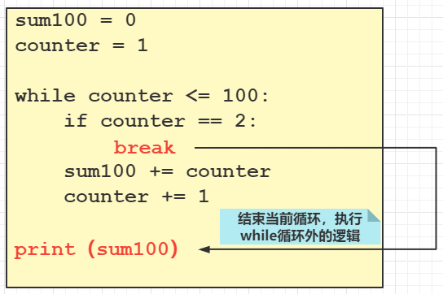

#### 练习 4：计算列表中前 5 个元素的和

```python
list01 = [10, 20, 30, 40, 50, 60, 70, 80, 90, 100]
index = 0
sum5 = 0
while True:
    if index >= 5:
        break
        print("break下的语句不会执行")
    sum5 += list01[index]
    index += 1
print(sum5)
```

### continue

* 当遇到 **continue** 语句时，程序会 **跳过当前循环**，并忽略剩余的语句，然后 **回到循环的顶端**
* 如果仍然满足循环条件，循环体内语句继续执行，否则退出循环

```python
sum100 = 0
counter = 1
while counter <= 100:
    if counter  == 2:
        continue
        print("continue下的语句不会执行")
    sum100 += counter
    counter += 1
print("循环")
print(sum100)
```

**图例**

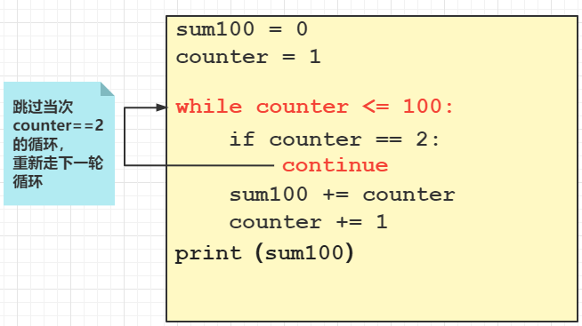


#### 练习 4：将 192.168.1 网段的 ip 添加到新的列表 dest 中（要求使用 continue 关键字）

```python
ips = ["192.168.1.100", "192.168.1.101", "192.168.2.100", "192.168.3.100", "192.168.1.200"]
index = -1
dest = []
while index < len(ips)-1:
    index += 1
    if ips[index][:9] != "192.168.1":
        continue
    dest.append(ips[index])
print(dest)
```

### else

- python 中的 while 语句也支持 else 子句

- **else 子句只在循环完成后执行**

- **break 语句也会跳过 else 块**

#### 练习 5：猜数字程序

**需求**

1. 系统随机生成 100 以内的数字

2. 要求用户猜生成的数字是多少

3. 最多猜 5 次，猜对结束程序

4. 如果5次全部猜错，则输出正确结果

```python
import random  # 调用随机数模块random
number = random.randint(1,100)  # 从1~100范围内，取出一个随机数
counter = 0  # 计数变量
while counter < 5:  # 指定猜的次数，0 - 4，共5次 
    answer = int(input("guess(1-100) "))  # 用户输入的猜测答案
    if answer == number:  # 判断猜测是否正确，正确就打印，并退出while循环
        print('猜对了')     
        break              
    elif answer > number:  # 如果猜大了，打印，并继续执行while循环
        print('猜大了')
    else:  # 如果猜大了，打印，并继续执行while循环
        print('猜小了')
    counter += 1  # 每次猜数，counter自加1
else:
    print('answer=%s' % number)
```

# for 循环详解

## for 循环语法结构

```python
for 变量 in 可迭代对象:
    for 循环逻辑
```

## 从购物过程理解 for 循环

**购物车**

我们都有在超市购物的经历，将一件一件的商品放进购物车：


我们如果把购物车比做一个容器，例如学习过的**列表，元组，字典**等数据结构，那么里面的商品就可以看成是一个个元素，而且购物车中的元素是有固定数量的。


**扫码结账**

当我们去超时收银台扫码结账的时候，店员会将购物车中的商品一件一件的取出，然后扫描二维码。注意这里的过程是拿一件，扫一件。

又因为购物车中商品数量是有限的，所以扫描商品的次数也是有限次。比如，购物车中有5件商品，那么最后就会扫描 5 次。


### 案例：扫描商品

```python
# cart 表示购物车
cart = ["巧克力派", "鱿鱼丝", "碎冰冰", "Python从入门到入坟"]

# for 的逻辑：店员每次从 cart 中拿出一个 item 进行扫码
for item in cart:
    print("扫码: " + item)
```

从上述代码可以看出，购物车cart中有5件商品，所以for中的print逻辑执行了5次。for一般用于指定次数的循环逻辑中，一般情况下，循环次数未知采用while循环，循环次数已知，采用for循环。在for关键字后面跟的这个item变量，变量名是可以根据变量命名规则更改的。

### 案例：计算购物车商品总价

```python
# cart_price 存放每个商品的价格
cart_price = [10, 15, 20, 99.99]

total_price = 0
# for 循环做价格的累加
for price in cart_price:
    total_price += price
print("总价为: " + str(total_price))
```

## 遍历以及迭代器

### 遍历

我们如果把店员将购物车商品一件一件取出进行扫码的过程，比喻成将某个容器中的元素一个个取出然后进行后续操作，这个过程就叫做遍历。、

遍历不仅限于列表，还适用于元组，字典和字符串类型。

### 可迭代对象

**概念：**一个实现了\_\_iter\_\_方法的对象是可迭代对象，一个实现next方法的对象则是迭代器。

**人话：**现阶段我们学过的可迭代对象有 **字符串，列表，元组，集合，字典，range()，并且能被 for 循环的都是可迭代对象。**

### 案例：遍历元组、字符串、字典

```python
# 遍历元组
tuple01 = (1, 2, 3, 4, 5)
for tuple_item in tuple01:
    print("tuple item: " + str(tuple_item))

# 遍历字符串
str01 = "hello world"
for str_item in str01:
    print(str_item)

# 遍历字典：默认遍历字典所有的key
dict01 = {"name": "zhangsan", "age": 18, "score": 88}
for dict_key in dict01:
    print("key: " + dict_key +", value: " + str(dict01[dict_key]))
```

## for 循环特性

### break、continue、else

| 关键字   | 作用                                          |
| :------- | --------------------------------------------- |
| break    | 结束当前循环                                  |
| continue | 跳出当次循环，记住执行下次循环                |
| else     | 循环正常结束（非 break 退出），执行 else 逻辑 |

### 案例：打印列表中元素，遇到小于0的元素停止打印

**break 应用**

```python
for item in [1, 2, 3, -4, 5, -6]:
    if item < 0:
        break
    print("item is: " + item)
print("for循环外部：打印完毕")
```

**图例说明：**

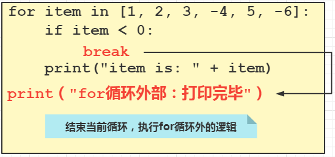

### 案例：计算列表中所有大于0的数字的和

**continue 应用**

```python
sum_for = 0
for item in [1, 2, 3, -4, 5, -6]:
	if item < 0:
        continue
	sum_for += item
    print("加了一次~")
print("for循环外部：计算完毕, sum: " + str(sum_for))
```

**图例说明：**

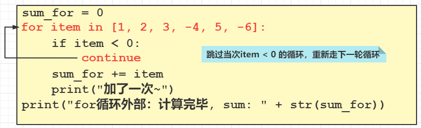

## range 函数

range 函数是一个内建函数，它的返回值是一个半闭半开范围内的数字。for 循环常与range函数一起使用，range 函数为循环提供条件。

**语法结构**

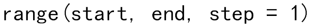

### 案例

**常规使用：**

```python
>>> tmp = range(1, 10)
>>> tmp
range(1, 10)
>>> len(tmp)
9
>>> list(tmp)
[1, 2, 3, 4, 5, 6, 7, 8, 9]
>>> tmp01 = range(5)
>>> tmp01
range(0, 5)
>>> list(tmp01)
[0, 1, 2, 3, 4]
```

**因为 range 函数的使用和切片比较类似，所以同样具有切片的使用特性：**

```python
>>> tmp = range(1, 10, 2)
>>> list(tmp)
[1, 3, 5, 7, 9]
>>> tmp01 = range(10, 1, -2)
>>> tmp01
range(10, 1, -2)
>>> list(tmp01)
[10, 8, 6, 4, 2]
```

### 与 for 循环一起使用

可以把 range 函数当成购物车，购物车中的商品是一个个范围内的数字，要想拿出里面的数字，就得遍历，所以 range 可以和 for 连用，可以控制循环次数。

#### 案例：打印 3 次"hello world"

```python
for i in range(3):
    print("第" + str(i) + "次：hello world")
```

如果直接打印 "hello world"：

```python
for i in range(3):
    print("hello world")
```

这里的变量 i 只是为了语法，在案例中没有实际意义，不写变量在语法层面会报错，这里的 range 只为控制循环次数。

#### 案例：作为序列的下标索引，获取元素

```python
# 打印下标为偶数的元素
list01 = ["zhangsan", "lisi", "wangwu", "zhaoliu"]
for i in range(len(list01)):  # len(list01): range(4) -> 0 1 2 3
    if i % 2 == 0:
        print(list01[i])
```

## 列表解析

它是一个非常有用、简单、而且灵活的工具，可以用来动态地创建列表

### 语法结构

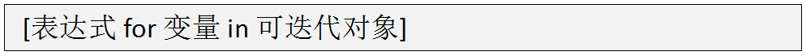

**说明**

这个语句的核心是 for 循环，它遍历可迭代对象的所有条目

expr 表达式应用于序列的每个成员，最后的结果值是该表达式产生的列表。也就类似于我们从购物车中拿出1件商品，接下来要做的事情。

### 案例：生成一个元素为 1~10 的列表

**for 循环方式：语法相对复杂，但是好理解**

```python
list01 = []
for i in range(1, 11):
    list01.append(i)
print(list01)
```

**列表解析式**

```python
list01 = [i for i in range(1, 11)]
```

列表解析式相对于for循环，只是变了一种结构，核心还是for循环，所以我们只需要关心语法即可。

### 练习：将刚才的 list01 列表的基础上对其中的每个元素加 1

```python
list01 = [1, 2, 3, 4, 5, 6, 7, 8, 9, 10]
list01 = [i+1 for i in list01]
print(list01)
```

## 综合练习

### 练习：斐波那契数列

1. 斐波那契数列就是某一个数，总是前两个数之和，比如 0，1，1，2，3，5，8
2. 使用for循环和range函数编写一个程序，计算有10个数字的斐波那契数列
3. 改进程序，要求用户输入一个数字，可以生成用户需要长度的斐波那契数列

**版本一**

```python
fib = [0,1]  # 定义列表，指定斐波那契数列的初始两个值
for i in  range(8):  # for循环执行8次，列表fib中的元素个数变为10【初始2个 + 新增的8个】
    fib.append(fib[-1] + fib[-2])  # 列表追加，每次都是最后一个元素和倒数第二个元素相加，产生新的元素
print(fib)  # 打印列表fib
```

**版本二：编写可以指定长度的斐波那契数列程序**

```python
fib = [0,1]  # 定义列表，指定斐波那契数列的初始两个值
n = int(input('长度: '))  # 定义变量n, 此变量为用户要看到的列表fib中的元素个数
# for循环执行n-2次，for循环执行多少次，列表fib会新增多少个元素
# 因为列表fib本身有两个初始值，所以要产生n-2个数字
for i in  range(n - 2):    
    fib.append(fib[-1] + fib[-2])  
print(fib)
```
