[TOC]

# 容器详解

## 列表

- 列表是 **有序、可变** 的数据类型
- 列表中可以包含 **不同类型** 的对象
- 列表可以由 **[]** 或 工厂函数 创建
- 支持 **下标** 及 **切片** 操作

### 列表的定义

```python
user_list = ["铁锤", "钢弹", "弹头"]
number_list = [98, 88, 666, 12, -1]
data_list = [1, True, "nfx"]
```

### 常用方法（功能：增删改查）

为了方便我们操作列表，Python中对所有列表提供了一些的功能。

| 序号 | 分类 | 关键字 / 函数 / 方法    | 说明                     |
| ---- | ---- | ----------------------- | ------------------------ |
| 1    | 增加 | 列表.insert(索引, 数据) | 在指定位置插入数据       |
|      |      | 列表.append(数据)       | 在末尾追加数据           |
|      |      | 列表.extend(列表2)      | 将列表2 的数据追加到列表 |
| 2    | 修改 | 列表[索引] = 数据       | 修改指定索引的数据       |
| 3    | 删除 | del 列表[索引]          | 删除指定索引的数据       |
|      |      | 列表.remove[数据]       | 删除第一个出现的指定数据 |
|      |      | 列表.pop                | 删除末尾数据             |
|      |      | 列表.pop(索引)          | 删除指定索引数据         |
|      |      | 列表.clear              | 清空列表                 |
| 4    | 统计 | len(列表)               | 列表长度                 |
|      |      | 列表.count(数据)        | 数据在列表中出现的次数   |
| 5    | 排序 | 列表.sort()             | 升序排序                 |
|      |      | 列表.sort(reverse=True) | 降序排序                 |
|      |      | 列表.reverse()          | 逆序、反转               |

#### 增

1. **追加**，在原列表中尾部追加值

   **图例**

   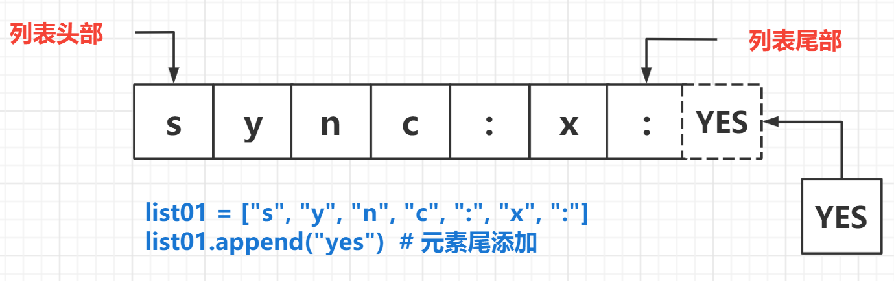

   **案例 1：向列表输入人员信息**
   
   ```python
    data_list = []
    v1 = input("请输入姓名")
    v2 = input("请输入昵称")
    data_list.append(v1)
    data_list.append(v2)
    print(data_list)
   ```

2. **插入**，在原列表的指定索引位置插入值

   **图例**

   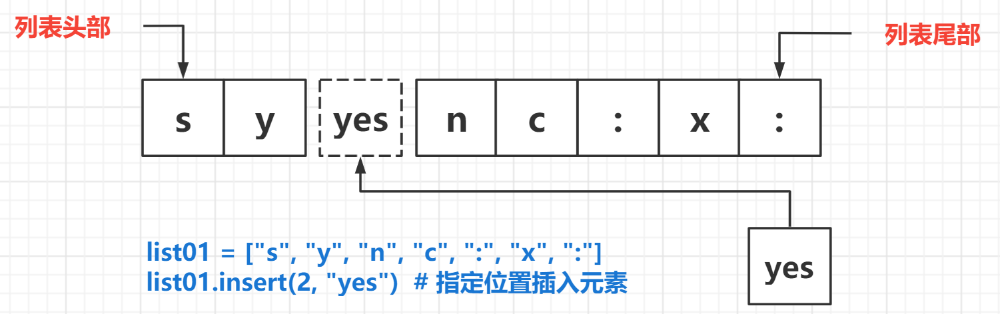

   **案例 2**

   ```python
    user_list = ["詹姆斯", "韦德", "波什"]
    user_list.insert(1,"安东尼")
    print(user_list)
   ```

3. **扩展**，将一个列表中的元素逐一添加另外一个列表

   **图例**

   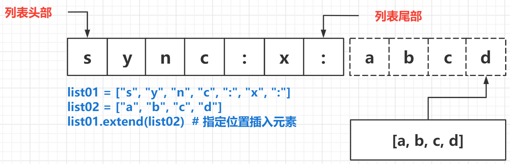

   **案例 3**

   ```python
   user_list = ["詹姆斯", "韦德", "波什"]
   suprs = ["邓肯", "吉诺比利", "帕克"]
   user_list.extend(suprs)  # suprs中的值逐一追加到 user_list 中
   print(user_list)
   ```

#### 删除

1. **删除**

   - **根据值**，remove(data)
   - 从左向右找，找到了就删除，然后停止搜索
   - **没有返回值**

   ```python
   user_list = ["詹姆斯", "韦德", "波什"]
   user_list.remove("波什")
   print(user_list)
   ```

2. **弹出**

   - 根据 **索引**
   - 从左向右找，找到了就弹出，然后停止搜索，默认弹出 **尾部元素**
   - **有返回值**

   ```python
   user_list = ["詹姆斯", "韦德", "波什"]
   player = user_list.pop()  # 弹出列表尾部元素
   print(user_list, player)
   user_list.pop(1)  # 弹出索引为 1 的元素
   print(user_list, player)
   ```

3. **del 关键字**

   * 使用 `del` 关键字(`delete`) 同样可以删除列表中元素
   * `del` 关键字本质上是用来 **将一个变量从内存中删除的**
   * 如果使用 `del` 关键字将变量从内存中删除，后续的代码就不能再使用这个变量了

   ```python
   user_list = ["詹姆斯", "韦德", "波什"]
   del user_list[2]
   print(user_list)
   ```

   > 在日常开发中，要从列表删除数据，建议 **使用列表提供的方法**

4. **清空** 原列表

   ```python
   user_list = ["詹姆斯", "韦德", "波什"]
   user_list.clear()
   print(user_list)
   ```

#### 改

- 修改动作一般是 **先查，后改**
- 查：**索引，切片**

```python
user_list = ["詹姆斯", "韦德", "波什"]
print(user_list[0])  # 查询，詹姆斯
user_list[0] = "杜兰特"  # 改
print(user_list)
```

#### 查

- 通过索引查询
- 通过切片查询

#### 遍历循环

* **遍历** 就是 **从头到尾** **依次** 从 **列表** 中获取数据
  * 在 **循环体内部** 针对 **每一个元素**，执行相同的操作
* 在 `Python` 中为了提高列表的遍历效率，专门提供的 **迭代 iteration 遍历**
* 使用 `for` 就能够实现迭代遍历

```python
# for 循环内部使用的变量 in 列表
for name in name_list:
    # 循环内部针对列表元素进行操作
    print(name)
```

**图例**

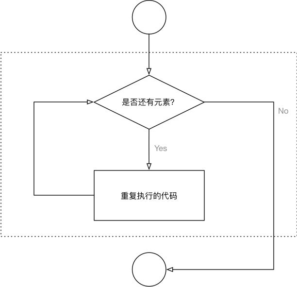

#### 其他

1. 获取长度：`len()`

   ```python
   user_list = ["詹姆斯", "韦德", "波什"]
   print( len(user_list) )
   ```

7. 反转：`reverse()`

   ```python
   user_list = ["詹姆斯", "韦德", "波什"]
   user_list.reverse()
   print(user_list)
   ```

3. 排序：`sort()`，给列表中的元素排序，**默认按从小到大的顺序**

   ```python
   num_list = [2, 3, 1, 4, -100, 10]
   num_list.sort()  # 默认从小到大，正序排列
   print(num_list)
   num_list.sort(reverse=True)  # reverse=True，倒序排列
   print(num_list)
   ```

4. 统计元素出现次数：`count()`

   ```python
   num_list = [2, 2, 3, 3, -100, 3]
   print(num_list.count(3))  # 2
   print(num_list.count(-100))  # 1
   ```

5. 转化：其他类型的元素转换成列表

   ```python
   message = "今天手感不错进了10个三分球"
   data = list(message)
   print(data)  # ['今', '天', '手', '感', '不', '错', '进', '了', '1', '0', '个', '三', '分', '球']
   ```

### 应用场景

* 尽管 `Python` 的 **列表** 中可以 **存储不同类型的数据**
* 但是在开发中，更多的应用场景是
  1. **列表** 存储相同类型的数据
  2. 通过 **迭代遍历**，在循环体内部，针对列表中的每一项元素，执行相同的操作

### 总结

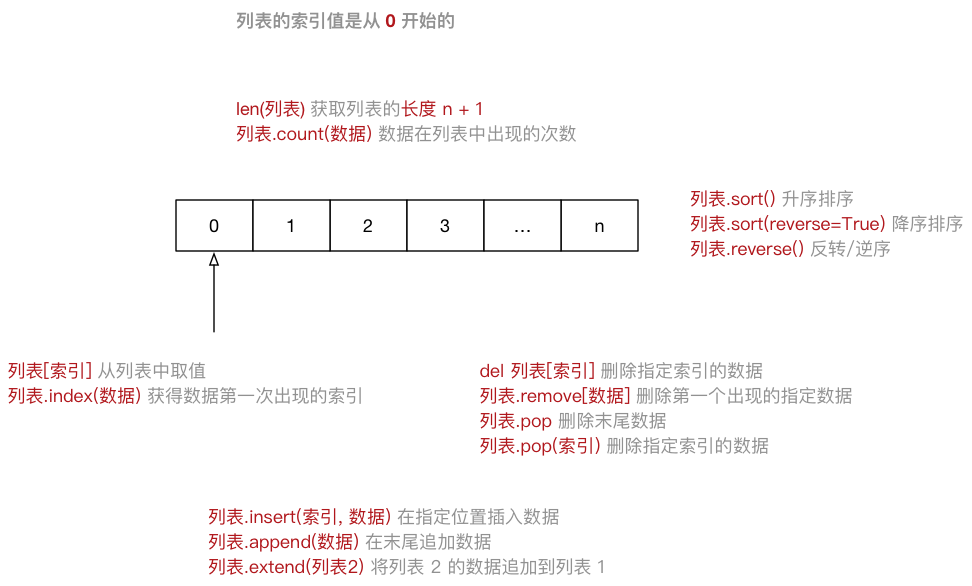

### 练习题

1. 写代码，有如下列表，按照要求实现每一个功能。

   ```python
   li = ["alex", "jerry", "tom", "barry", "wall"]
   ```

   - 计算列表的 **长度** 并输出
   - 请通过步长获取索引为 **偶数** 的所有值，并打印出获取后的列表
   - 列表中追加元素 **mike**，并输出添加后的列表
   - 请在列表的第 **1**个位置插入元素 **Tony** ，并输出添加后的列表
   - 请修改列表第 **2** 个位置的元素为 **Kelly**，并输出修改后的列表
   - 请将列表 **l2 = [1,”a”,3,4,”heart”]** 的每一个元素追加到列表 **li** 中，并输出添加后的列表
   - 请将字符串 **s = “qwert”** 的每一个元素添加到列表 **li** 中，一行代码实现，不允许循环添加
   - 请删除列表中的元素 **”barry”**，并输出删除后的列表
   - 请删除列表中的第 **2** 个元素，并 **输出** 删除元素后的列表

4. 请用代码实现循环输出元素和值：**user_list = ["詹姆斯", "韦德", "波什"]** ，如：

   ```
   0 詹姆斯 1 韦德 2 波什
   ```

5. 请用代码实现循环输出元素和值：**user_list = ["詹姆斯", "韦德", "波什"]** ，如：

   ```
   1 詹姆斯 2 韦德 3 波什
   ```

4. 写代码实现以下功能

   - 如有变量 **goods = ["暴风大剑", "无尽之刃", "狂徒铠甲"]** 提示用户可供选择的商品：

     ```
     0,暴风大剑 1,无尽之刃 2,狂徒铠甲
     ```

   - 用户输入索引后，将指定商品的内容拼接打印，如：用户输入0，则打印 您选择的商品是汽车。


## 元组

### 元组的定义

- 通过 `()` 或工厂函数 `tuple()` 创建元组
- 元组是**有序的、不可变类型**
- 与列表类似，作用于列表的操作，绝大数也可以作用于元组
- 一般用于存储一些在程序中不应该被修改的一系列值

### 常见操作

由于元组不可变的特性，所有没有 **增、删、改** 操作

```python
atuple = (10, 30, 25, 88)  # 定义一个元组
atuple[0] = 100  # 报错，元组定义以后，不可被修改，赋值
atuple.count(30)  # count(), 统计元组 atuple 中 30 出现的次数
atuple.index(88)  # index(), 计算元组 atuple 中元素 88 的下标
```

**注意：单元素元组的定义**

如果一个元组中只有一个元素，那么创建该元组时，需要加上一个 **逗号**，否则创建失败

```python
a = ("hello")  # 没加逗号的情况
print(a)
print(type(a))
a = ("hello", )  # 加逗号的情况
print(a)
print(type(a))
```

### 总结

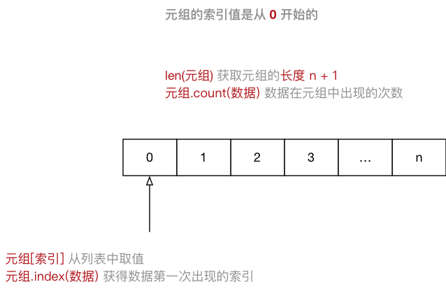

## 练习 1：用列表构建栈结构

**需求**

- 用列表构建 **栈结构**
  - 栈是一个 **后进先出** 的结构
  - 编写一个程序，用列表实现栈结构
  - 需要支持 **压栈、出栈、查询** 功能

**【版本一：架构】**

```python
def push_it():  # 函数push_it(), 功能：实现数据进栈
    print('push')

def pop_it():  # 函数pop_it(), 功能：实现数据出栈，后进先出
    print('pop')

def view_it():  # 函数view_it(), 功能：实现查看栈中的元素
    print('view')

def show_menu():  # show_menu()，功能：是实现和用户交互菜单列表
	# 定义变量prompt,提示用户输入选项
    prompt = """(0) push it			
(1) pop it
(2) view it
(3) exit
please input your choice(0/1/2/3): """
    while 1:  # while循环，让用户可以无限重复操作
        choice = input(prompt)  # 提示用户输入信息
        if choice not  in ['0', '1', '2', '3']:  # 如果用户输入不是0,1,2,3,提示重新输入
            print('Invalid input, try again.')
            continue  # 结束此次循环,直接开始下次循环

        if choice == '0':  # 用户选择0，调用进栈函数
            push_it()
        elif choice == '1':  # 用户选择1，调用出栈函数 
            pop_it()
        elif choice == '2':  # 用户选择2，调用视图函数 
            view_it()
        else:  # 用户选择3，打印bye，退出while循环
            print('Bye-bye')  
            break  # 直接退出while循环

if __name__ == '__main__':
    show_menu()  # 执行菜单函数
```

**【版本二：完整及优化】**

```python
stack = []  # 定义一个列表stack，用于存储栈数据
def push_it():  # 函数push_it(), 功能：实现数据进栈
    data = input('data: ').strip()  # strip()删除字串两边空白
    if data:  # data不为空,列表stack追加数据
        stack.append(data)
    else:  # data为空，打印print()
        print('Got nothing')

def pop_it():  # 函数pop_it(), 功能：实现数据出栈，后进先出
    if stack:  # 列表stack不为空，则弹出元素，pop()默认弹出列表最后一个元素
        print('From stack, popped: %s' % stack.pop())
    else:         #如果列表stack为空，打印空栈
        print('Empty Stack')

def view_it():  # 函数view_it(), 功能：实现查看栈中的元素
    print(stack)

def show_menu():  # show_menu()，功能：是实现和用户交互菜单列表
    # 定义字典cmds，用户选择数字时，返回不同的函数名
    # 这里不能直接写函数，例如：push_it()，因为结果为函数的返回值
    cmds = { '0': push_it, '1':pop_it, '2': view_it}
    
    # 定义变量prompt,提示用户输入选项    
    prompt = """(0) push it
(1) pop it
(2) view it
(3) exit
please input your choice(0/1/2/3): """

    while 1:				
        choice = input(prompt)      
        if choice not  in ['0', '1', '2', '3']:
            print('Invalid input, try again.')
            continue                 
        if choice == '3':  # 用户选择3，打印bye，退出while循环
            print('Bye-bye')
            break  # 直接退出while循环
        cmds[choice]()  # 当用户输入0，1，2时，返回对应的函数名，加上()即为函数调用，例如:push_it()

if __name__ == '__main__':
    show_menu()
```

## 字典

### 字典的定义

* `dictionary`（字典） 是 **除列表以外** `Python` 之中 **最灵活** 的数据类型
* 字典同样可以用来 **存储多个数据**
  * 通常用于存储 **描述一个 `物体` 的相关信息** 
* 和列表的区别
  * **列表** 是 **有序** 的对象集合
  * **字典** 是 **无序** 的对象集合
* 字典用 `{}` 定义
* 字典使用 **键值对** 存储数据，键值对之间使用 `,` 分隔
  * **键** `key` 是索引
  * **值** `value` 是数据
  * **键** 和 **值** 之间使用 `:` 分隔
  * **键必须是唯一的**
  * **值** 可以取任何数据类型，但 **键** 只能使用 **字符串**、**数字**或 **元组**

### 基本操作

#### 创建字典

- 通过 `{}` 操作符创建字典

- 通过 `dict()` 工厂方法创建字典

- 通过 `fromkeys()` 创建 **具有相同值** 的默认字典

**案例**

```python
dict01 = {"name": "zhangsan", "age": 18}
dict02 = dict([["name", "tom"], ["age", 18]])
dict03 = {}.fromkeys(('tom', 'bob', 'alice'), 18)  # 使用fromkeys()创建字典，第一列元组为键(key)，使用列表也可以，第二列为值(value)
```

### 常见方法

#### 访问字典：查询

字典是映射类型，意味着它没有下标，访问字典中的值需要使用相应的键

通过键 `(key)`，访问字典

```python
info = {"age":12, "status":True, "name":"nfx"}
print(dict01["name"])  # 获取 name 对应的 value
print("name" in dict01)  # 判断 name 是不是字典的 key

# 根据 name 为键去 info 字典中获取对应的值，如果不存在则返回 None，存在则返回值
info = {"age":12, "status":True,"name":"nfx"}
data = info.get("name",None) 
print(data) # 输出：nfx
```

##### 获取所有的键

通过 `字典对象.keys()` 获取

```python
info = {"age":12, "status":True, "name":"nfx","email":"xx@live.com"}
data = info.keys() # 获取字典的所有的键，返回一个"高仿的列表"，存放的都是字典中的key。
print(data) # 输出：dict_keys(['age', 'status', 'name', 'email'])
```

遍历：分别打印出每个 key

```python
info = {"age":12, "status":True, "name":"nfx","email":"xx@live.com"}
for ele in info.keys():
    print(ele)  # 打印出每个 key
    print(info[ele])  # 根据 key 获取并打印对应的 value
```

##### 获取所有的值

通过 `字典对象.values()` 获取

```python
info = {"age":12, "status":True, "name":"nfx","email":"xx@live.com"}
data = info.values()
print(data)  # 输出：dict_values([12, True, 'nfx', 'xx@live.com'])
```

遍历：分别打印出每个 value

```python
info = {"age":12, "status":True, "name":"nfx","email":"xx@live.com"}
for val in info.values():
    print(val) # 输出：dict_values([12, True, 'nfx', 'xx@live.com'])
```

##### 获取所有键值对

通过 `字典对象.items()` 获取

```python
info = {"age":12, "status":True, "name":"nfx","email":"xx@live.com"}
data = info.items()
print(data) # 输出 dict_items([('age', 12), ('status', True), ('name', 'nfx'), ('email', 'xx@live.com')])
```

遍历：分别打印出每个 `k:v` 对

```python
for item in info.items():
    print(item)  # item是一个元组 (键，值)
for key,value in info.items():
    print(key,value)  # key代表键，value代表值，将键值从元组中直接拆分出来了
```

#### 更新键值

通过 `字典对象.update()` 修改或添加

```python
info = {"age":12, "status":True}
info.update({"age":14,"name":"nfx"})  # info中没有的键直接添加；有的键则更新值
print(info) # 输出：{"age":14, "status":True,"name":"nfx"}
```

或者通过 `字典对象[key]` 修改或添加

```python
info = {"age":12, "status":True}
info["name"] = "nfx"  # info中没有的键直接添加
info["age"] = 18  # info中有的键则更新值
print(info)  # {"age":12, "status":True,"name":"nfx"}
```

`dict.setdefault(key, default=None)`：如果字典中不存在 key 键，由 `dict[key]=default` 为它赋值

```python
info = {"age":12, "status":True}
info.setdefault("age", 18)
info.setdefault("name", "nfx")
print(info)  # {"age":18, "status":True, "name":"nfx"}
```

#### 删除操作

`pop()`，**弹出指定键对应的元素并将弹出的元素返回**

```python
info = {"age":12, "status":True, "name":"nfx","email":"xx@live.com"}
info.pop("age")
print(info)  # {'status': True, 'name': 'nfx', 'email': 'xx@live.com'}
```

**del：删除指定的键值对，不返回数据**

```python
info = {"age":12, "status":True, "name":"nfx","email":"xx@live.com"}
del info["age"]
print(info)  # {'status': True, 'name': 'nfx', 'email': 'xx@live.com'}
```

**清空字典：clear()**

```python
info = {"age":12, "status":True, "name":"nfx","email":"xx@live.com"}
info.clear()
print(info)  # {}
```

#### 其他

字典相关函数

- len()：返回字典中元素的数目

- hash()：不是为字典设计，可以判断对象是否可以作为字典的键
  - hash() 可以判断对象是否可以作为字典的键：
    - 可变对象不能作为字典的key，例如：列表和字典；
    - 不可变对象可以作为字典的键，例如：数值，字符串，和元组；

#### 总结

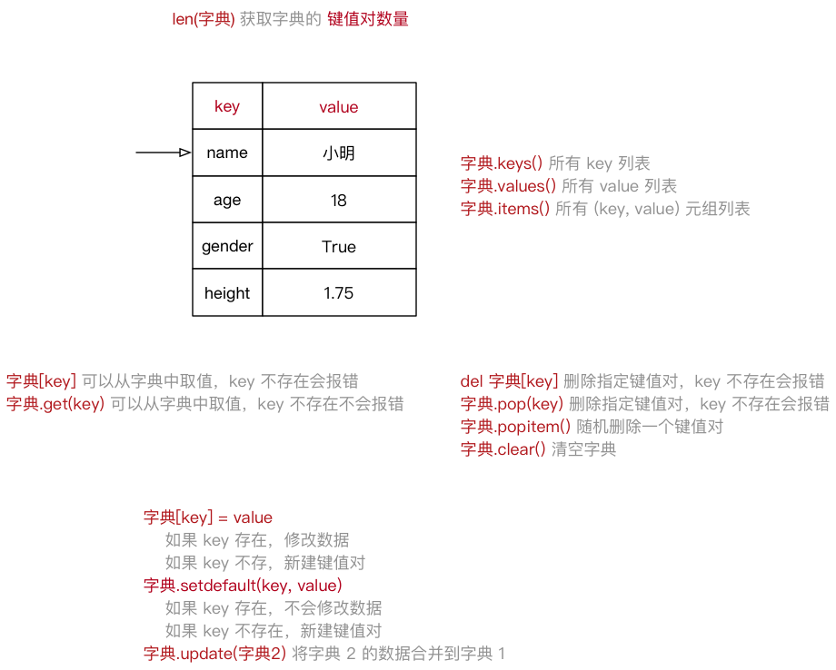

### 练习题

1. 字典 dict01 = {‘k1’: “v1”, “k2”: “v2”, “k3”: [11,22,33]}

```python
a. 请循环输出所有的key print(dict01.keys())
b. 请循环输出所有的value print(dict01.values())
c. 请循环输出所有的key和value print(dict01.items())
d. 请在字典中添加一个键值对，"k4": "v4"，输出添加后的字典 dict01["k4"] = "v4"
e. 请在修改字典中 "k1" 对应的值为 "alex"，输出修改后的字典 dict01["k1"] = "alex"
f. 请在k3对应的值中追加一个元素 44，输出修改后的字典
dict01["k3"].append(44) # list01 = dict01["k3"] list01.append(44)
g. 请在k3对应的值的第 1 个位置插入个元素 18，输出修改后的字典
dict01["k3"].insert(0, 18) # # list01 = dict01["k3"] list01.insert(0, 18)
```

2. 写代码

```python
有如下值 li= [11,22,33,44,55,66,77,88,99,90] ,将所有大于 66 的值保存至字典的第一个key对应的列表中，将小于 66 的值保存至第二个key对应的列表中。
result = {'k1':[],'k2':[]}
for item in li:
	if item >= 66:
		result["k1"].append(item)
	else:
		result["k2"].append(item)
print(result)
```

### 练习 2：模拟用户登录信息系统

**需求**

1. 支持新用户注册，新用户名和密码注册到字典中

2. 支持老用户登陆，用户名和密码正确提示登陆成功

3. 主程序通过循环询问，进行何种操作，根据用户的选择，执行注册或是登陆操作

**【版本一：代码架构】**

```python
def register():  # 函数register(), 功能：实现用户账号的注册
    pass
def login():  # 函数login(), 功能：用户可以使用用户名和密码进行登录
    pass
def show_menu():  # 函数show_menu(), 功能：是实现和用户交互菜单列表
	# 定义字典cmds，用户选择数字时，返回不同的函数名
    cmds = {'0': register, '1': login}
    # 定义变量prompt,提示用户输入选项 
    prompt = """(0) 注册
(1)登陆
(2)退出
请做出选择(0/1/2): """
    while 1:  # while循环，让用户可以无限重复操作
        choice = input(prompt).strip()  # 提示用户输入信息
        if choice not in ['0', '1', '2']:
            print('无效的输入，请重试。')
            continue  # 结束此次循环,直接开始下次循环
            
        if choice == '2':  # 用户选择2，打印bye，退出while循环
            print('Bye-bye')
            break  # 直接退出while循环
        cmds[choice]()  # 当用户输入0，1时，返回对应的函数名，()即为函数调用

if __name__ == '__main__':
	show_menu()
```

**【版本二：优化完整版】**

```python
import getpass  # 导入模块getpass
userdb = {}  # 定义一个字典，用于存储用户名和密码
def register():
    username = input('用户名： ').strip()  # strip()删除字串两边空白
    # 当username不为空，并且不在字典userdb中时才会创建密码，写入用户信息到字典
    if username and username not in userdb:
        password = input('密码: ')
        userdb[username] = password
    # 如果username为空值，并且在userdb中，执行print()    
    else:    
        print('您必须输入用户名，或用户名已存在')

def login():
    username = input('用户名： ').strip()  # strip()删除字串两边空白
    password = getpass.getpass('密码: ')  # 无显示输入密码
    
    #if (username not in userdb) or (userdb[username] != password):
    # 判断字典userdb中，是否存在用户username，不存在则userdb.get()返回空值，登录失败
    # 如果username用户存在，对应的值是否和password相等，不相等则登录失败
    if userdb.get(username) != password:
        print('登录失败')
    else:
        print('登录成功')

def show_menu():
	# 定义字典cmds，用户选择数字时，返回不同的函数名
    # 这里不能直接写函数，例如：register()，因为结果为函数的返回值
    cmds = {'0': register, '1': login}
    
    # 定义变量prompt,提示用户输入选项 
    prompt = """(0) 注册
(1)登陆
(2)退出
请做出选择(0/1/2): """
    
    while 1:  # while循环，让用户可以无限重复操作
        choice = input(prompt).strip()  # 提示用户输入信息
        if choice not in ['0', '1', '2']:
            print('无效的输入，请重试。')
            continue  # 结束此次循环,直接开始下次循环
            
        if choice == '2':  # 用户选择2，打印bye，退出while循环
            print('Bye-bye')
            break  # 直接退出while循环
        cmds[choice]()  # 当用户输入0，1时，返回对应的函数名，()即为函数调用

if __name__ == '__main__':
    show_menu()
```

## 集合

- 集合与元组和列表相似都用于做容器，在内部可以放一些子元素
- 集合有三特殊特点： `子元素不重复` 、 `子元素必须可哈希`、`无序`。

提示：目前可哈希的数据类型 `int/str/tuple`；不可哈希的类型 `dict/list/set` 。

### 常用方法

#### 创建集合

```python
set01 = {1, 2, 99, 18}
set02 = {"nfx", "Alex", "老妖", "Egon"}
set03 = {1, True, "world", (11, 22, 33)}
set03 = set("abc")
```

集合与字典虽然都是用`{}`括号，但字典内部是键值对，而集合内部直接是值。

#### 集合类型操作符

- 集合支持用 `in` 和 `not in` 操作符检查成员

- 能够通过 `len()` 检查集合大小

- 能够使用 `for` 迭代集合成员

- **不能取切片，没有键**

```python
set01 = {1, 2, 3, 4}
print(1 in set01)
print(len(set01))
for i in set01:
    print(i)
```

#### 添加元素 add()

```python
data = {"刘嘉玲", '关之琳', "王祖贤"}
data.add("郑裕玲")
print(data)

data = set()
data.add("周杰伦")
data.add("林俊杰")
print(data)
```

#### 删除元素

 **discard()**

- 从集合中移除一个元素 (如果它是成员)。
- 如果元素不是成员，则不做任何操作。

```python
data = {"刘嘉玲", '关之琳', "王祖贤"}
data.discard("刘嘉玲")
print(data)
```

**remove()**

- 从集合中移除一个元素；它 **必须** 是一个成员。
- 如果元素不是成员，则引发 **KeyError**。

```python
data = {"刘嘉玲", '关之琳', "王祖贤"}
data.remove("刘嘉玲")
print(data)
```

#### 交集

**图例**

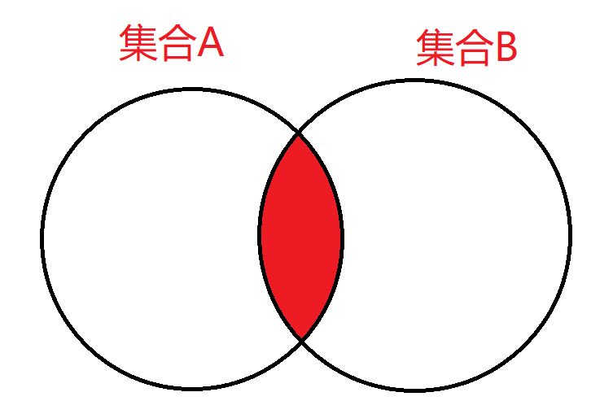

```python
s1 = {"刘能", "赵四", "⽪⻓⼭"}
s2 = {"刘科⻓", "冯乡⻓", "⽪⻓⼭"}
s3 = s1 & s2  # 方式一：取两个集合的交集
s4 = s1.intersection(s2) # 方式二：取两个集合的交集
print(s3, s4)
```

#### 并集

**图例**

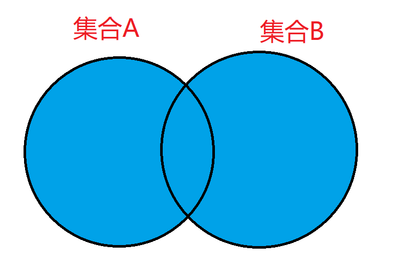

```python
s1 = {"刘能", "赵四", "⽪⻓⼭"}
s2 = {"刘科⻓", "冯乡⻓", "⽪⻓⼭"}
s3 = s1 | s2  # 方式一：取两个集合的并集
s4 = s1.union(s2) # 方式二：取两个集合的并集
print(s3, s4)
```

#### 差集

**图例**

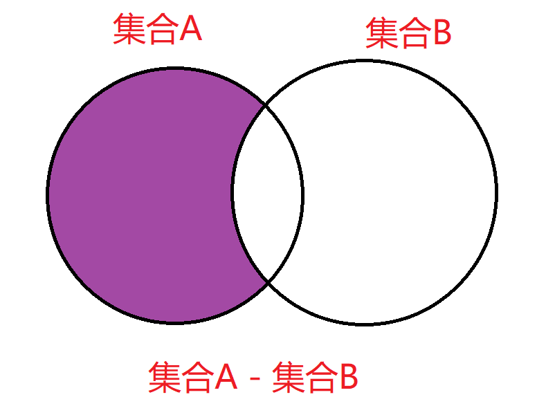

```python
s1 = {"刘能", "赵四", "⽪⻓⼭"}
s2 = {"刘科⻓", "冯乡⻓", "⽪⻓⼭"}
s3 = s1 - s2  # 方式一：差集，s1中有且s2中没有的值
s4 = s1.difference(s2)  # 方式二：差集，s1中有且s2中没有的值
print(s3, s4)
```

**图例**

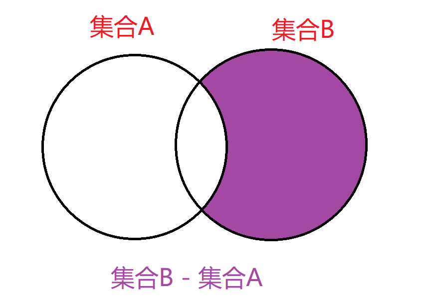

```python
s1 = {"刘能", "赵四", "⽪⻓⼭"}
s2 = {"刘科⻓", "冯乡⻓", "⽪⻓⼭"}
s3 = s2 - s1  # 方式一：差集，s2中有且s1中没有的值
s4 = s2.difference(s1)  # 方式二：差集，s2中有且s1中没有的值
print(s3, s4)
```

#### 其他

- 其他类型如果想要转换为集合类型，可以通过 `set `进行转换，并且如果数据有重复则 **自动去重**。

- **提示：**`int/list/tuple/dict` 都可以转换为集合。

```python
v1 = [11, 22, 33, 11, 3, 99, 22]
v2 = set(v1)
print(v2)  # {11,22,33,3,99}
print(list(v2))  # 再将set转换成list类型
```

### 练习 3：比较文件内容

**需求**

- 有两个文件：a.log 和 b.log
- 两个文件中有大量重复内容
- **取出只有在 b.log 中存在的行**

```python
# 定义变量，指定要操作的文件路径
fname1 = '/tmp/mima'
fname2 = '/tmp/mima2'

# 将对象fobj1转换为集合类型(集合中的元素无序排列，且不会重复)
with open(fname1) as fobj1:
    aset = set(fobj1)

# 将对象fobj2转换为集合类型(集合中的元素无序排列，且不会重复)
with open(fname2) as fobj2:
    bset = set(fobj2)

# 打开一个新的文件/tmp/result.txt，写入数据
# bset - aset 取出bset中包含，而在aset中不包含的行
with open('/tmp/result.txt', 'w') as fobj3:
    fobj3.writelines(bset - aset)
```
