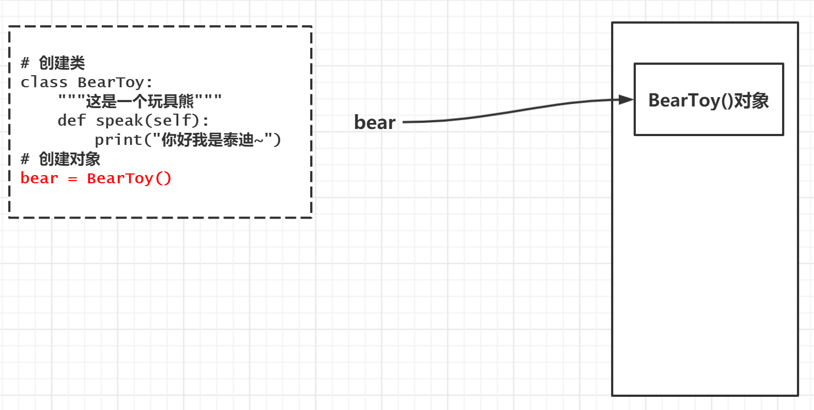
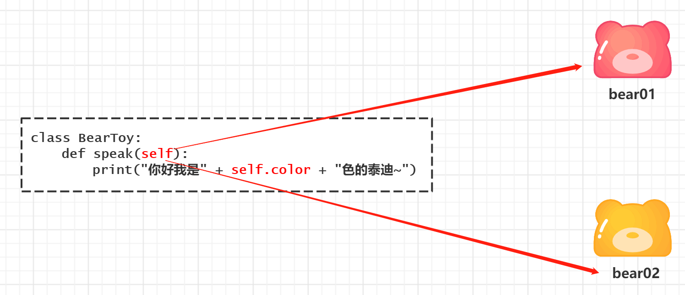
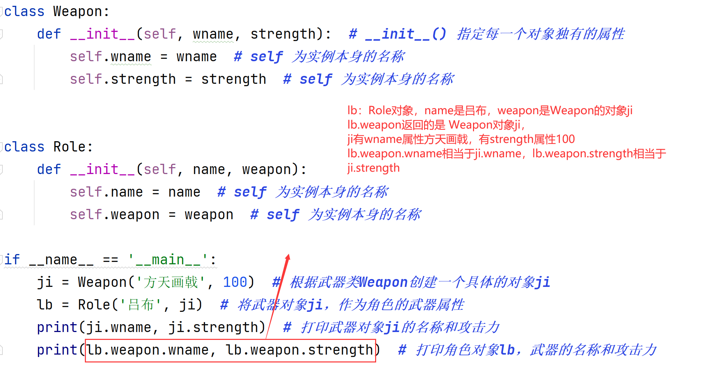

[TOC]

# 面向对象编程基础

## 面向过程

### 基本概念

面向过程是一种以事件为中心的编程思想，编程的时候把解决问题的步骤分析出来，然后用函数把这些步骤实现，在一步一步的具体步骤中再按顺序调用函数。


### 关注焦点 —— 怎么做？

1. 把完成某一个需求的 `所有步骤` `从头到尾` 逐步实现
2. 根据开发需求，将某些 **功能独立** 的代码 **封装** 成一个又一个 **函数**
3. 最后完成的代码，就是顺序地调用 **不同的函数**

**特点**

1. 注重 **步骤与过程**，不注重职责分工
2. 如果需求复杂，代码会变得很复杂
3. **开发复杂项目，没有固定的套路，开发难度很大！**

### 开个饭店—自力更生


**面向过程** 的设计思路是首先分析 **饭店经营** 的步骤 — **也就是所有事情自己做！！**！：

1. **买材料()** — 采购
2. **切菜切肉()** — 做饭
3. **端菜()** — 服务
4. **收钱()** — 收银结账

用函数实现上面一个一个的步骤，然后在主函数里依次调用上面的函数：

```python
if __name__ == '__main__':
    # 函数下都是我们自己的操作
    # 买材料()
    # 讨价还价()
    # 做饭()
    # 研究新菜谱()
    # 端菜()
    # 收钱()
    # 。。。。。。
```

而且面向过程不能将顺序打乱，否则会出大乱子，而且所有事情都自己做，估计还能活几天~

## 面向对象基本概念

* 我们之前学习的编程方式就是 **面向过程** 的
* **面向过程** 和 **面向对象**，是两种不同的 **编程方式**
* 对比 **面向过程** 的特点，可以更好地了解什么是 **面向对象**

### 基本概念

在日常生活或编程中，简单的问题可以用面向过程的思路来解决，直接有效，但是当问题的规模变得更大时，用面向过程的思想是远远不够的。所以慢慢就出现了面向对象的编程思想。世界上有很多人和事物，每一个都可以看做一个对象，而每个对象都有自己的属性和行为，对象与对象之间通过方法来交互。面向对象是一种以“对象”为中心的编程思想，把要解决的问题分解成各个对象，建立对象的目的不是为了完成一个步骤，而是为了描叙某个对象在整个解决问题的步骤中的属性和行为。


### 关注焦点 —— 谁来做？

> 相比较函数，**面向对象** 是 **更大** 的 **封装**，根据 **职责** 在 **一个对象中 封装 多个方法**

1. 在完成某一个需求前，首先确定 **职责** —— **要做的事情（方法）**
2. 根据 **职责** 确定不同的 **对象**，在 **对象** 内部封装不同的 **方法**（多个）**和属性**
3. 最后完成的代码，就是顺序地让 **不同的对象** 调用 **不同的方法**

**特点**

1. 注重 **对象和职责**，不同的对象承担不同的职责
2. 更加适合应对复杂的需求变化，**是专门应对复杂项目开发，提供的固定套路**
3. **需要在面向过程基础上，再学习一些面向对象的语法**

### 开个饭店—众人拾柴


| 采购人员   |      | 收银小姐姐 |      | 厨师         |      | 服务生     |
| ---------- | ---- | ---------- | ---- | ------------ | ---- | ---------- |
| **工资**   |      | **工资**   |      | **工资**     |      | **工资**   |
| 采购商品() |      | 收钱()     |      | 做饭()       |      | 接待顾客() |
| 讨价还价() |      | 找零()     |      | 研究新菜谱() |      |            |

# 类和对象

## 类和对象的概念

**类** 和 **对象** 是 **面向对象编程的 两个 核心概念**

### 类

* **类** 是对一群具有 **相同 特征** 或者 **行为** 的事物的一个统称，是抽象的，**不能直接使用**
  * **特征** 被称为 **属性**
  * **行为** 被称为 **方法**
* **类** 就相当于制造飞机时的**图纸**，是一个 **模板**，是 **负责创建对象的**


### 对象

* **对象** 是 **由类创建出来的一个具体存在**，可以直接使用
* 由 **哪一个类** 创建出来的 **对象**，就拥有在 **哪一个类** 中定义的：
  * 属性
  * 方法
* **对象** 就相当于用 **图纸** **制造** 的飞机

> 在程序开发中，应该 **先有类，再有对象**


## 类和对象的关系

* **类是模板**，**对象** 是根据 **类** 这个模板创建出来的，应该 **先有类，再有对象**
* **类** 只有一个，而 **对象** 可以有很多个
  * **不同的对象** 之间 **属性** 可能会各不相同
* **类** 中定义了什么 **属性和方法**，**对象** 中就有什么属性和方法，**不可能多，也不可能少**

## 类的设计

在使用面向对象开发前，应该首先分析需求，确定一下，程序中需要包含哪些类！

| 采购人员   |      | 收银小姐姐 |      | 厨师         |      | 服务生     |
| ---------- | ---- | ---------- | ---- | ------------ | ---- | ---------- |
| 工资       |      | 工资       |      | 工资         |      | 工资       |
| 采购商品() |      | 收钱()     |      | 做饭()       |      | 接待顾客() |
| 讨价还价() |      | 找零()     |      | 研究新菜谱() |      |            |

在程序开发中，要设计一个类，通常需要满足一下三个要素：

1. **类名** 这类事物的名字，**满足大驼峰命名法**
2. **属性** 这类事物具有什么样的特征
3. **方法** 这类事物具有什么样的行为

### 大驼峰命名法

`CapWords`

1. 每一个单词的首字母大写
2. 单词与单词之间没有下划线

### 类名的确定

**名词提炼法** 分析 **整个业务流程**，出现的 **名词**，通常就是找到的类

### 属性和方法的确定

* 对 **对象的特征描述**，通常可以定义成 **属性**
* **对象具有的行为**（动词），通常可以定义成 **方法**

> 提示：需求中没有涉及的属性或者方法在设计类时，不需要考虑

### 类设计：练习 1

**需求**

* **小明** 今年 **18 岁**，**身高 1.75**，每天早上 **跑** 完步，会去 **吃** 东西
* **小美** 今年 **17 岁**，**身高 1.65**，小美不跑步，小美喜欢 **吃** 东西 


### 类设计：练习 2

**需求**

- 一只 **大型** 的泰迪熊玩具

* 一只 **黄颜色** 的泰迪熊玩具
* 这只玩具熊会说话 **你好我是泰迪~**

# 面向对象实践

## 面向对象三大特性

1. **封装** 根据 **职责** 将 **属性** 和 **方法** **封装** 到一个抽象的 **类** 中
2. **继承** **实现代码的重用**，相同的代码不需要重复的编写
3. **多态** 不同的对象调用相同的方法，产生不同的执行结果，**增加代码的灵活度**

## 语法结构

### 定义只包含方法的类

* **方法** 的定义格式和之前学习过的 **函数** 的定义几乎一样
* 区别在于第一个参数必须是 `self`，大家暂时先记住，稍后介绍 `self`

```python
class 类名:

    def 方法1(self, 参数列表):
        pass
    
    def 方法2(self, 参数列表):
        pass
```

### 创建对象

```python
对象引用 = 类名()
```

### 案例

**需求**

* 一只玩具熊会说话 **你好我是泰迪~**

**分析**

- 定义一个玩具熊 `BearToy`

- 定义一个方法 `shout` 和 `shake`

- 分别调用上述两个方法

```python
# 创建类
class BearToy:
    """这是一个玩具熊"""
    def speak(self):
        print("你好我是泰迪~")
# 创建对象
bear = BearToy()
# 通过对象的引用调用方法
bear.speak()
```

**对象引用的说明**

* 在 `Python` 中使用类 **创建对象之后**，`bear` 变量中 仍然记录的是 **对象在内存中的地址**
* 也就是 `bear` 变量 **引用** 了 **新建的玩具熊对象**

**图例**



但是小熊还没有颜色和大小：

```python
# 创建对象
bear = BearToy()
bear.color = "yellow"  # 给熊添加颜色属性并赋值
bear.size = "big"  # 给熊添加大小属性并赋值
```

## 方法中的 self 参数

### 给对象增加属性

* 在 `Python` 中，要 **给对象设置属性**，非常的容易，**但是不推荐使用**
  * 因为：对象属性的封装应该封装在类的内部
* 只需要在 **类的外部的代码** 中直接通过 `.` 设置一个属性即可

> 注意：这种方式虽然简单，但是不推荐使用！因为没有加限制，任何属性都可。

```python
# 创建对象
bear = BearToy()
bear.color = "yellow"  # 给熊添加颜色属性并赋值
bear.lunzi = 4  # 给熊添加轮胎的属性，不合逻辑
```

### 使用 `self` 在方法内部输出每一只玩具熊的颜色

> 由 **哪一个对象** 调用的方法，方法内的 `self` 就是 **哪一个对象的引用**

* 在类封装的方法内部，`self` 就表示 **当前调用方法的对象自己**
* **调用方法时**，程序员不需要传递 `self` 参数
* **在方法内部**
  * 可以通过 `self.` **访问对象的属性**
  * 也可以通过 `self.` **调用其他的对象方法**
* 改造代码如下：

```python
class BearToy:
    def speak(self):
        print("你好我是" + self.color + "色的泰迪~")

bear01 = BearToy()
bear01.color = "red"  # 给熊添加颜色属性并赋值
bear01.speak()

bear02 = BearToy()
bear02.color = "yellow"  # 给熊添加颜色属性并赋值
bear02.speak()
```

**图例**



**总结**

* 在 **类的外部**，通过 `变量名.` 访问对象的 **属性和方法**
* 在 **类封装的方法中**，通过 `self.` 访问对象的 **属性和方法**

## \_\_init\_\_ 初始化方法

### 问题

* 将案例代码进行调整，**先调用方法 再设置属性**，观察一下执行效果

```python
bear01 = BearToy()
bear01.speak()
```

* 程序执行报错如下：

```
AttributeError: 'BearToy' object has no attribute 'color'
属性错误：'BearToy' 对象没有 'color' 属性
```

**提示**

* 在日常开发中，不推荐在 **类的外部** 给对象增加属性
  * 如果**在运行时，没有找到属性，程序会报错**
* 对象应该包含有哪些属性，应该 **封装在类的内部**

* 当使用 `类名()` 创建对象时，会 **自动** 执行以下操作：
  1. 为对象在内存中 **分配空间** —— 创建对象
  2. 为对象的属性 **设置初始值** —— 初始化方法(`init`)
* 这个 **初始化方法** 就是 `__init__` 方法，`__init__` 是对象的**内置方法**

> `__init__` 方法是 **专门** 用来定义一个类 **具有哪些属性的方法**！

在 `BearToy` 中增加 `__init__` 方法，验证该方法在创建对象时会被自动调用

### 初始化方法的调用时机

```python
class BearToy:  # 定义类BearToy
    def __init__(self):
        print("对象初始化")
if __name__ == "__main__":
    tidy01 = BearToy()
    tidy02 = BearToy()
    tidy03 = BearToy()
```

### 在初始化方法内部定义属性

给小熊的颜色在初始化的时候就确定

```python
class BearToy:  # 定义类BearToy
    def __init__(self):
        print("对象初始化")
        self.color = "yellow"
        self.size = "big"
    def speak():
        print("颜色: " + self.color + "，大小：" + self.size)
if __name__ == "__main__":
    tidy01 = BearToy()
    tidy01.speak()
    tidy02 = BearToy()
    tidy02.speak()
```

发现颜色和大小都一样，能不能各自有各自的颜色和大小，进一步修改：

```python
class BearToy:  # 定义类BearToy
    def __init__(self, color):
        print("对象初始化")
        self.color = color
    def speak():
        print("颜色: " + self.color + "，大小：" + self.size)
if __name__ == "__main__":
    tidy01 = BearToy("red", "big")
    tidy01.speak()
    tidy02 = BearToy("yellow", "small")
    tidy02.speak()
```

### 练习 3：编写游戏人物

**需求：**

- 创建游戏角色类
- 游戏人物角色拥有名字、武器等属性
- 游戏人物具有攻击和行走的方法
- 武器通过武器类实现

```python
# 创建新的python文件myclass.py，编写游戏人物
class Role:				#定义类Role【拥有相同属性和方法的对象的集合】
    def __init__(self, name, weapon):		#__init__() 可以指定每一个对象独有的属性
        self.name = name            #self 为实例本身的名称
        self.weapon = weapon        #self 为实例本身的名称
#类方法，即类中定义的函数，可以由对象去调用
    def attack(self, target):       #self 为实例本身的名称
        print('我是%s, 正在攻击%s' % (self.name, target))

if __name__ == '__main__':
    lb = Role('吕布', '方天画戟')     #根据Role类创建一个具体的对象lb
    print(lb.name, lb.weapon)       #打印对象lb的名字和武器
    lb.attack('张飞')                #让对象调用类方法attack()
```

## 组合

### 什么是组合

- 类被定义后，目标就是要把它当成一个模块来使用，并把这些对象嵌入到你的代码中去
- 组合就是让不同的类混合并加入到其它类中来增加功能和代码重用性
- 可以在一个大点的类中创建其它类的实例，实现一些其它属性和方法来增强原来的类对象

### 组合应用

- 两个类明显不同
- 一个类是另一个类的组件

### 案例：组合实践

```python
# 创建新的python文件myclass2.py，类的组合应用
class Weapon:
    def __init__(self, wname, strength):  # __init__() 指定每一个对象独有的属性
        self.wname = wname  # self 为实例本身的名称
        self.strength = strength  # self 为实例本身的名称


class Role:
    def __init__(self, name, weapon):
        self.name = name  # self 为实例本身的名称
        self.weapon = weapon  # self 为实例本身的名称


if __name__ == '__main__':
    ji = Weapon('方天画戟', 100)  # 根据武器类Weapon创建一个具体的对象ji
    lb = Role('吕布', ji)  # 将武器对象ji，作为角色的武器属性
    print(ji.wname, ji.strength)  # 打印武器对象ji的名称和攻击力
    print(lb.weapon.wname, lb.weapon.strength)  # 打印角色对象lb，武器的名称和攻击力
```

**图例**



## 继承

### 继承的概念、语法和特点

- **继承的概念**：**子类** 拥有 **父类** 的所有 **方法** 和 **属性**


### 继承的语法

```python
class 类名(父类名):
    pass
```

* **子类** 继承自 **父类**，可以直接 **享受** 父类中已经封装好的方法，不需要再次开发
* **子类** 中应该根据 **职责**，封装 **子类特有的** **属性和方法**

### 案例：继承实践

【实践1】

```python
# 创建新的python文件myclass3.py，创建子类【自动继承父类的变量和方法】
class Role:
    def __init__(self, name, weapon):
        self.name = name                #self 为实例本身的名称
        self.weapon = weapon            #self 为实例本身的名称   

    def show_me(self):                  #self 为实例本身的名称
        print('我是%s，我用的武器是%s' % (self.name, self.weapon))

class Warrior(Role):		#创建子类, 小括号()中要写父类的类名【继承父类变量和方法】
    pass

class Mage(Role):		#创建子类Mage, 小括号()中要写父类的类名【继承父类变量和方法】
    pass

if __name__ == '__main__':
    lb = Warrior('吕布', '方天画戟')   	    #根据子类Warrior，创建一个具体的对象lb 
    km = Mage('孔明', '羽扇')
    lb.show_me()					#调用子类的实例对象lb和km中的方法show_me()
    km.show_me()
```

【实践2】

```python
# 在myclass3.py中，子类定义自己的方法
class Role:
    def __init__(self, name, weapon):
        self.name = name                #self 为实例本身的名称
        self.weapon = weapon            #self 为实例本身的名称   
    def show_me(self):                  #self 为实例本身的名称
        print('我是%s，我用的武器是%s' % (self.name, self.weapon))

class Warrior(Role):
    def attack(self, target):		#子类Warrior定义自己的方法
        print('与%s近身肉搏' % target)

class Mage(Role):
    def attack(self, target):			#子类Mage定义自己的方法
        print('远程打击%s' % target)

if __name__ == '__main__':
lb = Warrior('吕布', '方天画戟 ')
km = Mage('孔明', '羽扇')
lb.show_me()
km.show_me()
lb.attack('张飞')		#子类的对象调用自己的方法attack()
km.attack('曹操')
```

【实践3】

**通过继承覆盖方法**

- 如果子类中有和父类同名的方法，父类方法将被覆盖
- 如果需要访问父类的方法，则要调用一个未绑定的父类方法，明确给出子类的实例

```python
# 在myclass3.py中，编写子类通过继承覆盖父类的方法
class Role:
    def __init__(self, name, weapon):
        self.name = name  # self 为实例本身的名称
        self.weapon = weapon  # self 为实例本身的名称

    def show_me(self):  # self 为实例本身的名称
        print('我是%s，我用的武器是%s' % (self.name, self.weapon))


class Warrior(Role):
    # 方法一：子类通过继承覆盖父类方法
    # def __init__(self, name, weapon, ride):
    #     self.name = name
    #     self.weapon = weapon
    #     self.ride = ride

    # 方法二：子类通过继承覆盖父类方法【推荐使用】
    # def __init__(self, name, weapon, ride):
    #     Role.__init__(self, name, weapon)
    #     self.ride = ride

    # 方法三：子类通过继承覆盖父类方法
    def __init__(self, name, weapon, ride):
        super(Warrior, self).__init__(name, weapon)
        self.ride = ride

    def attack(self, target):
        print('与%s近身肉搏' % target)


class Mage(Role):
    def attack(self, target):
        print('远程打击%s' % target)


if __name__ == '__main__':
    lb = Warrior('吕布', '方天画戟', '赤兔马')  # 子类Warrior多了一个变量ride，需要添加'赤兔马'
    km = Mage('孔明', '羽扇')
    lb.show_me()
    km.show_me()
    lb.attack('张飞')
	km.attack('曹操')
```

### 多重继承

- Python 允许多重继承，即：一个类可以是多个父类的子类，子类可以拥有所有父类的属性
- 在使用方法时，python有自己的查找顺序：自下向上，自左向右

```python
# 创建新的python文件multi_extend.py，初始代码
class A:				#定义类A, 方法为func1()
    def func1(self):
        print('A func')

class B:
    def func2(self):
        print('B func')

class C(A, B):
    def func3(self):
        print('C func')

if __name__ == '__main__':
    c1 = C()
    c1.func1()
    c1.func2()
    c1.func3()

(mypy) [root@localhost xxx]# python multi_extend.py
A func
B func
C func

# 类A和B中添加函数func4()
class A:
    def func1(self):
        print('A func')
    def func4(self):		#类A中，包含同样的方法名func4()
        print('A func4')

class B:
    def func2(self):
        print('B func')  
    def func4(self):		#类B中，包含同样的方法名func4() 
        print('B func4')

class C(A, B):
    def func3(self):
        print('C func')

if __name__ == '__main__':
    c1 = C()
    c1.func1()
    c1.func2()
    c1.func3()
    c1.func4()

(mypy) [root@localhost xxx]# python multi_extend.py
```

## 类的特殊方法

- 在 Python 中，所有以 “__” 双下划线包起来的方法，都统称为 “Magic Method”
- 如果对象实现了这些魔法方法中的某一个，那么这个方法就会在特殊的情况下被 Python 所调用
- 通过 dir() 可以查看对象的全部属性

查看魔法方法

```python
(mypy) [root@localhost xxx]# python
>>> dir(10)           #查看数值的魔法方法
>>> dir('abc')         #查看字符串的魔法方法
```

- __ init __ 方法：实例化类实例时默认会调用的方法
- __ str __ 方法：打印/显示实例时调用方法，返回字符串
- __ call __ 方法：用于创建可调用的实例

```python
# 创建新的python文件books.py，魔法方法 __str__，__call__方法的使用
class Book:		#创建类Book, 定义魔法方法，实现对书籍信息的打印
    def __init__(self, title, author):	#定义__init__方法，获取书籍的信息【默认自动调用】
        self.title = title
        self.author = author
    def __str__(self):				#定义__str__方法, 必须返回一个字符串
        return  '《%s》' % self.title
    def __call__(self):				#用于创建可调用的实例，直接作为方法调用
        print('《%s》是%s编写的' % (self.title, self.author))

if __name__ == '__main__':
    pybook = Book('Python核心编程', '韦斯利')  	# 抽象出对象pybook
    print(pybook)     						# 调用__str__方法,打印书名
    pybook()          						# 调用实例，默认调用__call__方法
```

# 正则表达式及re模块

## 复习正则表达式

```python
(mypy) [root@localhost xxx]# vim tm.txt
tam tbm tcm txm tom tomorrow
t0m t1m t2m t8m t10m
t m t_m t^m t@m t$m t-m
tabm tababm tabababm tababababm
tm ttm tttm ttttm tttttm ttttttm tttttttm
(mypy) [root@localhost day03]# vim tm.txt		#打开文件tm.txt, 进入查询模式【/】，——》练习单个字符的匹配

#01 ——》【查询模式】/t.m            	匹配t和m之间的任意字符 
#02 ——》【查询模式】/t[a-z]m        	匹配t和m之间是小写字母的单词
#03 ——》【查询模式】/t[abcd1234]m   	匹配t和m之间是abcd1234的单词
#04 ——》【查询模式】/t[0-9]m        	匹配t和m之间是0-9数字的单词
#05 ——》【查询模式】/t[0-10]m       	匹配t和m之间是0-1或0的单词
#06 ——》【查询模式】/t[^0-9]m       	匹配t和m之间不是数字的单词
#07 ——》【查询模式】/t[0-9^]m      	匹配t和m之间是0-9数字或^的单词
#08 ——》【查询模式】/t\dm           	匹配t和m之间是0-9数字的单词
#09 ——》【查询模式】/t\Dm           	匹配t和m之间不是0-9数字的单词
#10 ——》【查询模式】/t\wm           	匹配t和m之间是数字、字母或下划线单词
#11 ——》【查询模式】/t\Wm           	匹配t和m之间不是数字,字母或下划线单词
#12 ——》【查询模式】/t\sm           	匹配t和m之间是空白字符的单词
#12 ——》【查询模式】/t\Sm           	匹配t和m之间不是空白字符的单词

匹配一组字符，打开文件tm.txt, 进入末行模式【/】，——》练习一组字符的匹配
(mypy) [root@localhost xxx]# vim tm.txt
#01 ——》【查询模式】/tabm             		匹配字符tabm
#02 ——》【查询模式】/tam\|t2m\|tababm    	匹配字符tam 或t2m 或tababm
#03 ——》【查询模式】/t*m              		匹配字符t零次或多次，以m结尾
#04 ——》【查询模式】/t.*m             		匹配t和m之间有任意多个字符【.*】
#05 ——》【查询模式】/t\+m             		匹配字符t一次或多次，以m结尾
#06 ——》【查询模式】/t\(ab\)\+m        匹配字符ab一次或多次，以t开头，以m结尾
#07 ——》【查询模式】/t\(ab\)\?m        匹配字符ab零次或一次，以t开头，以m结尾
#08 ——》【查询模式】/t\{3,5\}m        	匹配字符t三次到五次，以t开头，以m结尾
#09 ——》【查询模式】/t\{3,\}m         	匹配字符t三次以上，以t开头，以m结尾
#10 ——》【查询模式】/t\{,3\}m         	匹配字符t最多三次，以t开头，以m结尾
#11 ——》【查询模式】/t\{3\}m         	匹配字符t三次，以t开头，以m结尾

其他元字符，打开文件tm.txt, 进入末行模式【/】，——》练习其他元字符的匹配
(mypy) [root@localhost xxx]# vim tm.txt
#01 ——》【查询模式】/^t\wm   匹配以t开头,中间是数字、字母或下划线, m结尾的单词
#02 ——》【查询模式】/t\wm$   匹配t, 中间是数字、字母或下划线, 以m结尾的单词
#03 ——》【查询模式】/tom     		匹配所有的tom
#04 ——》【查询模式】/\<tom\>     	匹配独立的单词,连续字符串内的tom不再匹配
```

## re 模块

### match 函数

- 尝试用正则表达式模式从字符串的 **开头匹配**，**如果匹配成功，则返回一个匹配对象；否则返回 None**

#### 案例：使用match函数匹配字符串

```python
>>> import re		#导入正则表达式模块
>>> re.match('foo', 'food')		#匹配字符串'food'中是否包含字符'foo'，包含返回一个对象
<re.Match object; span=(0, 3), match='foo'>
>>> re.match('foo', 'food').group() 	#匹配'seafood'中是否包含字符'foo'，不包含返回None
'foo'
```

### search 函数

- 在字符串中查找正则表达式模式的第一次出现，如果匹配成功，则返回一个匹配对象；否则返回 None。

#### 案例

```python
>>> import re		# 导入正则表达式模块
>>> m = re.search('foo', 'food')	# 匹配字符串'food'中是否包含字符'foo'，包含返回一个对象
>>> print(m)					# 打印对象m
<re.Match object; span=(0, 3), match='foo'>
>>> m = re.search('foo', 'seafood')		# 字符串'seafood'中是否包含字符'foo'，包含返回对象
>>> m
>>> m.group()		# 通过group()，取出m对象中的内容
```

### findall 函数

- 在字符串中查找正则表达式模式的所有（非重复）出现；返回一个匹配对象的列表

#### 案例

```python
>>> import re		# 导入正则表达式模块
>>> re.findall('foo', 'seafood is food')		# 查找所有的'foo'，会返回在一个列表中
['foo', 'foo']
```

### finditer函数

- 查找字符串中所有匹配字符【返回迭代器】

#### 案例

```python
>>> import re		# 导入正则表达式模块
>>> re.finditer('foo', 'seafood is food')		#查找所有的'foo'，返回在一个迭代器对象中
>>> list(re.finditer('foo', 'seafood is food'))		#将迭代器对象转换为列表，验证结果
>>> for m in re.finditer('foo', 'seafood is food'):		#for循环遍历finditer迭代器对象中元素
...     m.group()
```

### split 方法

- 根据正则表达式中的分隔符把字符分割为一个列表，并返回成功匹配的列表

- 字符串也有类似的方法，但是正则表达式更加灵活

#### 案例

```python
# split方法，使用正则切割字符串
>>> s1 = 'hello-world-how-are-you.tar.gz'		#定义一个字符串s1
>>> s1.split('-')								#split()，将字符串s1，用字符'-'进行切割
>>> s1.split('.')				#split()，将字符串s1，用字符'.'进行切割
>>> re.split('-|\.', s1)		#split()，使用正则，将字符串s1，用字符'-' 或'.'行切割，'.'代表任意字符，要用'\'进行转义
```

### sub方法

- 把字符串中所有匹配正则表达式的地方替换成新的字符串

```python
>>> import re		# 导入正则表达式模块
>>> re.sub('X', 'nfx', 'Hi X, Nice to meet you, X')		#将字符串中的'X', 替换成'nfx'
```

### compile函数

- 对正则表达式模式进行编译，返回一个正则表达式对象
- 不是必须要用这种方式，但是在大量匹配的情况下，可以提升效率

#### 案例

```python
>>> patt = re.compile('f..')		#编译正则表达式'f..'【匹配包含f的任意三个字串】
>>> m = patt.search('seafood is food')		#search(), 在字符串中，匹配正则表达式patt【f..】
>>> m			#查看对象m
>>> m.group()		#查看m中的对象

# findall(), 在字符串'seafood is food'中，匹配正则表达式patt【f..】
>>> patt.findall('seafood is food')		#将查找到的所有'foo'，返回在一个列表中
```

## 练习 4：分析 apache 访问日志

**需求：编写一个apache 日志分析脚本(count_patt.py)：**

- 统计每个客户端访问 apache 服务器的次数
- 将统计信息通过字典的方式显示出来
- 分别统计客户端是 Firefox 和 MSIE 的访问次数
- 分别使用函数式编程和面向对象编程的方式实现

【前序知识】

```python
# 将日志文件 access_log 上传到 /root/ 家目录下
(mypy) [root@localhost xxx]# head -1 /root/access_log
172.40.58.150 - - [26/Nov/2017:10:09:47 +0800] "GET / HTTP/1.1" 403 4897 "-" "Mozilla/5.0 (X11; Linux x86_64) AppleWebKit/537.36 (KHTML, like Gecko) Chrome/60.0.3112.113 Safari/537.36"
# 字典中get(key, '字符串')方法的使用，key存在则返回对应的value，不存在则返回自定义的‘字符串’
>>> patt_dict = {}			#定义字典
>>> key = '1.1'				#声明变量key
>>> patt_dict[key] = patt_dict.get(key, 0) + 1		#给字典添加元素，key存在则返回对应的value，不存在则返回0
>>> patt_dict				#查看字典中的元素
{'1.1': 1}

>>> patt_dict[key] = patt_dict.get(key, 0) + 1		
>>> patt_dict				#查看字典中的元素
{'1.1': 2}

>>> patt_dict[key] = patt_dict.get(key, 0) + 1
>>> patt_dict				#查看字典中的元素
{'1.1': 3}
```

**第一步：创建新的python文件count_patt.py，使用正则表达式过滤出IP地址和浏览器**

```python
import  re						#导入正则表达式的模块re
def count_patt(fname, patt):			#函数count_patt(), 功能：分析apache访问日志
	pass
if __name__ == '__main__':
    fname = '/root/access_log'       	#指定文件名
    ip = '(\d+\.){3}\d+'            		#使用正则匹配出IP地址
    br = 'Chrome|MSIE|Firefox'       	#使用正则匹配出浏览器
    result1 = count_patt(fname, ip)    	#统计文件中的IP地址的个数    
    result2 = count_patt(fname, br)    	#统计文件中的浏览器的个数  
    print(result1)         				#打印result1
    print(result2)
```

**第二步：编写函数count_patt()**

```python
import  re		#导入正则表达式的模块res
def count_patt(fname, patt):		#函数count_patt(), 功能：分析apache访问日志
    patt_dict = {}              #定义字典，存储结果数据
    cpatt = re.compile(patt)    #编译正则表达式【这里指: IP或br】
    with open(fname) as fobj:   #以字符类型打开文件，遍历行
        for line in fobj:
            m = cpatt.search(line)   #使用正则cpatt匹配line中的字符
            if m:                    #当行line中正则匹配成功时
                key = m.group()      #获取在行line中匹配到的内容
                 #【统计数量】给字典添加元素，key存在则返回对应的value，不存在则返回0
                patt_dict[key] = patt_dict.get(key, 0) + 1
                #方法一：
                # if key not in patt_dict:
                #     patt_dict[key] = 1
                # else:
                #     patt_dict[key] += 1
    return patt_dict    
if __name__ == '__main__':
    fname = '/root/access_log'       #指定文件名
    ip = '(\d+\.){3}\d+'             #使用正则匹配出IP地址
    br = 'Chrome|MSIE|Firefox'       #使用正则匹配出浏览器
    result1 = count_patt(fname, ip)    #统计文件中的IP地址的个数    
    result2 = count_patt(fname, br)    #统计文件中的浏览器的个数  
    print(result1)         #打印result1【IP地址出现的次数】
    print(result2)         #打印result2【不同浏览器出现的次数】

# 测试分析apache访问日志的程序
(mypy) [root@localhost xxx]# python count_patt.py
```

【面向对象的方式编写】

```python
# 创建新的python文件count_patt3.py，将以上面向对象的程序，修改为__init__ 类型的程序 
import  re
class  CountPatt:		#定义类 CountPatt
    def __init__(self, fname):   #定义__init__构造方法，传入文件名，【fname不经常变化】
        self.fname = fname
    def count_patt(self, patt):    	#删除形参fname, 通过构造方法__init__获取
        patt_dict = {}
        cpatt = re.compile(patt)
        with open(self.fname) as fobj:		#通过构造方法得到文件名self.fname
            for line in fobj:
                m = cpatt.search(line)
                if m:
                    key = m.group()
                    patt_dict[key] = patt_dict.get(key, 0) + 1
        return patt_dict

if __name__ == '__main__':
    fname = '/root/access_log'
    ip = '(\d+\.){3}\d+'
    br = 'Chrome|MSIE|Firefox'
    cp = CountPatt(fname)    	# 指定文件名，从类中抽象出实例cp        
    result1 = cp.count_patt(ip)  # 调用实例cp中的方法cp.count_patt()，fname 已经通过__init__构造方法获取，不需要传参
    result2 = cp.count_patt(br)
```
