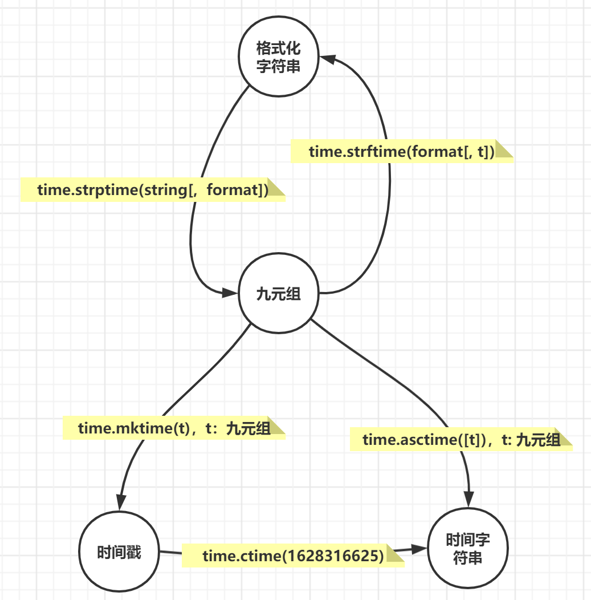
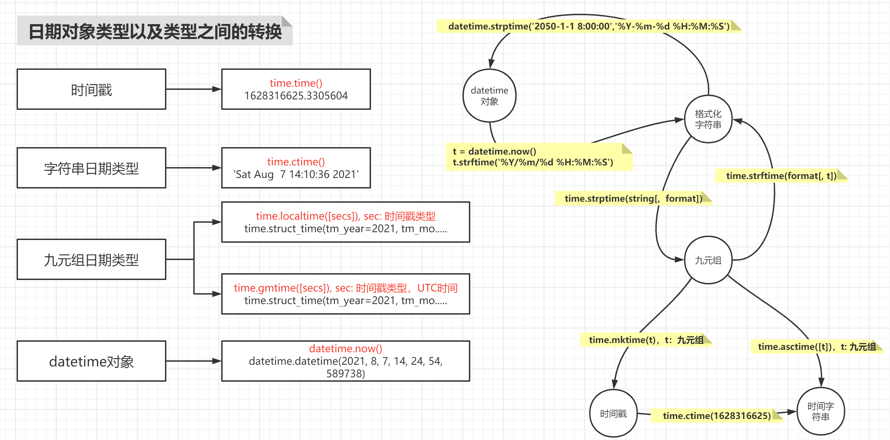
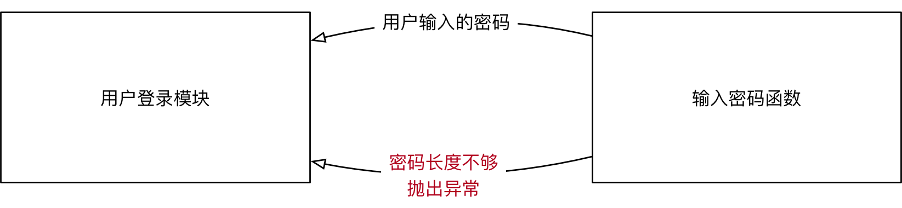

[TOC]

# 时间模块

## time 模块

### 时间表示方式

- **时间戳 timestamp：**表示的是从 1970 年1月1日 00:00:00 开始按秒计算的偏移量

- **UTC（Coordinated Universal Time, 世界协调时）**亦即格林威治天文时间，世界标准时间。在中国为 UTC+8  DST(Daylight Saving Time) 即夏令时；

- **元组（struct_time）**： 由 9 个元素组成

### 结构化时间（struct_time）

使用 `time.localtime()` 等方法可以获得一个结构化时间元组。

```python
>>> import time
>>> time.localtime()
time.struct_time(tm_year=2021, tm_mon=9, tm_mday=1, tm_hour=14, tm_min=23, tm_sec=29, tm_wday=2, tm_yday=244, tm_isdst=0)
```

结构化时间元组共有9个元素，按顺序排列如下表：

| 索引 | 属性                      | 取值范围           |
| ---- | ------------------------- | ------------------ |
| 0    | tm_year（年）             | 比如 2021          |
| 1    | tm_mon（月）              | 1 - 12             |
| 2    | tm_mday（日）             | 1 - 31             |
| 3    | tm_hour（时）             | 0 - 23             |
| 4    | tm_min（分）              | 0 - 59             |
| 5    | tm_sec（秒）              | 0 - 61             |
| 6    | tm_wday（weekday）        | 0 - 6（0表示周一） |
| 7    | tm_yday（一年中的第几天） | 1 - 366            |
| 8    | tm_isdst（是否是夏令时）  | 默认为-1           |

然结构化时间是一个元组，那么就可以通过索引进行取值，也可以进行分片，或者通过属性名获取对应的值。

```python
>>> import time
>>> t = time.localtime()
>>> t
time.struct_time(tm_year=2021, tm_mon=9, tm_mday=1, tm_hour=14, tm_min=23, tm_sec=29, tm_wday=2, tm_yday=244, tm_isdst=0)
>>> t[3]
14
>>> t[1:3]
(9, 1)
>>> t.tm_mon
9
```

**注意**

但是要记住，**Python的time类型是不可变类型，所有的时间值都只读，不能改**

```python
>>> t.tm_mon = 2
Traceback (most recent call last):
  File "<stdin>", line 1, in <module>
AttributeError: readonly attribute
```

### 格式化时间字符串

利用 `time.strftime('%Y-%m-%d %H:%M:%S')` 等方法可以获得一个格式化时间字符串

```python
>>> import time
>>> time.strftime('%Y-%m-%d %H:%M:%S')
'2021-09-01 02:39:23'
```

注意其中的空格、短横线和冒号都是美观修饰符号，真正起控制作用的是百分符

对于格式化控制字符串 `"%Y-%m-%d %H:%M:%S`，其中每一个字母所代表的意思如下表所示，注意大小写的区别：

| 格式 | 含义                                    | 格式 | 含义                                              |
| ---- | --------------------------------------- | ---- | ------------------------------------------------- |
| %a   | 本地简化星期名称                        | %m   | 月份（01 - 12）                                   |
| %A   | 本地完整星期名称                        | %M   | 分钟数（00 - 59）                                 |
| %b   | 本地简化月份名称                        | %p   | 本地am或者pm的相应符                              |
| %B   | 本地完整月份名称                        | %S   | 秒（01 - 61）                                     |
| %c   | 本地相应的日期和时间                    | %U   | 一年中的星期数（00 – 53，星期日是一个星期的开始） |
| %d   | 一个月中的第几天（01 - 31）             | %w   | 一个星期中的第几天（0 - 6，0是星期天）            |
| %H   | 一天中的第几个小时（24小时制，00 - 23） | %x   | 本地相应日期                                      |
| %I   | 第几个小时（12小时制，01 - 12）         | %X   | 本地相应时间                                      |
| %j   | 一年中的第几天（001 - 366）             | %y   | 去掉世纪的年份（00 - 99）                         |
| %Z   | 时区的名字                              | %Y   | 完整的年份                                        |

### time 模块主要方法

**1. time.sleep(t)**

time 模块最常用的方法之一，用来睡眠或者暂停程序t秒，t可以是浮点数或整数。

**2. time.time()**

返回当前系统时间戳。时间戳可以做算术运算。

```python
>>> time.time()
1630478727.255702
```

该方法经常用于计算程序运行时间：

```python
import time

def func():
    time.sleep(1.14)
    pass

t1 = time.time()
func()
t2 = time.time()
print(t2 - t1)

# print(t2 + 100)    
# print(t1 - 10)
# print(t1*2)
```

**3. time.gmtime([secs])**

将一个时间戳转换为 **UTC时区的结构化时间**。可选参数secs的默认值为 `time.time()`。

```python
>>> time.gmtime()
time.struct_time(tm_year=2021, tm_mon=9, tm_mday=1, tm_hour=6, tm_min=46, tm_sec=52, tm_wday=2, tm_yday=244, tm_isdst=0)
>>> t = time.time() - 10000
>>> time.gmtime(t)
time.struct_time(tm_year=2021, tm_mon=9, tm_mday=1, tm_hour=4, tm_min=0, tm_sec=22, tm_wday=2, tm_yday=244, tm_isdst=0)
```

**4. time.localtime([secs])**

将一个时间戳转换为 **当前时区** 的结构化时间。如果secs参数未提供，则以当前时间为准，即`time.time()`。

```python
>>> time.localtime()
time.struct_time(tm_year=2021, tm_mon=9, tm_mday=1, tm_hour=2, tm_min=47, tm_sec=29, tm_wday=2, tm_yday=244, tm_isdst=1)
>>> time.localtime(1406391907)
time.struct_time(tm_year=2014, tm_mon=7, tm_mday=26, tm_hour=12, tm_min=25, tm_sec=7, tm_wday=5, tm_yday=207, tm_isdst=1)
>>> time.localtime(time.time() + 10000)
time.struct_time(tm_year=2021, tm_mon=9, tm_mday=1, tm_hour=5, tm_min=35, tm_sec=1, tm_wday=2, tm_yday=244, tm_isdst=1)
>>> 
```

**5. time.ctime([secs])**

把一个时间戳转化为 **本地时间** 的格式化字符串。默认使用 `time.time()` 作为参数。

```python
>>> time.ctime()
'Wed Sep  1 02:49:41 2021'
>>> time.ctime(time.time())
'Wed Sep  1 02:49:49 2021'
>>> time.ctime(1406391907)
'Sat Jul 26 12:25:07 2014'
>>> time.ctime(time.time() + 10000)
'Wed Sep  1 05:36:44 2021'
```

**6. time.asctime([t])**

把一个结构化时间转换为 `Wed Sep  1 02:55:21 2021` 这种形式的格式化时间字符串。默认将`time.localtime()`作为参数。

```python
>>> time.asctime()
'Wed Sep  1 02:55:21 2021'
>>> time.asctime(time.time())
Traceback (most recent call last):
  File "<stdin>", line 1, in <module>
TypeError: Tuple or struct_time argument required
>>> time.asctime(time.localtime())
'Wed Sep  1 02:55:44 2021'
>>> time.asctime(time.gmtime())
'Wed Sep  1 06:55:50 2021'
```

**7. time.mktime(t)**

将一个结构化时间转化为时间戳。`time.mktime()`执行与`gmtime()`，`localtime()`相反的操作，它接收 `struct_time` 对象作为参数,返回用秒数表示时间的浮点数。如果输入的值不是一个合法的时间，将触发 `OverflowError `或  `ValueError`。

```python
time(1406391907)
Traceback (most recent call last):
  File "<stdin>", line 1, in <module>
TypeError: Tuple or struct_time argument required
>>> time.mktime(time.localtime())
1630479471.0
```

**8. time.strftime(format [, t])**

返回格式化字符串表示的当地时间。把一个`struct_time`（如`time.localtime()`和`time.gmtime()`的返回值）转化为格式化的时间字符串，显示的格式由参数`format`决定。如果未指定t，默认传入`time.localtime()`。

```python
>>> time.strftime("%Y-%m-%d %H:%M:%S")
'2021-09-01 02:58:16'
>>> time.strftime("%Y-%m-%d %H:%M:%S", time.gmtime())
'2021-09-01 06:58:31'
```

**9. time.strptime(string[,format])**

**将格式化时间字符串转化成结构化时间**

- 该方法是 `time.strftime()`方法的逆操作。
- `time.strptime()` 方法根据指定的格式把一个时间字符串解析为时间元组。
- 提供的字符串要和 **format参数** 的格式一一对应
  - 如果string中日期间使用 “-” 分隔，format中也必须使用“-”分隔
  - 时间中使用冒号 “:” 分隔，后面也必须使用冒号分隔
- 并且值也要在合法的区间范围内

```python
>>> import time
>>> stime = "2021-09-01 15:09:30"
>>> st = time.strptime(stime,"%Y-%m-%d %H:%M:%S")
>>> st
time.struct_time(tm_year=2021, tm_mon=9, tm_mday=1, tm_hour=15, tm_min=9, tm_sec=30, tm_wday=2, tm_yday=244, tm_isdst=-1)
>>> for item in st:
...     print(item)
... 
2021
9
1
15
9
30
2
244
-1
>>> wrong_time = "2021-14-26 12:11:30"
>>> st = time.strptime(wrong_time,"%Y-%m-%d %H:%M:%S")
Traceback (most recent call last):
  File "<stdin>", line 1, in <module>
  File "/usr/lib64/python3.6/_strptime.py", line 559, in _strptime_time
    tt = _strptime(data_string, format)[0]
  File "/usr/lib64/python3.6/_strptime.py", line 362, in _strptime
    (data_string, format))
ValueError: time data '2021-14-26 12:11:30' does not match format '%Y-%m-%d %H:%M:%S'
```

### 时间格式之间的转换

Python的三种类型时间格式，可以互相进行转换

| 从             | 到             | 方法        |
| -------------- | -------------- | ----------- |
| 时间戳         | UTC结构化时间  | gmtime()    |
| 时间戳         | 本地结构化时间 | localtime() |
| 本地结构化时间 | 时间戳         | mktime()    |
| 结构化时间     | 格式化字符串   | strftime()  |
| 格式化字符串   | 结构化时间     | strptime()  |

**图例**



### 练习 1：时间类型转换

- **t 是一个时间戳 （t = time.time()）**
- t 减去1万秒，然后转换成 **UTC 结构化** 时间
- t 减去1万秒，然后转换成 **中国本地结构化** 时间
- 从本地结构化时间转换为时间戳
- 从本地结构化时间转换为时间字符串
- 从时间字符串转换为结构化时间

```python
>>> t = time.time()  # t是一个时间戳
>>> time.gmtime(t - 10000)  # t减去1万秒，然后转换成UTC结构化时间
time.struct_time(tm_year=2017, tm_mon=9, tm_mday=25, tm_hour=22, tm_min=50, tm_sec=36, tm_wday=0, tm_yday=268, tm_isdst=0)
>>> lt = time.localtime(t - 10000)  # t减去1万秒，然后转换成中国本地结构化时间
time.struct_time(tm_year=2017, tm_mon=9, tm_mday=26, tm_hour=6, tm_min=50, tm_sec=36, tm_wday=1, tm_yday=269, tm_isdst=0)
>>> time.mktime(lt)  # 从本地结构化时间转换为时间戳
1506379836.0
>>> st = time.strftime("%Y-%m-%d %H:%M:%S",lt)  # 从本地结构化时间转换为时间字符串
>>> st
'2017-09-26 06:50:36'
>>> lt2 = time.strptime(st, "%Y-%m-%d %H:%M:%S") # 从时间字符串转换为结构化时间
>>> lt2
time.struct_time(tm_year=2017, tm_mon=9, tm_mday=26, tm_hour=6, tm_min=50, tm_sec=36, tm_wday=1, tm_yday=269, tm_isdst=-1)
```

## datetime 模块

### datetime 模块中 datetime 方法的使用

1. **datetime.today()：**返回一个表示当前本地时间的 datetime 对象
2. **datetime.now([tz])：**返回一个表示当前本地时间的 datetime 对象，如果提供了参数 tz, 则获取 tz 参数所指时区的本地时间
3. **datetime.strptime(date_string, format)：**将格式字符串转换为 datetime 对象
4. **datetime.ctime(datetime对象)：**返回时间格式字符串
5. **datetime.strftime(format)：**返回指定格式字符串

```python
>>> from datetime import datetime  # 导入datetime模块的datetime方法
>>> datetime.now()  # now()，获取当前的系统时间
datetime.datetime(2020, 11, 23, 17, 9, 42, 656827)
>>> t = datetime.now()  # 将当前的系统时间，赋值给对象变量t
>>> t.  # t.<Tab><Tab>, 查看对象t,可以使用的方法
>>> t.year  # 单独获取对象变量t中的年份
2020
>>> t.year, t.month, t.day, t.hour, t.minute, t.second, t.microsecond  # 单独获取对象变量t中的时间：年，月，日，时，分，秒，毫秒
(2020, 11, 23, 17, 10, 8, 55277)
```

### 时间对象转换

```python
# 时间对象strptime()和时间字符串strftime()的转换
>>> t.time()  # time(), 获取对象变量t中的时间： 时，分，秒，毫秒
datetime.time(17, 10, 8, 55277)
>>> t.today()  # 获取对象变量t中的时间：年，月，日，时，分，秒，毫秒
datetime.datetime(2020, 11, 23, 17, 11, 55, 88428)
>>> t  # 查看对象变量t的内容
>>> t.strftime('%Y/%m/%d %H:%M:%S')  # strftime(),将时间对象t, 以字符格式'%Y/%m/%d %H:%M:%S'进行显示 
>>> datetime.strptime('2050-1-1 8:00:00','%Y-%m-%d %H:%M:%S')  # strptime(), 将时间字符串'2050-1-1 8:00:00', 转换为datetime对象
```

### 时间计算

- 使用 **timedelta** 可以很方便的在日期上做天 days，小时 hour，分钟，秒，毫秒，微秒的时间计算

```python
>>> datetime.now()  # now(), 获取当前的系统时间
>>> from datetime import timedelta  # 导入datetime模块的timedelta方法
>>> t = datetime.now()  # 定义时间对象t,值为当前的系统时间
>>> days = timedelta(days=100, hours=2)	 # timedelta(),可以很方便的在日期上做天的计算
>>> t - days  # 以当前系统时间作为参照，获取100天2小时以前的系统时间
datetime.datetime(2020, 8, 15, 15, 32, 58, 385963)
>>> t + days  # 以当前系统时间作为参照，获取100天2小时以后的系统时间
datetime.datetime(2021, 3, 3, 19, 32, 58, 385963)
```

## 时间类型转换



## 练习 2：取出指定时间段的文本

**需求**

1. 有一日志文件，按时间先后顺序记录日志

2. 给定 **时间范围**，取出该范围内的日志

3. 自定义日志文件 **myweb.log**

   ```shell
   (mypy) [root@localhost day01]# vim myweb.log
   2030-01-02 08:01:43 aaaaaaaaaaaaaaaaa
   2030-01-02 08:34:23 bbbbbbbbbbbbbbbbbbbb
   2030-01-02 09:23:12 ccccccccccccccccccccc
   2030-01-02 10:56:13 ddddddddddddddddddddddddddd
   2030-01-02 11:38:19 eeeeeeeeeeeeeeee
   2030-01-02 12:02:28 ffffffffffffffff
   ```

【方案一】

```python
# 取出指定时间段 [9点~12点] 的行
from datetime import  datetime  # 导入datetime模块的datetime方法
# strptime(), 将字符时间'2030-01-02 09:00:00'，转换成时间对象
t9 = datetime.strptime('2030-01-02 09:00:00', '%Y-%m-%d %H:%M:%S')
t12 = datetime.strptime('2030-01-02 12:00:00', '%Y-%m-%d %H:%M:%S')

# 读取日志文件myweb.log中的数据
with open('myweb.log') as fobj:
    for line in fobj:
        # strptime(), 将line[:19]截取的字符时间，转换成时间对象
        t = datetime.strptime(line[:19], '%Y-%m-%d %H:%M:%S')  
        if t9 <= t <= t12:  # 此种判断会遍历日志文件中的每一行，有可能执行大量无效操作，效率低下
            print(line, end='')
```

【方案二】

```python
# 日志文件中，时间点是从前往后不断增加的，所以只要遍历到有一行时间超过预计，则后面的所有行均是不满足条件的
from datetime import  datetime  # 导入datetime模块的datetime方法
# strptime(), 将字符时间'2030-01-02 09:00:00'，转换成时间对象
t9 = datetime.strptime('2030-01-02 09:00:00', '%Y-%m-%d %H:%M:%S')
t12 = datetime.strptime('2030-01-02 12:00:00', '%Y-%m-%d %H:%M:%S')

with open('myweb.log') as fobj:  # 读取日志文件myweb.log中的数据，逐行进行遍历
    for line in fobj:
        # strptime(), 将line[:19]截取的字符时间，转换成时间对象
        t = datetime.strptime(line[:19], '%Y-%m-%d %H:%M:%S')
        if t > t12:  # 当时间大于12点时，退出循环
            break
        if t >= t9:  # 当时间大于9点时，打印对应行
            print(line, end='')

```

# 异常处理

## 什么是异常

程序在运行时，如果 `Python 解释器` **遇到** 到一个错误，**会停止程序的执行，并且提示一些错误信息**，这就是 **异常**

异常是因为程序出现了错误，而在正常控制流以外采取的行为

- 这个行为又分为两个阶段：
  - 首先是引起异常发生的错误
  - 然后是检测（和采取可能的措施）阶段

## Python 中的异常

当程序运行时，因遇到未解的错误而导致中止运行，便会出现 **traceback** 消息，打印异常

```python
KeyboardInterrupt     # Ctrl + C，会产生用户中断执行错误
EOFError              # Ctrl + D，会产出此错误
```

### python 中异常演示

```python
>>> a + 5							# NameError，变量a没有定义
>>> 'hello'[5]						# IndexError，字符串hello的最长索引下标为4
>>> a = 10			
>>> if a = 10:						# SyntaxError，python中的等于号使用'=='表示
>>> n = input('number:' )			# 要求输入number时，Ctrl + D, 产生EOFError
>>> n = input('number: ')			# Ctrl + C，产生KeyboardInterrupt，用户中断执行
```

### 错误类型捕获

* 在程序执行时，可能会遇到 **不同类型的异常**，并且需要 **针对不同类型的异常，做出不同的响应**，这个时候，就需要捕获错误类型了
* 语法如下：

```python
try:
    # 尝试执行的代码
    pass
except 错误类型1:
    # 针对错误类型1，对应的代码处理
    pass
except (错误类型2, 错误类型3):
    # 针对错误类型2 和 3，对应的代码处理
    pass
except Exception as result:
    print("未知错误 %s" % result)
```

#### try-except 语句

- 定义了进行异常监控的一段代码，并且提供了处理异常的机制

```python
try:
    n = int(input('number: '))  # 没有输入任何值，回车，产生ValueError异常
    print(n)
except ValueError:
    print('无效的输入')  # 当异常ValueError发生时，执行print()
```

#### 带有多个 expect 的 try 语句

- 可以把多个 except 语句连接在一起，处理一个try 块中可能发生的多种异常

```python
# 使用多个expect的try语句，处理异常
try:
    n = int(input('number: '))  # 没有输入任何值，回车，产生ValueError异常
    print(n)
except ValueError:  # 当异常ValueError发生时，执行print()
    print('无效的输入')
except KeyboardInterrupt:  # Ctrl + C，产生KeyboardInterrupt，用户中断执行
    print('\nBye-bye')
except EOFError:  # Ctrl + D, 产生EOFError, 没有内建输入
    print('\nBye-bye')
```

- 检测上述模块中异常处理结果

```python
(mypy) [root@localhost xxx] # python day01.py 
number:  # 回车，ValueError异常，s输入错误类型
无效的输入
(mypy) [root@localhost xxx] # python day01.py 
number: ^CBye-bye  # Ctrl + C，KeyboardInterrupt异常，用户操作中断
(mypy) [root@localhost xxx]# python day01.py 
number: Bye-bye  # Ctrl + D, EOFError异常, 没有内建输入
```

#### 捕获未知错误

* 在开发时，**要预判到所有可能出现的错误**，还是有一定难度的
* 如果希望程序 **无论出现任何错误**，都不会因为 `Python` 解释器 **抛出异常而被终止**，可以再增加一个 `except`

语法如下：

```python
except Exception as result:
    print("未知错误 %s" % result)
```

### 异常参数

- 异常也可以有参数，异常引发后它会被传递给异常处理器

- 当异常被引发后参数是作为附加帮助信息传递给异常处理器的

**查看异常提示信息**

```python
>>> n = int(input('number: '))
number:  # 回车，ValueError异常
Traceback (most recent call last):
  File "<stdin>", line 1, in <module>
ValueError: invalid literal for int() with base 10: ''
```

**使用多个expect的try语句，实现异常参数**

```python
try:
    n = int(input('number: '))    
    print(n)
except ValueError as e:  # 当异常ValueError发生时，将异常信息赋值给变量e
    print('无效的输入', e)  # print(), 打印异常信息
except KeyboardInterrupt:    
    print('\nBye-bye')
except EOFError:            
    print('\nBye-bye')

(mypy) [root@localhost day01]# python day01.py 
number:  # 回车，ValueError异常
无效的输入 invalid literal for int() with base 10: ''  # 输出异常信息
```

**使用多个expect的try语句，捕获多个异常**

```python
try:
    n = int(input('number: '))    
    print(n)
except ValueError as e:        
    print('无效的输入', e)       
except (KeyboardInterrupt, EOFError):  # 使用except捕获多个异常  
    print('\nBye-bye')

(mypy) [root@localhost day01]# python day01.py 
number: ^C  # Ctrl + C，产生KeyboardInterrupt，用户中断执行
Bye-bye
(mypy) [root@localhost day01]# python day01.py 
number:  # Ctrl + D, EOFError异常, 没有内建输入
Bye-bye
```

### else 子句

- 在 try 范围中没有异常被检测到时，执行 else 子句

- 在else 范围中的任何代码运行前，try 中的所有代码必须完全成功

```python
# else子句的使用
try:  # 有可能发生异常的代码块
    n = int(input('number: '))
except ValueError as e:  # 当异常ValueError发生时，将异常信息赋值给变量e
    print('无效的输入', e)  # print(), 打印异常信息
except (KeyboardInterrupt, EOFError):   
    print('\nBye-bye')
else:  # 当不发生异常时，要执行的代码块
    print(n)

(mypy) [root@localhost day01] # python day01.py 
number: 19  # 正常输入，打印else
19
```

### finally子句

- finally 子句是 **无论异常是否发生，是否捕捉都会执行的一段代码**

- 如果打开文件后，因为发生异常导致文件没有关闭，可能会发生数据损坏，**使用finally 可以保证文件总是能正常的关闭**

```python
# finally子句的使用
try:                            # 有可能发生异常的代码块
    n = int(input('number: '))
except ValueError as e:         # 当异常ValueError发生时，将异常信息赋值给变量e
    print('无效的输入', e)        # print(), 打印异常信息
except (KeyboardInterrupt, EOFError):   
    print('\nBye-bye')
    exit()                      # 退出程序
else:                           # 当不发生异常时，要执行的代码块
    print(n)
finally:                        # 不管异常是否发生都会执行代码块
	print('Done')

(mypy) [root@localhost day01]# python day01.py 
number:            # Ctrl + D, EOFError异常, 没有内建输入
Bye-bye
Done               # 出现异常，finally 继续执行

(mypy) [root@localhost day01]# python day01.py 
number: 19         # 正常输入整数，打印结果
19
Done               # 没有出现异常，finally 还是继续执行
```

### 练习 3：简化除法判断

**需求**

1. 提示用户输入一个数字作为除法
2. 如果用户按下 Ctrl + C 或 Ctrl + D 则退出程序
3. 如果用户输入非数字字符，提示用户应该输入数字
4. 如果用户输入 0，提示用户 0 不能作为除法

```python
# mydiv.py
try:  # 有可能发生异常的代码块
    n = int(input('number: '))
    result = 100 / n
# 当异常ValueError发生时，将异常信息赋值给变量e    
except (ValueError, ZeroDivisionError) as e:  
    print('无效的输入', e)  # print(), 打印异常信息       
except (KeyboardInterrupt, EOFError):  # 出现异常，执行print()，exit()
    print('\nBye-bye')
    exit()  # 退出程序
    
else:  # 当不发生异常时，要执行的代码块
    print(result)
    
finally:  # 不管异常是否发生都会执行代码块
    print('Done')

(mypy) [root@localhost day01] # python mydiv.py 
number:  # 空值，回车，异常处理
无效的输入 invalid literal for int() with base 10: ''
Done  # 不管异常是否发生，都会打印

# 使用python解释器，执行day01.py
(mypy) [root@localhost day01]# python mydiv.py 
number: 0  # 输入0，异常处理
无效的输入 division by zero
Done  # 不管异常是否发生，都会打印
```

## 自定义异常

### 抛出异常—raise

### 应用场景

* 在开发中，除了 **代码执行出错** `Python` 解释器会 **抛出** 异常之外
* 还可以根据 **应用程序** **特有的业务需求** **主动抛出异常**

**示例**

- 提示用户 **输入密码**，如果 **长度少于 8**，抛出 **异常**



**注意**

* 当前函数 **只负责** 提示用户输入密码，如果 **密码长度不正确，需要其他的函数进行额外处理**
* 因此可以 **抛出异常**，由其他需要处理的函数 **捕获异常**

### 抛出异常

* `Python` 中提供了一个 `Exception` **异常类**
* 在开发时，如果满足 **特定业务需求时**，希望 **抛出异常**，可以：
  1. **创建** 一个 `Exception` 的 **对象**
  2. 使用 `raise` **关键字** 抛出 **异常对象**

**需求**

* 定义 `input_password` 函数，提示用户输入密码
* 如果用户输入长度 < 8，抛出异常
* 如果用户输入长度 >= 8，返回输入的密码

```python
def input_password():

    # 1. 提示用户输入密码
    pwd = input("请输入密码：")

    # 2. 判断密码长度，如果长度 >= 8，返回用户输入的密码
    if len(pwd) >= 8:
        return pwd

    # 3. 密码长度不够，需要抛出异常
    # 1> 创建异常对象 - 使用异常的错误信息字符串作为参数
    ex = Exception("密码长度不够")

    # 2> 抛出异常对象
    raise ex
try:
    user_pwd = input_password()
    print(user_pwd)
except Exception as result:
    print("发现错误：%s" % result)
```

### 练习 4：自定义异常

**需求**

- 编写第一个函数，接收姓名和年龄，如果年龄不在1到120之间，产生 **ValueError** 异常

```python
# 编写函数get_info()，在文件user_info.py上操作
def get_info(name, age):  # 定义函数，接收姓名和年龄
    # 异常触发ValueError，提示信息为：无效的年龄(1 ~ 119)
    if not 0 < age < 120:            
        raise ValueError('无效的年龄(1 ~ 119)')
    # 当age在0 ~ 120的范围，else代码块执行    
    else:         
        print('%s is %s years old' %(name, age))

# 调用函数get_info()，在文件call_user_info.py上操作
# 将user_info.py作为模块导入
import  user_info
try:  # 有可能发生异常的代码块
    user_info.get_info('tom', 200)
except ValueError as e:  # 当异常ValueError发生时，将异常信息赋值给变量e
    print('Error:', e)  # print(), 打印异常信息
    exit()  # 退出程序，不继续执行后续代码
print('Done')  # exit()，退出后，此代码不执行
```

# os 模块

- 对文件系统的访问大多通过 python 的 os 模块实现
- 该模块是 python 访问操作系统功能的主要接口
- 有些方法，如：**copy** 等，并没有提供，可以使用 **shutil** 模块作为补充

```python
# os模块的常用方法
>>> import os					#导入os系统模块
>>> os.						#os.<Tab><Tab> 查看os模块的所以方法
>>> os.getcwd()				#getcwd(),查看当前所处的文件路径，类似于: pwd
>>> os.listdir()			#listdir(), 查看当前目录下的所有文件(包括隐藏文件)，类似于：ls -a
>>> os.listdir('/tmp')			#listdir('/tmp'), 查看/tmp目录下的内容，类似于：ls /tmp
>>> os.mkdir('/tmp/mytest')		#mkdir(), 创建目录，类似于：mkdir /tmp/mytest
>>> os.mkdir('/tmp/demo/abc')			#只能创建单级目录，父目录无法创建
>>> os.makedirs('/tmp/demo/abc')		#创建目录时，父目录不存在，会自动创建，类似于: mkdir -p ...
>>> os.chdir('/tmp/demo')		#chdir(), 切换当前所处的文件位置，类似于：cd /tmp/demo
>>> os.getcwd()				#getcwd(),查看当前所处的文件路径，类似于: pwd
>>> os.listdir()			#listdir(), 查看当前目录下的所有文件(包括隐藏文件)，类似于：ls -a
>>> import shutil				#导入shutil模块
>>> shutil.copy('/etc/hosts', '.')		#copy(), 将/etc/hosts文件，拷贝到当前目录下
>>> os.listdir()			#listdir(), 查看当前目录下的所有文件(包括隐藏文件)，类似于：ls -a
>>> os.symlink('/etc/passwd', 'mima')		#symlink(), 为/etc/passwd建立软链接mima，类似于: ln -s /etc/passwd  mima
>>> os.listdir()				#listdir(), 查看当前目录下的所有文件(包括隐藏文件)，类似：ls -a

(mypy) [root@localhost day01]# ll /tmp/demo/hosts		#重开终端【local(2)】,查看hosts文件的权限
>>> os.chmod('hosts', 0o600)		#chmod(),修改文件hosts的权限，必须使用8进制数完成
>>> 0o644			#使用10进制修改文件hosts的权限为644，先将8进制的644转换为十进制数
>>> os.chmod('hosts', 420)		#使用转换后的十进制数修改修改hosts文件的权限
>>> os.remove('abc')		#remove(), 只能删除单个文件，不能删除目录
>>> os.rmdir('abc')			#rmdir(),只能删除空目录；要删除非空目录要使用shutil.rmtree()
>>> os.rmdir('/var/tmp')		#rmdir(),只能删除空目录；要删除非空目录要使用shutil.rmtree()
>>> os.remove('hosts')		#remove(),只能删除单个文件，不能删除目录
>>> os.unlink('mima')		#unlink(),取消删除链接文件

>>> os.path.				#查看os.path子模块的所有方法
>>> os.mkdir('abc')			#mkdir(), 在当前路径下，创建一个目录'abc'
>>> os.path.abspath('abc')		#abspath(), 获取abc文件的路径
>>> os.path.basename('/tmp/demo/abc')		#获取最右边'/'，右边的数据‘abc’
>>> os.path.basename('/tmp/demo/abc/')		#basename(),获取最右边'/'，右边的数据''
>>> os.path.dirname('/tmp/demo/abc')		#dirname(), 获取最右边'/'，左边的数据'/tmp/demo'
>>> os.path.split('/tmp/demo/abc')		#split(), 路径切割，从最右边'/'开始，进行切割
>>> os.path.splitext('tedu.txt')			#splitext(),将扩展名和文件名进行切割
>>> os.path.join('/tmp/demo', 'abc')		#join(), 路径的拼接

>>> os.path.is						#os.path.is<Tab><Tab>, 列出所有判断的方法
>>> os.path.isabs('tmp/abc/xyz')		#'tmp/abc/xyz'是否是绝对路径，不管文件是否存在，False
>>> os.path.isabs('/tmp/abc/xyz')		#'/tmp/abc/xyz'是否是绝对路径，不管文件是否存在，True
>>> os.path.isdir('/tmp/demo/abc')		# 字符串是否为目录(文件必须存在，且必须是目录) ，True
>>> os.path.isdir('/tmp/demo/xyz')		# 字符串是否为目录(文件必须存在，且必须是目录)，False
>>> os.path.isfile('/etc/hosts')		#字符串是否是文件(文件必须存在，且必须是文件)，True
>>> os.path.isfile('/etc/')			#字符串是否是文件(文件必须存在，且必须是文件)，False
>>> os.path.islink('/etc/grub2.cfg')			#字符串是否是链接文件(文件必须存在，且必须是链接文件)，True
>>> os.path.ismount('/')				#判断字符串是否是挂载文件，'/'是挂载文件
>>> os.path.ismount('/etc')			#判断字符串是否是挂载文件，'/etc' 不是挂载文件
>>> os.path.exists('/etc/hostname')			#判断字符串是否存在，/etc/hostname，True
```

## 练习 5：os 操作

**需求**

- 编写脚本，熟悉os模块操作
  - 切换到 /tmp 目录
  - 创建 example 目录
  - 切换到 /tmp/example 目录
  - 创建 test 文件，并写入字符串 foo bar
  - 列出 /tmp/exaple 目录内容
  - 打印 test 文件内容
  - 反向操作，把 test 文件以及 example 目录删除

# pickle 模块

## 模块简介

- 把数据写入文件时，常规的文件方法只能把字符串对象写入。其他数据需先转换成字符串再写入文件
- python 提供了一个标准的模块，称为 **pickle**。使用它可以在一个文件中 **存储任何 python 对象**，之后又可以把它完整无缺地取出来

## 主要方法

| 方法                       | 功能                                                 |
| -------------------------- | ---------------------------------------------------- |
| pickle.dump(obj, file)     | 将 Python 数据转换并保存到 **pickle 格式的文件内**   |
| pickle.dumps(obj)          | 将 Python 数据转换为pickle格式的 **bytes 字串**      |
| pickle.load(file)          | 从 pickle 格式的文件中读取数据并转换为 python 的类型 |
| pickle.loads(bytes_object) | 将pickle格式的bytes字串转换为 python 的类型          |

### 基本演示

- 常规方法写入数据，只能是字符串类型，其他类型无法写入，例如：int，字典，列表等类型；
- pickle模块，可以在文件中存储任何类型的数据，也可以完整取出任何类型的数据；

```python
>>> f = open('/tmp/a.data', 'w')  # 写入数据时，常规的文件方法只能写入字符串对象，否则报错
>>> f.write(100)

>>> f = open('/tmp/a.data', 'wb')
>>> f.write(100)
```

### pickle 模块方法

```python
>>> f = open('/tmp/a.data', 'wb')  # 打开文件/tmp/a.data，以字节的方式写入
>>> user = {'name': 'tom', 'age': 20}  # 定义字典user
>>> import pickle  # 导入模块pickle，可以写入和取出不同类型的数据
>>> pickle.dump(user,f)  # pickle.dump(), 将字典user, 写入到对象f中【/tmp/a.data】
>>> f.close()  # 关闭打开的文件
>>> f = open('/tmp/a.data', 'rb')  # 打开文件/tmp/a.data，【以字节的方式读取】
>>> adict = pickle.load(f)  # 取出对象f中【/tmp/a.data】所有数据，赋值给变量adict
>>> adict  # 查看字典adict中内容
```

## 练习 6：记账程序

**需求**

- 假设在记账时，有一万元钱
- 无论是开销还是收入都要进行记账
- 记账内容包括时间、金额和说明等
- 记账数据要求永久存储

**第一步：构建程序的结构，编写菜单函数** **show_menu()**

```python
import os  # 导入os模块，检测文件是否存在
import pickle  # 导入pickle模块，存储列表类型的数据
def save(fname):  # 函数save(), 功能：实现收入记录存储在fname中
	pass
def cost(fname):  # 函数cost(), 功能：实现支出记录存储在fname中
	pass
def query(fname):  # 函数query(), 功能：实现收入和支出的查询
	pass
def show_menu():  # show_menu()，功能：是实现和用户交互菜单列表
    cmds = {'0': save, '1': cost, '2': query}  # 定义字典cmds，用户选择数字时，返回不同的函数名
    # fname, 用户的收支情况存储到account.data文件中
    # init_data 初始数据，['时间', '收入', '支出', '余额', '备注']
    fname = 'account.data'
    init_data = [['2000-1-1', 0, 0, 10000, 'init data']]    
    # 定义变量prompt,提示用户输入选项 
    prompt = """(0) 收入
(1) 支出
(2) 查询
(3) 退出 
请选择(0/1/2/3): """
	# 如果fname(数据文件)不存在，则新建文件，并写入初始数据
    if not os.path.exists(fname):
        with open(fname, 'wb') as fobj:
            pickle.dump(init_data, fobj)
    while 1:  # while循环，让用户可以无限重复操作
        choice = input(prompt).strip()  # 提示用户输入信息
        if choice not in ['0', '1', '2', '3']:  # 判断用户输入的是否是规定数字
            print('无效的选择，请重试')
            continue  # 结束此次循环,直接开始下次循环
        
        if choice == '3':  # 用户选择3，打印bye，退出while循环
            print('\nBye-bye')
            break  # 直接退出while循环
        # 当用户输入0，1时，返回对应的函数名，加上()即为函数调用，例如:save(fname)
        cmds[choice](fname)

if __name__ == '__main__':
    show_menu()
```

**第二步：编写 save(), cost(), query() 函数**

```python
import os                       # 导入os模块，检测文件是否存在
import pickle                   # 导入pickle模块，存储列表类型的数据
from time import strftime       # 导入strftime，将时间【年-月-日】转换为字符串

def save(fname):                 
    date = strftime('%Y-%m-%d')         # 获取系统时间: 年-月-日
    amount = int(input('金额: '))        # 输入收入金额
    comment = input('备注: ')            # 收入金额的备注信息
    
    # 以读字节的方式，打开文件fname, 赋值给对象fobj
    with open(fname, 'rb') as fobj:
        content = pickle.load(fobj)     # 读出fname中的数据，赋值给content
        
    balance = content[-1][-2] + amount  # 总余额 = 余额 + 收入金额 
    
    # 定义列表line【收入信息】，将列表line作为子列表追加到列表content的末尾
    line = [date, amount, 0, balance, comment]
    content.append(line)
    
    # 以写字节的方式，打开文件fname, 赋值给对象fobj
    with open(fname, 'wb') as fobj:
        pickle.dump(content, fobj)   #将列表content写入到文件fname中
 
def cost(fname):
    date = strftime('%Y-%m-%d')         # 获取系统时间: 年-月-日
    amount = int(input('金额: '))        # 输入收入金额
    comment = input('备注: ')            # 收入金额的备注信息
    
    # 以读字节的方式，打开文件fname, 赋值给对象fobj
    with open(fname, 'rb') as fobj:
        content = pickle.load(fobj)     # 读出fname中的数据，赋值给content
        
    balance = content[-1][-2] - amount  # 总余额 = 余额 - 收入金额 
    
    # 定义列表line【收入信息】，将列表line作为子列表追加到列表content的末尾
    line = [date, 0, amount, balance, comment]
    content.append(line)
    
    # 以写字节的方式，打开文件fname, 赋值给对象fobj
    with open(fname, 'wb') as fobj:
        pickle.dump(content, fobj)   # 将列表content写入到文件fname中
    
def query(fname):
    # print() 制表, %-12s等，可以实现列之间的空白分割
    print('%-12s%-8s%-8s%-12s%-20s' %('date', 'save', 'cost', 'balance', 'comment'))	
    
    # 以读字节的方式，打开文件fname, 赋值给对象fobj
    with open(fname, 'rb') as  fobj:
        content = pickle.load(fobj)   #读出fname中的数据，赋值给content
    
    # for循环遍历，列表中content的元素，%12s等，实现各元素之间的空白分隔
    for line in content:
        print('%-12s%-8s%-8s%-12s%-20s' % tuple(line))  
  
def show_menu():
	# 定义字典cmds，用户选择数字时，返回不同的函数名
    # 这里不能直接写函数，例如：save()，因为结果为函数的返回值
    cmds = {'0': save, '1': cost, '2': query}
    
    # fname, 用户的收支情况存储到account.data文件中
    # init_data 初始数据，['时间', '收入', '支出', '余额', '备注']
    fname = 'account.data'
    init_data = [['2000-1-1', 0, 0, 10000, 'init data']]    
    
    # 定义变量prompt,提示用户输入选项 
    prompt = """(0) 收入
(1) 支出
(2) 查询
(3) 退出 
请选择(0/1/2/3): """

	# 果然fname(数据文件)不存在，则新建文件，并写入初始数据
    if not os.path.exists(fname):
        with open(fname, 'wb') as fobj:
            pickle.dump(init_data, fobj)
   
    # while循环，让用户可以无限重复操作
    while 1:
        choice = input(prompt).strip()         # 提示用户输入信息
        if choice not in ['0', '1', '2', '3']:  # 判断用户输入的是否是规定数字
            print('无效的选择，请重试')
            continue                           # 结束此次循环,直接开始下次循环
        
        if choice == '3':          # 用户选择3，打印bye，退出while循环
            print('\nBye-bye')
            break                  # 直接退出while循环
        
        # 当用户输入0，1时，返回对应的函数名，加上()即为函数调用，例如:save(fname)
        cmds[choice](fname)

if __name__ == '__main__':
    show_menu()
```

