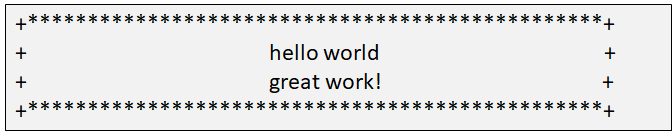

[TOC]

# shutil 模块

## 基本概念

- `shutil` 可以简单地理解为 `sh + util`，**shell 工具** 的意思
- `shutil` 模块是对 `os` 模块的补充，主要针对文件的 **拷贝、删除、移动、压缩和解压** 操作

## shutil 模块的主要方法

### 复制和移动

#### shutil.copyfileobj(fsrc, fdst)

- 将类似文件的对象 **fsrc** 的内容复制到类似文件的对象 **fdst**

- copy 文件内容到另一个文件，可以 copy 指定大小的内容
- 这个方法是 shutil 模块中其它拷贝方法的基础，其它方法在本质上都是调用这个方法

让我们看一下它的源码：

```python
def copyfileobj(fsrc, fdst, length=16*1024):
    while 1:
        buf = fsrc.read(length)
        if not buf:
            break
        fdst.write(buf)
```

代码很简单，一看就懂。但是要注意，其中的 **fsrc，fdst** 都是使用 **open()** 方法打开后的文件对象。

**案例**

```python
>>> import shutil  # 导入模块shutil，其中的copyfileobj()方法可以用于拷贝文件
>>> f1 = open('/etc/passwd','rb')  # 打开原文件'/etc/passwd', 用于读取数据
>>> f2 = open('/tmp/mima', 'wb')  # 打开目标文件'/tmp/mima', 用于写入数据
>>> shutil.copyfileobj(f1, f2)  # 调用shutil模块的copyfileobj()方法，将f1中的内容拷贝到f2中
>>> f1.close()
>>> f2.close()

# 通过查看源文件和目标文件md5值，验证文件是否拷贝成功
(mypy) [root@localhost xxx]# md5sum /etc/passwd /tmp/mima
```

#### shutil.copyfile(src, dst)

- 将名为 **src** 的文件的内容（无元数据）复制到名为 **dst** 的文件，然后返回 **dst**
- 同样看下它的源码，忽略前面一些检测用的代码，该方法的核心在最后几行，我们可以很清楚地看到 `copyfile()` 方法对 `copyfileobj()` 进行了调用。

**案例**

```python
>>> import shutil    
>>> shutil.copyfile("/etc/passwd", "/opt/passwd")
'/opt/passwd'
```

#### shutil.copy(src, dst)

将文件 **src** 复制到文件或目录 **dst**，包括权限

**src** 和 **dst** 应为字符串。如果 **dst** 指定目录，则文件将使用 **src** 的基本文件名复制到 **dst** 中。返回新创建的文件的路径。

**案例**

```python
>>> import shutil  # 导入模块(如果已经导入，则不需要再次导入)
>>> shutil.copy('/etc/hosts', '/tmp/zj.txt')  # 拷贝hosts文件，到/tmp下，文件名为zj.txt
(mypy) [root@localhost xxx]  # cat /tmp/zj.txts
```

**源码**

```python
######### copy()调用了方法copyfile()，copyfile()调用了方法copyfileobj()
####### 方法copyfileobj()是最底层的代码，实现真实的数据拷贝过程
### 第一步：【Ctrl + 鼠标左键】 ——》 点击copy()查看源码，源码如下：
..........
def copy(src, dst, *, follow_symlinks=True):
..........
    if os.path.isdir(dst):
        dst = os.path.join(dst, os.path.basename(src))
    copyfile(src, dst, follow_symlinks=follow_symlinks)
    copymode(src, dst, follow_symlinks=follow_symlinks)
    return dst
..........

###第二步：【Ctrl + 鼠标左键】 ——》 点击copyfile()查看源码，源码如下：
..........
def copyfile(src, dst, *, follow_symlinks=True):
..........

    if not follow_symlinks and os.path.islink(src):
        os.symlink(os.readlink(src), dst)
    else:
        with open(src, 'rb') as fsrc:
            with open(dst, 'wb') as fdst:
                copyfileobj(fsrc, fdst)  # copyfileobj()被copyfile()调用
    return dst
..........
```

#### shutil.move(src, dst)

- 递归地将文件或目录（**src**）移动到另一个位置（**dst**），并返回目标

**案例**

```python
>>> shutil.move('/tmp/zj2.txt', '/var/tmp')  # 将/tmp目录下的文件移动到/var/tmp目录下
(mypy) [root@localhost xxx]# ls /tmp/zj2.txt  # 查看/tmp/zj2.txt，文件不存在
(mypy) [root@localhost xxx]# ls /var/tmp/zj2.txt  # 查看/var/tmp/zj2.txt ，文件移动成功
```

### 目录操作

#### shutil.copytree(src, dst)

- 递归地复制以 **src** 为根的整个目录树，返回目标目录。由 **dst** 命名的目标目录不能已经存在

**案例**

```python
>>> shutil.copytree('/etc/security', '/tmp/security')  # 使用copytree()时，需要指定一个不存在的目录，否则报错
```

#### shutil.rmtree(path)

- 删除整个目录树； **路径 **必须指向目录（而不是指向目录的符号链接）

```python
>>> shutil.rmtree('/tmp/security')
```

### 权限管理

#### shutil.copymode(src, dst)

- 将权限位从 **src** 复制到 **dst**
- 文件内容，**所有者和组不受影响**
- **src** 和 **dst** 是以字符串形式给出的路径名称

**案例**

```python
# 使用shutil模块的copymode()功能【只拷贝权限】
(mypy) [root@localhost xxx] # ll /tmp/zj.txt  # 查看/tmp/zj.txt的权限，为：644
(mypy) [root@localhost xxx] # ll /usr/bin/ls  # 查看/usr/bin/ls的权限，为：755
(mypy) [root@localhost xxx] # python  # 进入python3的解释器交互界面
>>> shutil.copymode('/usr/bin/ls', '/tmp/zj.txt')  # 将文件ls的权限，拷贝给文件zj.txt, zj.txt内容不变
(mypy) [root@localhost xxx] # ll /tmp/zj.txt  # 查看/tmp/zj.txt的权限，为：755，权限拷贝成功
```

#### shutil.copystat(src, dst)

- 将权限位，最后访问时间，上次修改时间和标志从 **src** 复制到 **dst**

#### shutil.chown(path, user=None, group=None)

- 更改给定 **路径** 的所有者 **用户** 和 **组**

**案例**

```python
# 修改文件的所有者和所属组
(mypy) [root@localhost xxx] # ll /tmp/zj.txt  # 查看/tmp/zj.txt的属性，属主和属组均为root
(mypy) [root@localhost xxx] # python
# 使用 shutil 模块的 chown() 的方法，修改文件的属主和属组为 'adm'
>>> shutil.chown('/tmp/zj.txt', user='adm', group='adm')
(mypy) [root@localhost xxx] # ll /tmp/zj.txt  # 属主和属组已经被更改为 adm
```

# subprocess 模块

## 基础概念

- subprocess 模块主要用于执行 **系统命令**

- subprocess 模块允许你产生新的进程，连接到它们的 **输入 / 输出 / 错误** 管道，并获得它们的返回状态
- 通俗地说就是通过这个模块，你可以在 Python 的代码里执行操作系统级别的命令，比如 **"ipconfig" 、"du -sh"** 等等

## run 方法

- subprocess.run(args, *, stdin=None, input=None, stdout=None, stderr=None, shell=False, timeout=None, check=False, encoding=None, errors=None)

**功能：执行 args 参数所表示的命令，等待命令结束，并返回一个 CompletedProcess 类型对象**

```shell
>>> import subprocess
>>> subprocess.run(['ls'])  # 将命令写到列表中，执行linux命令
>>> subprocess.run(['ls', '/home'])  # 将命令和操作的目录写到列表中，执行linux命令
>>> subprocess.run('ls /home')  # 以字符串形式执行linux命令，无法区分命令和目标文件，错误，会把'ls /home 当做一个整体
>>> subprocess.run('ls /home', shell=True)  # 若想以字符串形式执行，指定shell解释器
```

### 通过 shell 执行命令

- `subprocess.run(['ls', '/home'])` 这种方式不支持环境变量，不支持命令的扩展，不支持 **shell解释器** 下执行命令，所以使用字符串的方式执行 **linux命令**

```shell
>>> subprocess.run('echo $HOME', shell=True)  # 使用run()查看当前用户的家目录，使用shell执行命令
>>> subprocess.run('ls /root', shell=True)
```

### run 方法返回值

- run 方法查看上一级目录下的内容，使用 **shell 执行命令**

```shell
>>> subprocess.run('ls ..', shell=True)  # 最后一行为返回值
day01  day02  day03  day04
CompletedProcess(args='ls ..', returncode=0)

# run方法查看上一级目录下的内容，赋值给变量result
>>> result = subprocess.run('ls ..', shell=True)
day01  day02  day03  day04

# 查看变量result的值，为run()的返回值
>>> result
CompletedProcess(args='ls ..', returncode=0)

# 查看result中args列表的内容，为linux命令
>>> result.args
'ls ..'

# 查看result中returncode的值，为0\；returncode 为状态码
# 上一条命令执行成功，结果为0；反之，结果为非零值
>>> result.returncode
'0'
```

## 输出和错误

- run 方法执行的结果默认打印在屏幕上，也可以通过管道将其存储在 **标准输出和标准错误** 中

```shell
# 将run方法执行的结果，保存在变量中
# run() 查看root的用户信息，查看zhangsan的用户信息
>>> result = subprocess.run('id root; id zhangsan', shell=True)  

# 将run() 的执行结果，赋值给result变量，stdout 记录的是标准输出信息；stderr 记录的是错误输出信息
>>> result = subprocess.run('id root; id zhangsan', shell=True, stdout=subprocess.PIPE, stderr=subprocess.PIPE)

# 查看result中的信息
>>> result
>>> result.args		# args列表中存放着用户执行的linux命令
>>> result.returncode  # returncode为最后一条命令的执行状态
>>> result.stdout  # stdout 记录的是命令的正确执行结果，以字节的方式显示
>>> result.stdout.decode()  # 将linux命令的正确输出信息，转换成 string 类型
>>> result.stderr  # stderr 记录的是命令的错误执行结果，以字节的方式显示
```

## 注意

- subprocess 模块虽然可以支持所有的 linux 命令，但不可乱用，放弃其他的模块
- subprocess 模块编写的代码，**不具有跨平台性，不能在 windows，mac 等系统使用**

## 练习 1：调用 ping 命令

**需求**

- **调用 ping 命令**

  - 编写 **ping 函数**

  - 用于测试远程主机的联通性
  - ping 通显示：**x.x.x.x:up**
  - ping 不通显示：**x.x.x.x:down**

```python
import  sys  # 导入sys模块，用于获取位置参数
import subprocess  # 导入subprocess模块，用于执行linux的ping命令
def ping(host):  # 使用def定义函数ping(),用于检测主机的联通性
# subprocess.run() 在shell解释器下，执行linux命令；ping -c 2 发送两个数据包；
# %s 为占位符；&> /dev/null 将错误和正确信息都写入黑洞设备；
# result 获得run()得放回信息，returncode为状态码(0 指命令成功；非0 指失败)
    result = subprocess.run('ping -c 2 %s &> /dev/null' % host, shell=True)    
    if result.returncode == 0:
        return '%s:up' % host
    else:
        return '%s:down' % host

# 测试代码块，__name__作为python文件调用时，执行该代码块
if __name__ == '__main__':
    host = sys.argv[1]
	print(ping(host))
```

# python 语法风格和模块布局

## 变量赋值

**1. python支持链式多重赋值**

```python
>>> x = y = 10  # 将10赋值给x和y
>>> x  # 查看x的值
10
>>> y  # 查看y的值
10
>>> y = 20  # 给变量y重新赋值为20
>>> y  # 查看y的值
20
>>> x  # x的值不发生变化
10
```

**2. 给列表使用多重赋值时，两个列表同时指向同一个列表空间，任何一个列表改变，另外一个随着改变**

```python
>>> alist = blist = [1, 2]
>>> alist  # 查看列表alist的值
[1, 2]
>>> blist  # 查看列表blist的值
[1, 2]
>>> blist[-1] = 100  # 修改列表blist中的最后一个元素为100
>>> alist  # 当列表blist改变时，alist也会改变
[1, 100]
```

**3. python 的多元赋值方法**

```python
>>> a, b = 10, 20  # 将10和20, 分别赋值给a和b
>>> a  # 查看变量a的值
10
>>> b  # 查看变量a的值
20
>>> c, d = 'mn'  # 将m和n, 分别赋值给c和d
>>> c  # 查看变量c的值
'm'
>>> d  # 查看变量d的值
'n'
>>> e,f = (100, 200)  # 将元组中的元素, 分别赋值给e和f
>>> e  # 查看变量e的值
100		
>>> f  # 查看变量f的值
200
>>> m, n = ['bob', 'alice']  # 将列表中的元素，分别赋值给变量m和变量n
>>> m  # 查看变量m的值
'bob'
>>> n  # 查看变量n的值
'alice'
```

**4. 在python中，完成两个变量值的互换**

```python
>>> a, b = 100, 200  # 将100和200，分别赋值给变量a和变量b
>>> a, b = b, a  # 将变量a和变量b的值，进行交换
>>> a  # 查看变量a的值
200
>>> b  # 查看变量b的值
100
```

## 合法标识符

- Python 标识符，字符串规则和其他大部分用 C 编写的高级语言相似

- 第一个字符必须是 **字母或下划线 _**

- 剩下的字符可以是字母和数字或下划线

- **大小写敏感**

## 关键字

- 和其他的高级语言一样，python 也拥有一些被称作关键字的保留字符

- 任何语言的关键字应该保持相对的稳定，但是因为 python 是一门不断成长和进化的语言，其关键字偶尔会更新

- 关键字列表和 **iskeyword()** 函数都放入了 keyword 模块以便查阅

### 案例：查看，判断python中的关键字

```python
>>> import keyword  # 导入模块keyword
>>> keyword.kwlist  # 查看keyword模块中，包含的关键字
>>> 'pass' in keyword.kwlist  # 判断 'pass' 是否是python中的关键字，是
True
>>> keyword.iskeyword('abc')  # 判断 'abc' 是否是python中的关键字，否
False
```

## 内建

- Python 为什么可以直接使用一些内建函数，而不用显式的导入它们？
- 比如 **str()、int()、dir()、id()、type()，max()，min()，len()** 等，许多许多非常好用，快捷方便的函数。
- 这些函数都是一个叫做 `builtins` 模块中定义的函数，而 `builtins` 模块默认 **在Python环境启动的时候就自动导入**，所以可以直接使用这些函数

### 案例：如何查看内建函数

```python
>>> globals()
{'__name__': '__main__', '__doc__': None, '__package__': None, '__loader__': <class '_frozen_importlib.BuiltinImporter'>, '__spec__': None, '__annotations__': {}, '__builtins__': <module 'builtins' (built-in)>}

>>> dir(__builtins__)
['ArithmeticError', ......, 'abs', 'all', 'any', 'ascii', 'bin', 'bool', 'bytearray', 'bytes', 'callable', 'chr', 'classmethod', 'compile', 'complex', 'copyright', 'credits', 'delattr', 'dict', 'dir', 'divmod', 'enumerate', 'eval', 'exec', 'exit', 'filter', 'float', 'format', 'frozenset', 'getattr', 'globals', 'hasattr', 'hash', 'help', 'hex', 'id', 'input', 'int', 'isinstance', 'issubclass', 'iter', 'len', 'license', 'list', 'locals', 'map', 'max', 'memoryview', 'min', 'next', 'object', 'oct', 'open', 'ord', 'pow', 'print', 'property', 'quit', 'range', 'repr', 'reversed', 'round', 'set', 'setattr', 'slice', 'sorted', 'staticmethod', 'str', 'sum', 'super', 'tuple', 'type', 'vars', 'zip']
```

**globals()** 函数可以查看当前状态下，全局变量有哪些，其中最后一个 `'__builtins__': <module 'builtins' (built-in)>` 就是我们说的 builtins 模块。再使用 dir() 函数查看它的成员属性，就会出现一大堆。

| 内置函数      |             |              |            |                |
| ------------- | ----------- | ------------ | ---------- | -------------- |
| abs()         | dict()      | help()       | min()      | setattr()      |
| all()         | dir()       | hex()        | next()     | slice()        |
| any()         | divmod()    | id()         | object()   | sorted()       |
| ascii()       | enumerate() | input()      | oct()      | staticmethod() |
| bin()         | eval()      | int()        | open()     | str()          |
| bool()        | exec()      | isinstance() | ord()      | sum()          |
| bytearray()   | filter()    | issubclass() | pow()      | super()        |
| bytes()       | float()     | iter()       | print()    | tuple()        |
| callable()    | format()    | len()        | property() | type()         |
| chr()         | frozenset() | list()       | range()    | vars()         |
| classmethod() | getattr()   | locals()     | repr()     | zip()          |
| compile()     | globals()   | map()        | reversed() | `__import__()` |
| complex()     | hasattr()   | max()        | round()    |                |
| delattr()     | hash()      | memoryview() | set()      |                |

## 练习 2：测试字符串是否为合法标识符

**需求**

1. 编写用于测试字符串的函数

2. 函数用于确定字符串是否为合法标识符

3. 字符串不能为关键字

```python
import  sys  # 导入sys模块，用于传递位置参数
from string import ascii_letters,digits  # 导入string模块的方法，获取大小写字母和数字的变量
import keyword  # 导入keyword模块，用于判断是字符串是否是关键字

first_chs = ascii_letters + '_'  # 变量的首字母必须是大小写字母或下划线
other_chs = first_chs + digits  # 变量的其他字符必须是大小写字母，数字或下划线

def check_idt(idt):  # 定义函数，判断字符是否合法，idt为形参
    if keyword.iskeyword(idt):  # 判断变量idt是否和关键字冲突
        return '%s 是关键字' % idt  # return执行时，会中断程序继续执行，返回结果
    if idt[0] not in first_chs:  # 判断变量idt的第一个字符是否是字母或下划线
        return '第一个字符不合法'   # return执行时，会中断程序继续执行，返回结果

    for i in range(len(idt)):  # 判断变量idt中，首字符以外的其他字符是否合法 
        if i == 0:  # 变量idt的首字符已经判断，跳过即可
            continue  # 跳过本次循环
        if idt[i] not in other_chs:  # 判断idt首字符以外的其他字符是否合法
            return '第%s个字符(%s)不合法' %(i+1, idt[i])
    return '%s是合法的标识符' %idt
# 测试代码块，__name__作为python文件调用时，执行代码块
if __name__ == '__main__':
    print(check_idt(sys.argv[1]))

    
(mypy) [root@localhost day04]# python check_idt.py for
for 是关键字
(mypy) [root@localhost day04]# python check_idt.py 2abc
2abc是合法的标识符
(mypy) [root@localhost day04]# python check_idt.py abc@123
第4个字符(@)不合法
(mypy) [root@localhost day04]# python check_idt.py abc_123
abc_123是合法的标识符
```

# 字符串

## 操作符

- 比较操作符：字符串大小按 **ASCII** 码值大小进行比较
- 切片操作符：**[ ]、[ : ]、[ : : ]**
- 成员关系操作符：**in、not  in**

## 格式化详解

- 可以使用格式化符号来表示特定含义

| **格式化字符** | **转换方式**                  |
| -------------- | ----------------------------- |
| %c             | 转换成字符                    |
| %s             | 优先用str()函数进行字符串转换 |
| %d / %i        | 转成有符号十进制数            |
| %o             | 转成无符号八进制数            |
| %e / %E        | 转成科学计数法                |
| %f / %F        | 转成浮点数                    |

- 辅助指令

| **辅助指令** | **作  用**                          |
| ------------ | ----------------------------------- |
| *            | 定义宽度或者小数点精度              |
| -            | 左对齐                              |
| +            | 在正数前面显示加号                  |
| 0            | 显示的数字前面填充0而不是默认的空格 |

### 百分号

#### 关于整数的输出

- %o：oct 八进制
- %d：dec 十进制
- %x：hex 十六进制

```python
print("整数：%d,%d,%d" % (1, 22.22, 33))
print("整数不足5位，左边补空格%5d   " % 22)
print("整数不足5位，左边补0%05d   " % 22)
print("整数不足5位，右边补空格%-5d" % 22 + "end")
print("八进制 %o" % 222)
print("十六进制 %x" % 12)
```

**结果**

```python
整数：1,22,33
整数不足5位，左边补空格   22   
整数不足5位，左边补000022   
整数不足5位，右边补空格  22   end
八进制 336
十六进制 c
```

#### 关于浮点数的输出

```python
print("浮点数：%f,%f " % (1, 22.22))
print("浮点数保留两位小数：%.2f  " % 22.222)
```

**结果**

```python
浮点数：1.000000,22.220000 
浮点数保留两位小数：22.22  
```

#### 关于字符串的输出

```python
print("字符串：%s,%s,%s" % (1, 22.22, [1, 2]))
print("字符串不足5位，左边补空格%5s   " % '2')
print("字符串不足5位，右边补空格   %-5s" % '2' + "end")
print("字符串宽10位，截取两位%10.2s " % "hello.world")
```

**结果**

```python
字符串：1,22.22,[1, 2]
字符串不足5位，左边补空格    2   
字符串不足5位，右边补空格   2    end
字符串宽10位，截取两位        he
```

**注意**

- 可以传入任意类型的数据，如 **整数、浮点数、列表、元组甚至字典**，都会自动转成字符串类型

### format 格式化输出

- 相对基本格式化输出采用 **%** 的方法，**format()** 功能更强大，**该函数把字符串当成一个模板**，通过传入的参数进行格式化，并且使用大括号 **{}** 作为特殊字符代替 **%**

#### 位置匹配（最常用）

-  不带编号，**即 “{}”** 
-  带数字编号，可调换顺序，即 **“{1}”、“{2}”** 
-  带关键字，即 **“{a}”、“{tom}”**

```python
print("今天是{}的{}生日会".format("帅哥", 18))
print("今天是{1}的{0}生日会".format("帅哥", 18))
print("今天是{0}的{1}生日会".format("帅哥", 18))
print("今天是{name}的{key}生日会".format(22, 11, name="帅哥", key=18))
print("今天是{name}的{key}生日会，接着上{}".format("test", name="帅哥", key=18))
# 以下会报错
print("今天是{0}的{}生日会".format("帅哥", 18))
print("今天是{name}的{key}生日会，接着上{}".format( name="帅哥", key=18,"test"))
```

**结果**

```python
今天是帅哥的18生日会
今天是18的帅哥生日会
今天是帅哥的18生日会
今天是帅哥的18生日会
今天是帅哥的19生日会，接着上test
```

#### 对齐

| 13   | {:>10} | 13   | 右对齐 (默认, 宽度为10) |
| ---- | ------ | ---- | ----------------------- |
| 13   | {:<10} | 13   | 左对齐 (宽度为10)       |
| 13   | {:^10} | 13   | 中间对齐 (宽度为10)     |

#### 练习 4：格式化输出

**需求**

- 提示用户输入（多行）数据

- 假定屏幕的宽度为50，用户输入的多行数据如下显示（文本内容居中）：

- 提示：{:^48} 表示将字符串居中

  

```python
width = 48
contents = ["hello world~", "great work!"]
print('+%s+' % ('*' * 48))
for line in contents:
    print('+{:^48}+'.format(line))
print('+%s+' % ('*' * 48))
```

### 内建函数

```python
- string.endswith(obj, beg=0, end=len(string)): 检查字符串是否以 obj 结束，如果beg 或者end 指定则检查指定的范围内是否以 obj 结束，如果是，返回 True，否则返回False
- string.islower(): 如果 string 中包含至少一个区分大小写的字符，并且所有这些字符都是小写，则返回 True，否则返回False

>>> s2.startswith('abc')		#判断字符串s2，是否是以'abc'开头的，False
>>> s2.startswith('h')		#判断字符串s2，是否是以'h'开头的，True
>>> s2.startswith('he')		#判断字符串s2，是否是以'he'开头的，True
>>> s2.endswith('abc')		#判断字符串s2，是否是以'abc'结尾的，False
>>> s2.endswith('rld')		#判断字符串s2，是否是以'rld'结尾的，True

判断字符串，经常使用is..进行判断
>>> s1 = '123456'			#定义一个变量s1
>>> s2 = 'hello world'		#定义一个变量s2
>>> s3 = 'HELLO WORLD'		#定义一个变量s3
>>> s2.islower()			#判断变量s2，是否都是小写字母，True
>>> s3.isupper()			#判断变量s3，是否都是大写字母，True
>>> s1.isdigit()				#判断变量s1, 是否是数字，True
>>> s2.isalpha()			#判断变量s2，是否都是由字母构成的，s2中包含空格, 为False
>>> 'Hello'.isalpha()			#判断字符串'Hello'，是否都是由字母构成的，为True
>>> 'Hao123'.isalpha()		#判断字符串'Hao123'，是否都是由字母构成的，为False
>>> 'Hao'.isalnum()			#判断字符串'Hao'，是否都是由字母或数字构成的，为True
>>> 'Hao43'.isalnum()		#判断字符串'Hao43'，是否都是由字母或数字构成的，为True
>>> 'Hao_43'.isalnum()		#判断字符串'Hao_43'，是否都是由字母或数字构成的，为False, 因为存在非字母和数字的字符
>>> 'abc_123'.isidentifier()		#判断字符串'abc_123'，是否是标识符【标识符构成：字母，数字或下划线】，True
>>> 'abc-123'.isidentifier()		#判断字符串'abc-123'，是否是标识符【标识符构成：字母，数字或下划线】,False


- string.strip(): 删除 string 字符串两端的空白
- string.upper():  转换string 中的小写字母为大写
- string.split(str= "",  num=string.count(str)):  以str为分隔符切分string，如果 num 有指定值，则仅分隔 num 个子字符串

删除 string 字符串两端的空白
>>> s4 = '\thello world        '		#定义变量s4, 左右两边有空白字符，\t 为制表符【这里显示为空白】
>>> print(s4)		#打印s4，\t 制表符转换为空白字符
>>> s4.strip()		#去掉变量s4，左右两边的空白字符
>>> s4.lstrip()		#去掉变量s4，左边的空白字符，右边空白字符保留
>>> s4.rstrip()		#去掉变量s4，右边的空白字符，左边空白字符保留

切割字符串，拼接字符串
>>> s2 = 'hello world'		#定义一个字符串变量s2
>>> s3 = 'hello.tar.gz'		#定义一个变量s3
>>> s2.split()		#切割字符串s2, 存入列表中，默认以空格作为分隔符进行切割
>>> s3.split('.')		#切割字符串s3, 存入列表中，这里以'.'作为分隔符进行切割
>>> alist = ['tom', 'bob', 'alice']		#定义一个列表alist
>>> '_'.join(alist)			#以'_'作为连接符，将列表alist中的元素拼接在一起
>>> ' '.join(alist)			#以'.'作为连接符，将列表alist中的元素拼接在一起
```

#### 练习 5：创建用户

**需求**

- 编写一个程序，实现创建用户的功能
- 提示用户输入 **用户名**
- 随机生成 **8位密码 (导入之前的模块文件)**
- 创建用户并设置密码
- 将用户相关信息 **写入指定文件**

```python
import randpass2  # 将randpass2.py作为模块调用
import subprocess  # 调用subprocess模块，执行linux命令
import sys  # 获取位置参数

# 定义函数adduser(), 创建用户，给用户设置密码，并保存用户信息到一个文件中
def adduser(user, passwd, fname):
# 使用run()执行linux命令，检查用户是否存在，存在打印已存在，return返回none，退出
    result = subprocess.run('id %s &> /dev/null' % user, shell=True)
    if result.returncode == 0:
        print('%s已存在' % user)
        return

# 用户不存在，使用run()创建用户，非交互式给用户设置密码
    subprocess.run('useradd %s' % user, shell=True)
    subprocess.run('echo %s | passwd --stdin %s' % (passwd, user), shell=True)

# 三引号，保留格式，用户记录用户的基本信息
    info = """用户信息：
用户名：%s
密码：%s
""" % (user, passwd)

    with open(fname, 'a') as fobj:  # a 以追加的方式打开文件,写入用户信息
        fobj.write(info)
if __name__ == '__main__':
    passwd = randpass2.randpass()  # 使用randpass2.py中的方法randpass()，生成一个8位的随机密码
    adduser(sys.argv[1], passwd, '/tmp/users.txt')  # sys.argv作为列表，保存用户的位置参数，argv[0]为文件名，所有从argv[1]开始
```

**测试**

```python
(mypy) [root@localhost xxx]# python adduser.py tom /tmp/users.txt
(mypy) [root@localhost xxx]# python adduser.py tom /tmp/users.txt  # 重新创建相同的用户时，提示已存在，正确
```

