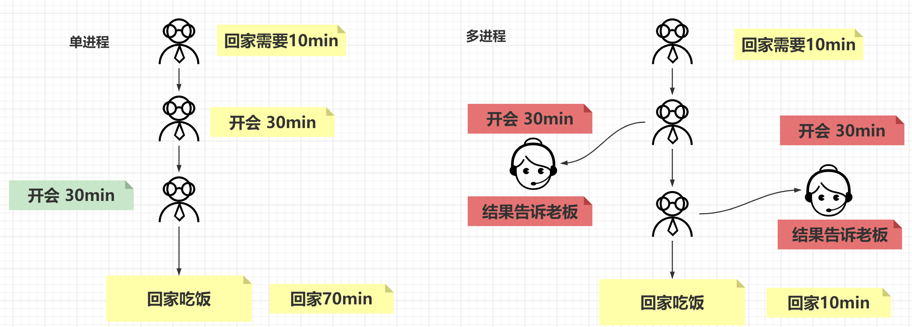
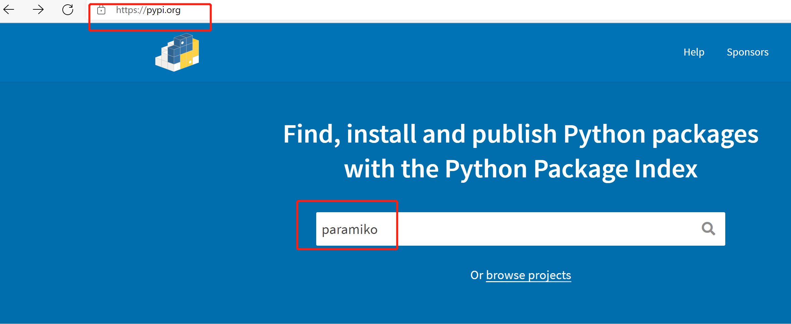
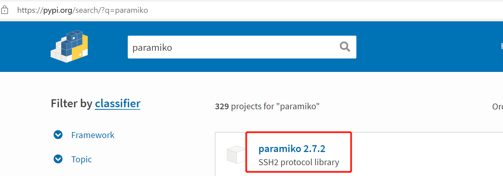
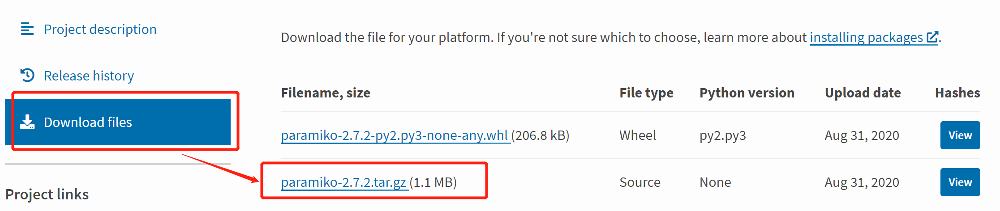
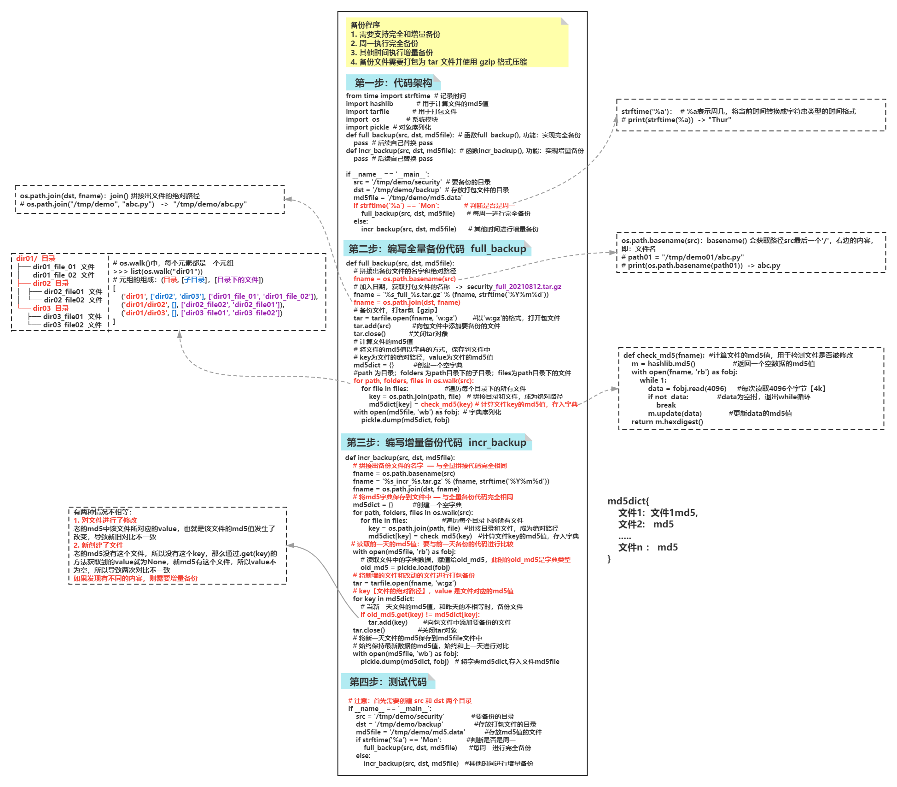

[TOC]

# 进程和线程

## 概念

### 进程

> 1. **计算机程序只不过是磁盘中可执行的二进制（或去他类型）的数据**
> 2. **进程（有时被称为重量级进程）是程序的一次执行**
> 3. **每个进程都有自己的地址空间、内存以及其它记录其运行轨迹的辅助数据（称之为上下文 context）**
> 4. **操作系统管理在其上运行的所有进程，并为这些进程公平分配时间（CPU）**

### 线程

> 1. **线程（有时被称为轻量级进程）跟进程有些类似，不同的是所有线程运行在同一个进程中，共享相同的运行环境**
> 2. **一个进程中的各个线程之间共享同一片数据空间，所以线程之间可以比进程之间更方便的共享数据以及相互通讯**

### 理解（人话）


### 总结

1. **进程是争夺 CPU 资源的最小单位，线程是程序执行的最小单位**
2. **线程的执行离不开进程的资源，进程的流转离不开线程的工作**

## 多线程

### 动机

- 在多线程（MT）编程出现之前，电脑程序的运行由 **一个执行序列组成**，执行序列按顺序在主机的**中央处理器（CPU）中运行**
- 无论是任务本身要求**顺序执行还是整个程序是由多个子任务组成**，程序都是按这种方式执行的
- **即使子任务相互独立，互相无关（即，一个子任务的结果不影响其它子任务的结果）时也是这样**
- 如果并行运行这些相互独立的子任务可以大幅度地 **提升整个任务的效率**

### 工作特点

- 它们本质上就是 **异步的**，需要有多个并发事务
- 各个事务的运行顺序可以是 **不确定的，随机的，不可预测的**
- 这样的编程任务可以被分成 **多个执行流，每个流都有一个要完成的目标**
- **根据应用的不同，这些子任务可能都要计算出一个中间结果，用于合并得到最后的结果**

### 理解



### 多线程编程

#### 概念

- **thread 和 threading **模块允许程序员创建和管理线程
- **thread** 模块提供了基本的线程和锁的支持，**而 threading 提供了更高级别、功能更强的线程管理功能**
- 推荐使用更高级别的 **threading** 模块

#### 使用

- 多线程编程有多种方法，传递函数给threading模块的Thread类是介绍的第一种方法
- **Thread** 对象使用 **start()** 方法开始线程的执行，直到线程结束

#### 案例：三秒后打印内容

**需求：使用多线程实现功能**

**【一般方法】**

```python
import time

# 定义方法say_hi()，功能: 打印信息
def say_hi():
    time.sleep(3)
    print('Hello World!')

if __name__ == '__main__':
# 当前处于主线程下，通过for循环生成工作线程t, target指定线程运行的函数
    for i in range(3):
        say_hi()
```

**【多线程】**

```python
import time
import threading

# 导入多线程的模块
import  threading

# 定义方法say_hi()，功能: 打印信息
def say_hi():
    time.sleep(3)
    print('Hello World!')

if __name__ == '__main__':
# 当前处于主线程下，通过for循环生成工作线程t, target指定线程运行的函数
    for i in range(3):
        t = threading.Thread(target=say_hi)
        t.start()     #启动工作线程, 会运行target()【等同于say_hi()】
```

#### 练习 1：扫描存活主机

**需求：**

1. 通过 **ping** 测试主机是否可达
2. 如果 **ping** 不通，不管什么原因都认为主机不可用
3. **通过多线程方式实现并发扫描**

**分析：**

- subprocess.run() 方法可以调用系统命令，其返回值是系统命令退出码，也就是如果系统命令成功执行，返回0，如果没有成功执行，返回非零值

```python
import subprocess
import threading
def ping(host):
    rc = subprocess.run(
        'ping -c2 %s &> /dev/null' % host,
        shell=True
    )
    if rc.returncode != 0:
        print('%s: down' % host)
    else:
        print('%s: up' % host)
if __name__ == '__main__':
    ips = ['172.40.58.%s' % i for i in range(1, 255)]
    for ip in ips:
        # 创建线程，ping是上面定义的函数, args是传给ping函数的参数
        t = threading.Thread(target=ping, args=(ip,))
        t.start()  # 执行ping(ip)
```

# Python 模块安装

## 本地安装pip模块

- **pip** 是 **Python** 包管理工具
- 提供了对 **Python** 包的查找、下载、安装、卸载的功能
- 下载 **pip** 后解压缩并安装

### 步骤

#### 下载 pip 模块







#### 安装

上传 paramiko-2.7.2.tar.gz 到 pycharm 主机

```shell
[root@localhost ~]# source /root/mypy/bin/activate  # 进入到python虚拟环境下
[root@localhost ~]# tar tar xf paramiko-2.7.2.tar.gz  # 解压pip压缩包
[root@localhost ~]# cd paramiko-2.7.2/  # 进入到paramiko解压目录下
[root@localhost paramiko-2.7.2]# python3 setup.py install  # 安装paramiko
[root@localhost paramiko-2.7.2]# pip3 list |grep -i paramiko  # 查看paramiko的版本
```

### 在线安装模块

#### 使用国内镜像站点

```shell
[root@localhost xxx]# mkdir ~/.pip			#在root家目录下，创建隐藏目录.pip
[root@localhost xxx]# vim ~/.pip/pip.conf		#创建，配置国内镜像源，index-url 指定国内镜像源路径，trusted-host 信任该镜像网站，否则无法使用
[global]
index-url=https://mirrors.aliyun.com/pypi/simple/
[install]
trusted-host=mirrors.aliyun.com
```

#### 安装

使用pip尝试安装paramiko，可以看到配置的国内镜像站点

```shell
(mypy) [root@localhost xxx]# pip3 install paramiko
```

# paramiko 模块应用

## 功能

实现对 SSH 的相关功能，例如：要对服务器进行远程管理的操作，就需要使用此模块

## 安装

```python
[root@localhost xxx]# pip3 install paramiko  # 使用pip，安装paramiko模块
```

## 基本使用

### 常用方法解释说明

- **SSHClient：**创建用于连接 ssh 服务器的实例

- **paramiko.AutoAddPolicy：**设置自动添加主机密钥

- **ssh.connect：**连接ssh服务器

- **ssh.exec_command：**在ssh 服务器上执行指定命令

### 案例：实现ssh远程连接服务器

```shell
(mypy) [root@localhost xxx]# python
>>> import paramiko  # 导入paramiko，远程连接模块
>>> ssh = paramiko.SSHClient()  # 声明一个远程连接的客户端对象
>>> ssh.set_missing_host_key_policy(paramiko.AutoAddPolicy())  # 设置远程连接的提示【类似：ssh 远程连接时，提示'yes/no', 要选择yes的操作】
>>> ssh.connect('127.0.0.1', username='root', password='123456')  # 使用客户端对象ssh，连接服务器【指定服务器的IP地址，用户名和密码】
>>> result = ssh.exec_command('id root; id zhangsan')  # 将结果返回值保存到变量result中，返回值为：输入，输出和错误的类文件对象
>>> result  # 查看变量result中返回值信息【result为元组】
>>> len(result)
>>> result[0]  # 查看元组result中，【输入信息】的类文件对象
>>> result[1]  # 查看元组result中，【输出信息】的类文件对象
>>> result[2]  # 查看元组result中，【错误信息】的类文件对象
>>> out = result[1].read()  # 读取【输出信息】内容，赋值给变量out
>>> err = result[2].read()  # 读取【错误信息】内容，赋值给变量err
>>> out						# 查看【输出信息】内容，以bytes字节方式显示
>>> err						# 查看【错误信息】内容，以bytes字节方式显示
>>> out.decode()			# 查看【输出信息】内容，使用decode()，转换为字符类型
>>> ssh.close()				# 断开ssh连接
```

## 练习：paramiko 实例

**需求：**

- 创建 SSHClient 实例
- 设置添加主机密钥策略
- 连接 ssh 服务器
- 执行指定命令
- 在 shell 命令行中接收用于连接远程服务器的密码以及在远程主机上执行的命令

```python
# 创建新的python文件rcmd.py ，使用paramiko, 实现ssh远程连接服务器
import  paramiko		#导入模块parmiko
def rcmd(host, user, passwd, port=22, cmds=None):  # 定义函数rcmd(), 功能：实现ssh的远程连接，port=22 cmds=None  如果不传递参数，则使用默认值
    ssh = paramiko.SSHClient()  # 声明一个远程连接的客户端对象
    ssh.set_missing_host_key_policy(paramiko.AutoAddPolicy())  # 设置远程连接的提示【类似：ssh 远程连接时，提示'yes/no', 要选择yes的操作】
    ssh.connect(host, username=user, password=passwd, port=port)  # 使用客户端对象ssh，连接服务器【指定服务器的IP地址，端口，用户名和密码】
    stdin, stdout, stderr = ssh.exec_command(cmds)  # 将元组中的元素，分别赋值给三个变量
    out = stdout.read()  # 读取输出信息和错误信息
    err = stderr.read()
    if out:  # 输出信息out为绿色显示，错误信息err为红色显示
        print('[%s]OUT:\n%s' %(host, out.decode()))
    if err:
        print('[%s]ERROR:\n%s' % (host, err.decode()))
    ssh.close()  # 关闭ssh的连接
if __name__ == '__main__':
	# 调用函数，指定服务器IP地址，用户名，密码和要执行的命令，采用默认端口22
    rcmd('127.0.0.1', 'root', '123456', cmds='id root; id zhangsan')
```

# JSON

## 概念

**JSON** 是一种轻量级的数据交换格式。

## 理解

数据交换格式那么多，为啥还要学个 **JSON？**


数据交换格式是不同平台、语言中进行数据传递的通用格式。比如 **Python** 和 **Java** 之间要对话，你直接传递给 **Java** 一个 **dict 或 list** 吗？**Java** 会问，这是什么鬼？虽然它也有字典和列表数据类型，但两种字典不是一个“物种”，根本无法相互理解。这个时候就需要用 **Json** 这种交换格式了，**Python** 和 **Java** 都能理解 **Json**。那么别的语言为什么能理解 **Json** 呢？因为这些语言都内置或提供了 **Json** 处理模块，比如 **Python** 的 **json** 模块。

## 基本用法

**JSON格式：** 在各种语言中，都可以被读取，被用作不同语言的中间转换语言【类似翻译器】

### 主要结构

- “键/值” 对的集合；python 中主要对应 **字典**

- 值的有序列表；在大部分语言中，它被理解为 **数组**

| **Python**  | **JSON** |
| ----------- | -------- |
| dict        | object   |
| list, tuple | array    |
| str         | string   |
| int, float  | number   |
| True        | true     |
| False       | false    |
| None        | null     |

### 常用函数

- **loads 方法**：对编码后的 **json** 对象进行 **decode** 解密，得到原始数据，需要使用的 **json.loads()** 函数

- **dumps 方法：**可以将原始数据转换为 **json** 格式

### 案例

```python
[root@localhost xxx]# python3
>>> import json  # 导入json模块
>>> adict = {'user': 'tom', 'age': 20}  # 定义字典adict
>>> data = json.dumps(adict)  # dumps()，将字典转换为json格式【字符串类型】，赋值给变量data
>>> data  # 查看变量的内容，字符串
>>> type(data)  # 查看变量data的数据类型，为字符串类型
>>> jdata = json.loads(data)  # l将json格式【字符串类型】转换为字典，赋值给变量jdata
>>> jdata  # 查看变量data的值，字典
>>> type(jdata)  # 查看jdata的数据类型，为字典类型
```

# 邮件编程

## 在Linux的终端上，查看邮件服务器是否开启

```shell
rmp -q postfix || yum -y install postfix
yum -y install mailx
systemctl start postfix
netstat -utnlp | grep :25
vim /etc/hosts  # 把自己的主机名和127地址绑定
127.0.0.1 xxx localhost
:wq!
```

## 发送并设置邮件

标准邮件需要三个头部信息

- From：发件人
- To：收件人
- Subject：主题

## SMTP

### 概念

- SMTP（Simple Mail Transfer Protocol） 即简单邮件传输协议，使用 TCP 协议 25 端口
- 它是一组用于由源地址到目的地址传送邮件的规则，由它来控制信件的中转方式
- python 的 **smtplib** 提供了一种很方便的途径发送电子邮件。它对 **smtp 协议进行了简单的封装**

### SMTP对象

- Python 发送邮件，**第一步是创建 SMTP 对象**
- 创建 SMTP 对象也可以不给定参数，之后再通过对象的其他方法进行绑定

### sendmail 方法

- Python SMTP 对象使用 **sendmail** 方法发送邮件
- sendmail 方法三个必须的参数有：
  - **收件人**
  - **发件人**
  - **消息主体 msg 是一个字符串，表示邮件**

- 将准备好的邮件发送

## 案例：通过本机发送邮件

### 准备工作

1. 创建 **bob** 和 **alice** 账号
2. 编写发送邮件程序，发件人为 **root**，收件人是本机的 **bob **和 **alice** 账号

```shell
[root@localhost xxx]# useradd bob  # 创建接收邮件的用户bob和alice
[root@localhost xxx]# useradd alice
[root@localhost xxx]# mail -u bob  # 查看用户bob的邮件，成功
[root@localhost xxx]# mail -u alice
```

### 代码编写

```python
# local_mail.py，使用本机的root用户，发送邮件给bob和alice用户  
from email.mime.text import  MIMEText  # 导入邮件主体内容的类
from  email.header import Header  # 导入邮件头部信息的类
import  smtplib	 # 导入发送邮件的模块

msg = MIMEText('python 本地邮件测试\n', 'plain', 'utf8')  # 定义文件的内容；'plain' 表示纯文本【类似vim 编写的文件】，富文本【包含图片，字体颜色等】，文本类型为'utf8'
msg['From'] = Header('发送者', 'utf8')  # 声明邮件的发件人，类型为'utf8'
msg['To'] = Header('接收者们', 'utf8')  # 声明接收邮件方，类型为'utf8'
msg['Subject'] = Header('py test', 'utf8')  # 声明邮件的主题【标题】
smtp = smtplib.SMTP('127.0.0.1')  # 创建对象，声明发送邮件的服务器
sender = 'root'  # 声明发送邮件的用户
receivers = ['bob', 'alice']  # 声明接收邮件的用户，发送邮件给多个用户，用列表表示
# 从当前本机的邮件服务器上，发送邮件，指定发件人，接收方，发送的邮件【包含邮件主体，发件人，收件人，邮件标题】
# msg.as_bytes() 指定以字节的方式发送邮件
smtp.sendmail(sender, receivers, msg.as_bytes())
```

# 终极练习：备份程序

**需求**

- 需要支持完全和增量备份
- 周一执行完全备份
- 其他时间执行增量备份
- 备份文件需要打包为 tar 文件并使用 gzip 格式压缩

**前置知识**

```python
# os.walk()可以递归获取目录下的所有子目录和文件
(mypy) [root@localhost xxx]# python
>>> import os									#导入系统模块os
>>> os.walk('/tmp/demo/security')				#返回一个对象
>>> alist = list(os.walk('/tmp/demo/security'))		#保存在变量alist中
>>> alist		#每个元组为列表中的元素，元组中的第一值为目录，第二个值为该目录下的子目录，第三值为该目录下的文件
>>> alist[0]		#查看列表alist的第1个元素【元组】：(目录, [子目录]，[目录下的文件])
>>> alist[1]		#查看列表alist的第2个元素【元组】：(目录, [子目录]，[目录下的文件])

# 获取/tmp/demo/security下每一个文件的绝对路径

>>> src = '/tmp/demo/security'		#定义变量src, 值为要操作的目录
>>> for path, folders, files in os.walk(src):		#path 为目录；folders 为path目录下的子目录；files为path目录下的文件
...     for file in files:             #遍历每个目录下的所有文件
...        os.path.join(path, file)    #拼接目录和文件，成为绝对路径
...

[root@localhost xxx]# mkdir /tmp/demo			#创建测试数据目录
[root@localhost xxx]# mkdir /tmp/demo/backup		#创建存放备份文件的目录
[root@localhost xxx]# cp -r /etc/security /tmp/demo/		#拷贝数据到/tmp/demo目录下
```

**步骤一：构建脚本结构**

```python
# 创建新的python文件backup.py ，构建程序的结构 
from time import strftime			#导入time模块的strftime【将时间对象转换为字符串】
def full_backup(src, dst, md5file):		#函数full_backup(), 功能：实现完全备份
def incr_backup(src, dst, md5file):		#函数incr_backup(), 功能：实现增量备份
    
if __name__ == '__main__':
    src = '/tmp/demo/security'              #要备份的目录
    dst = '/tmp/demo/backup'                #存放打包文件的目录
    md5file = '/tmp/demo/md5.data'          #存放md5值的文件
    
    if strftime('%a') == 'Mon':             #判断是否是周一
        full_backup(src, dst, md5file)      #每周一进行完全备份 
    else:
        incr_backup(src, dst, md5file)      #其他时间进行增量备份
```

**步骤二：完善脚本**

```python
# 编写完全备份full_backup()和md5值函数check_md5()，增量备份incr_backup()
from time import strftime
import hashlib           	#用于计算文件的md5值 
import tarfile           	#用于打包文件
import  os             	#系统模块
import pickle          	#实现将字典等类型数据保存在文件中

def check_md5(fname):		#计算文件的md5值，用于检测文件是否被修改
    m = hashlib.md5()                  #返回一个空数据的md5值
    with open(fname, 'rb') as fobj:
        while 1:
            data = fobj.read(4096)     #每次读取4096个字节【4k】
            if not  data:              #data为空时，退出while循环
                break
            m.update(data)             #更新data的md5值
    return m.hexdigest()               #返回给函数16进制的md5值

def full_backup(src, dst, md5file):
	# 拼接出备份文件的名字和绝对路径
    fname = os.path.basename(src)		#basename() 会获取路径src最后一个'/'，右边的内容，即：文件名
    fname = '%s_full_%s.tar.gz' % (fname, strftime('%Y%m%d'))		   #加入日期，获取打包文件的名称
    fname = os.path.join(dst, fname)    #join() 拼接出备份文件的绝对路径
	# 备份文件，打tar包【gzip】
    tar = tarfile.open(fname, 'w:gz')   	    #以'w:gz'的格式，打开包文件
    tar.add(src)           #向包文件中添加要备份的文件
    tar.close()            #关闭tar对象
	# 计算文件的md5值，将文件的md5值以字典的方式，保存到文件中，key为文件的绝对路径，value为文件的md5值
    md5dict = {}          #创建一个空字典
	# os.walk()中，每个元素都是一个元组，元组的组成：(目录, [子目录]，[目录下的文件])
	# path 为目录；folders 为path目录下的子目录；files为path目录下的文件
    for path, folders, files in os.walk(src):
        for file in files:                  	#遍历每个目录下的所有文件
            key = os.path.join(path, file)  	#拼接目录和文件，成为绝对路径
            md5dict[key] = check_md5(key)	#计算文件key的md5值，存入字典
    with open(md5file, 'wb') as fobj:
        pickle.dump(md5dict, fobj)          #将字典md5dict存入到文件中

def incr_backup(src, dst, md5file):		#函数incr_backup(), 功能：实现增量备份
	# 拼接出备份文件的名字
    fname = os.path.basename(src)
    fname = '%s_incr_%s.tar.gz' % (fname, strftime('%Y%m%d'))
    fname = os.path.join(dst, fname)
	# 将md5字典保存到文件中
    md5dict = {}  # 创建一个空字典
    for path, folders, files in os.walk(src):
        for file in files:                  #遍历每个目录下的所有文件
            key = os.path.join(path, file)  #拼接目录和文件，成为绝对路径
            md5dict[key] = check_md5(key)   #计算文件key的md5值，存入字典
    # 读取前一天的md5值
    with open(md5file, 'rb') as fobj:
        old_md5 = pickle.loa d(fobj)   #读取文件中的字典数据，赋值给old_md5
	# 将新增的文件和改动的文件进行打包备份
    tar = tarfile.open(fname, 'w:gz')
    for key in md5dict:		    			#key【文件的绝对路径】，遍历字典md5dict
        if old_md5.get(key) != md5dict[key]:	        #当新一天文件的md5值，和昨天的不相等时，备份文件
            tar.add(key)        #向包文件中添加要备份的文件
    tar.close()                 #关闭tar对象
	# 将新一天文件的md5保存到md5file文件中，始终保持最新数据的md5值，始终和上一天进行对比
    with open(md5file, 'wb') as fobj:
        pickle.dump(md5dict, fobj)   #将字典md5dict,存入文件md5file
    
if __name__ == '__main__':
    src = '/tmp/demo/security'              #要备份的目录
    dst = '/tmp/demo/backup'                #存放打包文件的目录
    md5file = '/tmp/demo/md5.data'          #存放md5值的文件
    if strftime('%a') == 'Mon':             #判断是否是周一
        full_backup(src, dst, md5file)      #每周一进行完全备份 
    else:
        incr_backup(src, dst, md5file)			#其他时间进行增量备份

# 完全备份，将main中的代码： if strftime('%a') == 'Mon': 修改为： if strftime('%a') != 'Mon':
# 因为测试时，系统时间不一定是周一，不修改无法完成完全备份                      
[root@localhost xxx]# python3 backup.py 
[root@localhost xxx]# ls /tmp/demo/			 md5.data生成
[root@localhost xxx]# ls /tmp/demo/backup/
```

**图例**


